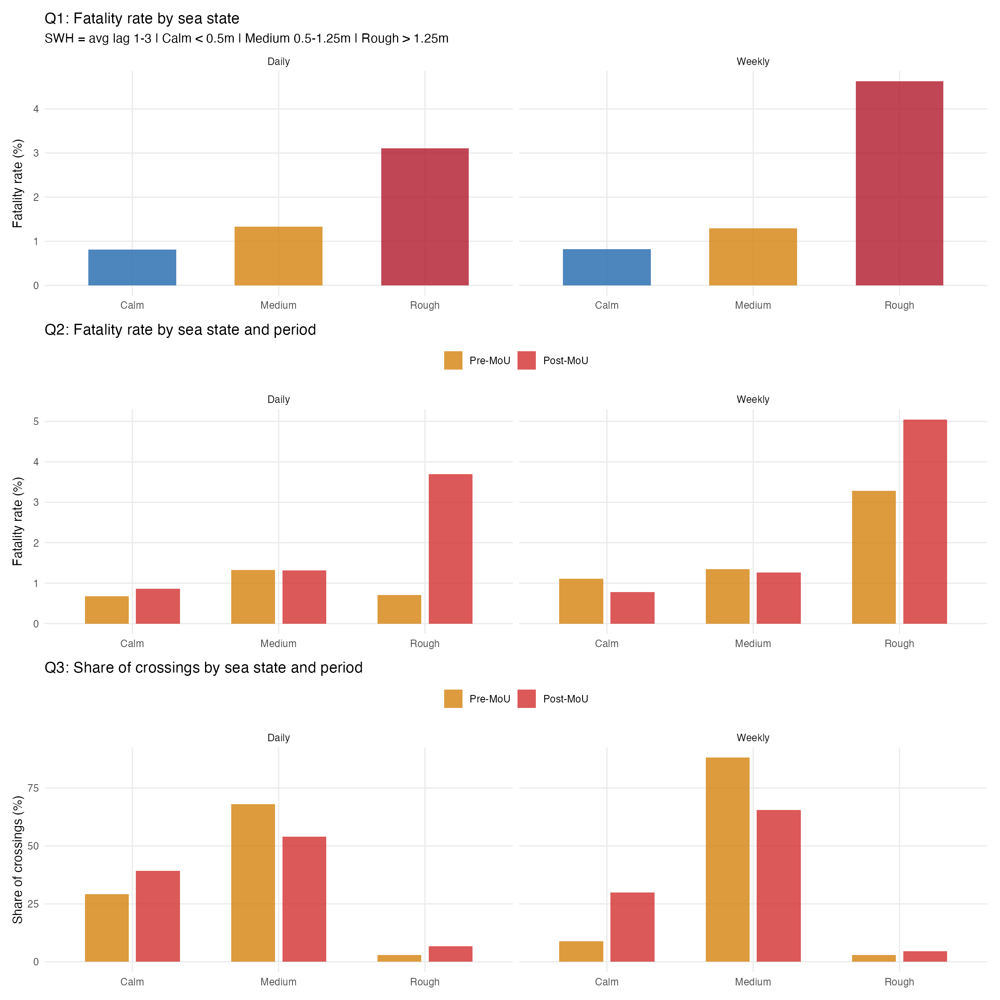
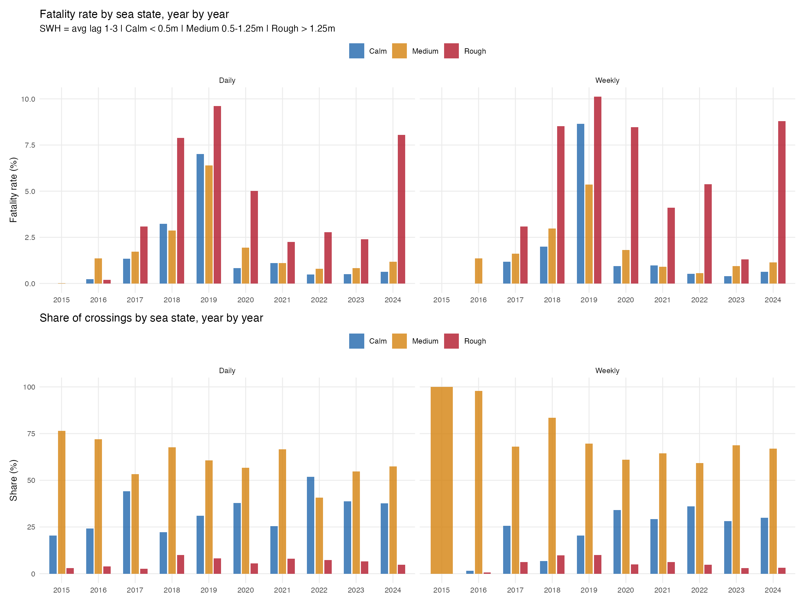

## Motivation

We want to understand the descriptive relationship between sea conditions and
the danger of crossing the Central Mediterranean. Specifically:

1. How much more dangerous is being at sea during rough conditions?
2. Did rough-weather danger change after the EU--Libya MoU (July 2017)?
3. Did the share of crossings happening in rough conditions change after the MoU?

These are descriptive questions. We make no causal claims.

## Data

**Incidents and deaths.** We use the IOM Missing Migrants Project (MMP) incident-level
data for the Central Mediterranean route, covering 2014--2025. Each record contains
the incident date, geographic coordinates, and the number of dead and missing.
We restrict incidents to those falling inside a sea zone polygon that follows the
coastlines of Libya, Tunisia, and Sicily (based on the approach of Camarena et al. 2020).
This yields 731 incidents.

**Arrivals.** UNHCR daily sea arrivals to Italy, available from October 2015 onward.
Italy is the primary destination for the Central Mediterranean route, so these
figures capture successful CMR crossings.

**Sea conditions.** ERA5 reanalysis significant wave height (SWH) at 0.5-degree
resolution. For each day we compute the spatial mean SWH over all ocean grid
cells within the sea zone polygon (85 cells).

## Construction of variables

**SWH measure.** For each day $t$, we define the weather exposure as the average
SWH over the three preceding days:
$$\text{SWH}^{\text{avg13}}_t = \frac{\text{SWH}_{t-1} + \text{SWH}_{t-2} + \text{SWH}_{t-3}}{3}$$
This captures the sea conditions experienced during transit, since boats
departing from Libya typically take 1--3 days to reach Italian waters or to be
recorded as an incident by IOM. Using lagged weather avoids simultaneity between
same-day conditions and the recording of events.

**Sea state classification.** We classify each observation into three categories
based on $\text{SWH}^{\text{avg13}}$, following the Douglas Sea Scale:

- Calm (Douglas 0--2): SWH < 0.5 m
- Medium (Douglas 3--4): 0.5 m $\leq$ SWH $\leq$ 1.25 m
- Rough (Douglas 5+): SWH > 1.25 m

**Fatality rate.** We define the fatality rate as:
$$\text{FR} = \frac{\text{Deaths}}{\text{Deaths} + \text{Arrivals}}$$
where Deaths is the sum of dead and missing from IOM incidents within the sea
zone, and Arrivals is the UNHCR daily count of sea arrivals to Italy. This
approximates the probability of dying per crossing attempt.

An important caveat: after the MoU, the Libyan coast guard began intercepting
boats and returning them to Libya. Intercepted individuals attempted a crossing
but appear in neither the deaths nor the arrivals count. This means the
denominator understates total crossing attempts in the post-MoU period, and the
fatality rate is mechanically biased upward after the MoU. We keep this caveat
in mind when interpreting pre--post comparisons.

**Period definition.** Pre-MoU: before July 2017. Post-MoU: July 2017 onward.
The analysis covers October 2015 to December 2024 (constrained by UNHCR
arrivals data availability, which begins October 2015).

## Temporal aggregation

We compute results at two levels:

- **Daily.** Each day receives its own $\text{SWH}^{\text{avg13}}$ value and
  sea state classification. Fatality rates are computed by summing deaths and
  crossings across all days within each bin (sea state $\times$ period).

- **Weekly.** Days are aggregated into ISO weeks: deaths and arrivals are summed,
  and SWH is averaged within each week. The weekly mean $\text{SWH}^{\text{avg13}}$
  determines the sea state classification. This reduces noise from days with
  very few crossings and captures sustained weather conditions rather than
  single-day spikes.

## Results

### Q1: How dangerous is being at sea during different conditions?

| Sea state | Daily FR (%) | Weekly FR (%) |
|-----------|:-----------:|:------------:|
| Calm      | 0.81        | 0.82         |
| Medium    | 1.33        | 1.29         |
| Rough     | 3.11        | 4.63         |

There is a clear and monotonic gradient. Rough-sea crossings are approximately
4--6 times more dangerous than calm-sea crossings, depending on the level of
temporal aggregation.

{width=100%}

### Q2: Is rough weather more dangerous after the MoU?

| Period   | Calm | Medium | Rough |
|----------|:----:|:------:|:-----:|
| **Daily** | | | |
| Pre-MoU  | 0.68 | 1.33   | 0.71  |
| Post-MoU | 0.86 | 1.32   | 3.70  |
| **Weekly** | | | |
| Pre-MoU  | 1.11 | 1.35   | 3.28  |
| Post-MoU | 0.78 | 1.26   | 5.05  |

: Fatality rate (%) by sea state and period {#tbl-q2}

At the weekly level, the rough-weather fatality rate increased from 3.3% to
5.1% after the MoU --- a roughly 50% increase. The calm and medium categories
remained stable or declined slightly. The weather--danger gradient steepened:
the ratio of rough to calm fatality rates increased from approximately 3:1
pre-MoU to 6.5:1 post-MoU (weekly).

The daily pre-MoU rough estimate (0.71%) is based on only 42 days with 8,343
total crossings and is unreliable. The weekly estimate (3.28%, based on 8 weeks)
is also imprecise but directionally consistent with the overall gradient.

### Q3: Did the share of rough-weather crossings change?

| Period   | Calm  | Medium | Rough |
|----------|:-----:|:------:|:-----:|
| **Daily** | | | |
| Pre-MoU  | 29.1  | 68.0   | 2.9   |
| Post-MoU | 39.3  | 53.9   | 6.8   |
| **Weekly** | | | |
| Pre-MoU  | 8.9   | 88.1   | 3.0   |
| Post-MoU | 29.9  | 65.5   | 4.5   |

: Share of crossings (%) by sea state and period {#tbl-q3}

The share of rough-weather crossings increased modestly post-MoU (daily:
2.9% to 6.8%; weekly: 3.1% to 4.5%). Overall crossing volume dropped
substantially after the MoU, but a slightly larger fraction of the remaining
crossings occurred during rough conditions.

### Year-by-year patterns

{width=100%}

The year-by-year breakdown shows substantial volatility. 2018--2019 stand out
with particularly high rough-weather fatality rates. The crossing share in
rough conditions is small (typically under 10%) but persistent across years.

## Summary

Rough seas are substantially more dangerous for Mediterranean crossings.
After the MoU, rough-weather crossings became even more dangerous (fatality
rate approximately 50% higher), while calm-weather crossings became slightly
safer. At the same time, a modestly larger share of post-MoU crossings
occurred during rough conditions. These patterns are descriptive and do not
establish causation; in particular, the post-MoU fatality rate is
mechanically inflated by the omission of Libyan coast guard interceptions
from the denominator.
