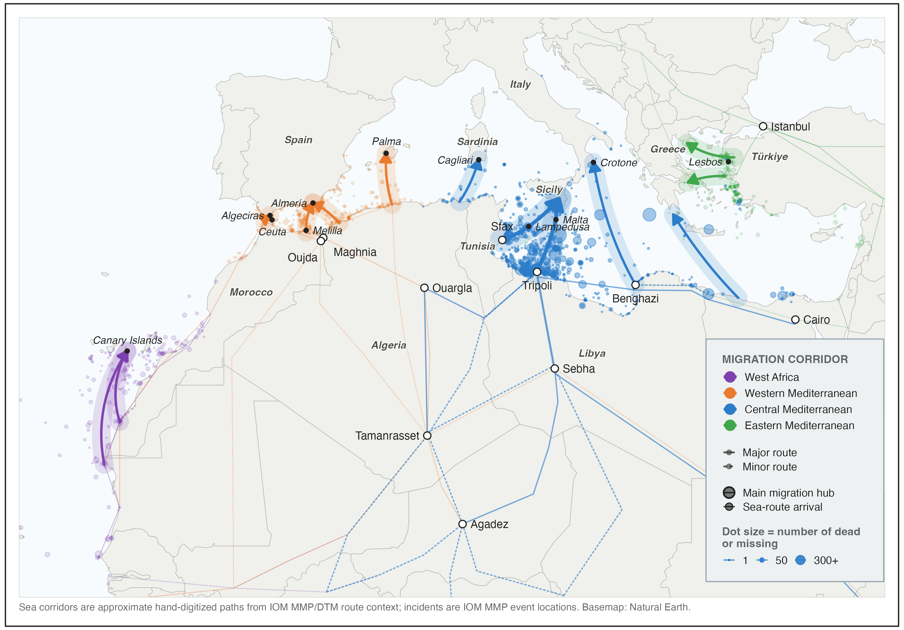

---
format:
  pdf:
    documentclass: article
    papersize: a4
    fontsize: 11pt
    linestretch: 1.2
    geometry:
      - margin=3cm
    number-sections: true
    toc: false
    title-block-style: none
    include-in-header:
      text: |
        \usepackage{setspace}
        \usepackage{graphicx}
        \usepackage{float}
        \usepackage{amsmath}
        \usepackage{caption}
        \captionsetup[figure]{font=footnotesize,labelfont=footnotesize,textfont=footnotesize}
        \captionsetup[table]{font=footnotesize,labelfont=footnotesize,textfont=footnotesize}
bibliography: references.bib
csl: apa.csl
filters:
  - wordcount_filter.lua
execute:
  echo: false
  warning: false
  message: false
---

\begin{titlepage}
\thispagestyle{empty}
\centering

\vspace*{1cm}

\includegraphics[width=0.45\textwidth]{assets/hertie-school-logo.png}

\vspace{3.5cm}

{\LARGE\bfseries [Thesis Title — TBD] \par}

\vspace{3.5cm}

Master's Thesis submitted

in partial fulfillment of the requirements for the degree of

\textbf{Master of Data Science for Public Policy at the Hertie School}

Class of 2026

\vspace{3.5cm}

\begin{flushleft}
\textbf{Supervisor:} Prof. Dr. Asya Magazinnik \\[0.4em]
\textbf{Candidate:} Giorgio Coppola
\end{flushleft}

\vfill

Word Count: @WORDCOUNT_BODY@

\vspace{1cm}
\end{titlepage}

\pagenumbering{roman}

\tableofcontents

\newpage

# Abstract {.unnumbered}

<!-- TO WRITE LAST. ~150-250 words. Structure:
     puzzle/setting -> approach/identification -> main results with magnitudes
     -> interpretation -> contribution. Use numbers; no lit review. -->

\newpage

\pagenumbering{arabic}

# Introduction

@fig-cmr-static-2014-2023 places the Central Mediterranean route in the wider Mediterranean and Atlantic migration system. The route appears alongside the Western Mediterranean, Eastern Mediterranean, and West Africa routes, with IOM Missing Migrants Project event locations scaled by the number of dead or missing migrants. The map is used here as regional context: it shows why the Central Mediterranean is treated as a distinct empirical setting while also making clear that it is one route within a broader network.

{#fig-cmr-static-2014-2023 width=100% fig-pos="H"}

<!-- TO WRITE AFTER LIT REVIEW. ~2-3 pages. Structure:

     1. Stakes and motivation
        Hook: the CMR is the deadliest migration route in the world
        (@poole2020 documents the spatial-temporal clusters); deaths
        continued after the 2017 Italy-Libya MoU even as crossings fell;
        the policy debate centers on whether rescue is a "pull factor"
        (@cusumano2021 documents how this claim drove NGO criminalization)
        or a safety net against the per-crossing risk of dying at sea.

     2. Research question
        How does the marginal association between sea state and recorded deaths
        change across SAR/policy regimes?

     3. Approach
        Daily route panel 2014-2023; ERA5 wave height; IOM + UNITED death
        series triangulated; Frontex SAR records. Main spec: daily recorded
        death counts with month-year FE and NW(14) SEs, using UNITED as the
        primary source and IOM as comparison. Rate-like models include the
        constructed crossing-attempt measure as a free log covariate, not a
        forced offset. Report pre-period SWH slope, swh:post_mou shift, and
        implied post-period slope. Mechanism: replace the binary policy event
        with continuous SAR capacity (share and rescued persons).

     4. Results with magnitudes (lift verbatim from output/tables/05_analysis/01_primary_model.txt)
        Main count-model slopes: report b_pre, b_shift, and b_post separately
        for UNITED and IOM. Do not summarize only the interaction, because the
        implied post-MoU slope is clearly positive for UNITED but imprecise
        for IOM count models. Report rate-like sensitivity separately.
        Mechanism: negative SWH x SAR-capacity interactions.

     5. Contribution
        Relative to @rodriguezsanchez2023 (null volume at monthly),
        @deiana2024 (mechanism on behavior not mortality), @tafani2025
        (route diversion), and @hoffmannpham2024 (smuggler boat choice),
        this thesis takes the SWH-recorded mortality SLOPE as the estimand —
        an unfilled position in this literature.
        Two precedents matter most. METHODOLOGICALLY, @deiana2024 — same
        daily CMR route panel, same SWH-as-exogenous identification,
        same Poisson + NW HAC SEs — but their estimand is the crossings
        slope, not the recorded-death slope. SUBSTANTIVELY (same policy event,
        mortality-related outcome), @zambiasi2025 — spatial DiD on the
        same 2017 MoU finding increased deadly-incident probability in
        LCG-patrolled areas. We adopt Deiana's identification logic and
        apply it to Z&A's outcome.

     6. Roadmap. -->

# Literature Review

A substantial literature shows that intensified or externalized border enforcement can raise migrant mortality even when it reduces, or seeks to deter, departures. It can do so by displacing migrants onto more hazardous routes or by making a given crossing more dangerous. The canonical case is the United States border, where tighter controls after 1993 redirected crossings into dangerous desert terrain and sharply increased the death toll [@cornelius2001; @solano2022]. A similar relationship is observed at sea: enforcement operations around the European Union between 2006 and 2015 are positively associated with migrant fatalities and with the rerouting of journeys toward more dangerous, less-patrolled crossings [@williams2018]. Likewise, post-2018 bilateral agreements in the Western Mediterranean increased mortality by militarizing the border and pushing migrants onto longer routes [@prieto-flores2025; @vives2023]. At the same border between 1997 and 2004, however, surveillance kept the risk of dying on each crossing roughly constant despite rising attempts and deaths, plausibly because it also enabled rescue [@carling2007].

Border policy can affect maritime mortality through three channels. First, it can change the *number* of crossings: fewer crossings mean fewer people at risk at sea (*deterrence*). Second, it can change the *way* crossings happen: the boats, routes, and timing chosen by smugglers and migrants (*moral hazard*). Third, it can change the *risk of dying* once boats are at sea, through search-and-rescue (SAR) availability and the humanitarian response (*risk-reduction*). Although the data are limited, the first two channels are partly visible in administrative records --- arrivals to Italy and Malta, incident records on boat type, and Libyan and Tunisian Coast Guard pullbacks --- and have been studied empirically for the Central Mediterranean [@rodriguezsanchez2023; @deiana2024; @hoffmannpham2024]. The third channel is harder to observe directly, but it is the one on which SAR should matter most.

Recent quantitative work on the Central Mediterranean has examined how the route changed after the post-2017 contraction of SAR capacity. Crossing volume shows no detectable response to SAR itself, contrary to the "pull factor" hypothesis; coordinated Libyan Coast Guard pushbacks did reduce attempted crossings [@rodriguezsanchez2023]. Boat composition responded more clearly through a moral-hazard channel: the earlier expansion of SAR encouraged smugglers to use flimsier rafts and depart in worse weather, offsetting part of the intended safety gain [@deiana2024]. Route choice also adjusted: the contraction of rescue deterred Central Mediterranean crossings and diverted part of the flow toward the Western route [@hoffmannpham2024], a cross-route displacement also observed at measurable cost in lives after the EU--Turkey agreement [@tafani2025].

Quantitative studies of migrant mortality at sea are few. One of the remaining gaps is how the risk of death during an attempt of crossing the Central Mediterranean sea changes across policy periods, and therefore, as SAR availability contracts. Volume, composition, and route diversion describe how many people cross and under what conditions, not the risk itself. The spatial evidence on the MoU locates that risk in space --- where deadly incidents became more likely --- rather than tracing its relationship to sea state over time [@zambiasi2025]; sea state has been used as exogenous variation on this route --- the identification strategy adopted here --- but to explain crossing behavior rather than mortality [@deiana2024].

This thesis fills that gap by treating the slope linking sea state to recorded deaths as the estimand. If SAR reduces the chance that rough seas become deadly, then this slope should become less negative, or more positive, when rescue availability is reduced or redirected toward interception.

# Theoretical Framework and Empirical Strategy

The literature review leaves a specific theoretical claim to formalize: rescue availability should moderate the relationship between maritime hazard and mortality. This section first defines the post-2017 rescue/interception regime, then links weather, SAR, and per-crossing risk, and finally translates the theoretical quantity into the empirical slope-shift estimand.

## Externalized border control and the reconfiguration of search and rescue

This thesis focuses on the 2017 Italy--Libya Memorandum of Understanding (MoU) because it marks the point at which a longer trajectory of externalized border control became operationally central to rescue and interception along the Central Mediterranean route. Italy--Libya and EU--Libya cooperation on patrols, expulsions, detention, and border-management support had existed for two decades [@lutterbeck2006; @paoletti2011; @bialasiewicz2012], and the outsourcing of migration management to transit states had been identified as a distinct policy paradigm since the early 2000s [@boswell2003]. What changed after the 2015--2016 crisis was the intensity and institutional form of this paradigm: externalization was increasingly formalized through interstate instruments that delegated interception to third-country authorities while seeking to insulate European states from direct legal responsibility for it [@frelick2016; @niemann2023; @moreno-lax2017; @muller2021]. @fig-policy-timeline traces this policy sequence on the Central Mediterranean route, from the state-led rescue model of 2013--2014, through the 2017 MoU, to the later containment of NGO rescue and distant-port measures; the rest of this section follows it in turn.

{#fig-policy-timeline width=100%}

The 2017 MoU was the Central Mediterranean expression of this wider shift. Signed on 2 February 2017, it committed Italy to supporting Libyan border-control infrastructure, training, and equipment, including for the Libyan Coast Guard (LCG); the Malta Declaration adopted the following day endorsed the same approach at EU level. Its logic echoed the 2016 EU--Turkey Statement, which sought to curb irregular crossings in the Eastern Mediterranean through returns from the Greek islands to Turkey, resettlement from Turkey to the EU, and financial support for refugee-hosting capacity in Turkey. In this sense, the MoU can be read as the operational expression, on the Central Mediterranean route, of a broader EU turn toward externalized and securitarian border governance [@ghezelbash2018; @wolff2024].

This institutional shift also changed the practical organization of search and rescue (SAR). The direct state-led rescue model of the Italian Navy's Operation Mare Nostrum (October 2013--November 2014) had already given way to a more limited model centered on border surveillance and counter-smuggling under Frontex's Operation Triton, launched in late 2014, and EUNAVFOR MED Sophia, launched in 2015 [@cusumano2019]. NGO vessels increasingly filled the resulting rescue gap, especially in international waters near the Libyan coast [@cusumano2021].

The year 2017 was also pivotal for the containment of NGO SAR operations. That year, the Italian government issued a Code of Conduct for NGOs engaged in the rescue of migrants at sea ("Codice di condotta per le ONG impegnate nel salvataggio dei migranti in mare"). This framework was later hardened by the Salvini security decrees, notably Decree-Law No. 53 of 14 June 2019 ("Decreto Sicurezza Bis"), which authorized restrictions on the entry, transit, and stay of rescue vessels in Italian territorial waters and introduced heavy fines for non-compliant ships [@cusumano2019a; @cusumano2021]. Although the so-called Lamorgese Decree-Law of 21 October 2020 (Decree-Law No. 130) partially rolled back this framework by reducing the severity of sanctions and restoring some protection and reception guarantees, it did not abandon the underlying approach to migration governance. This logic continued under later governments through administrative measures such as the assignment of distant ports of disembarkation, which increased the time NGO vessels spent away from the rescue zone and further reduced rescue availability [@punzo2024].

European state-led rescue availability receded in parallel. Operation Sophia's naval assets were suspended in March 2019, and from 2019 the Italian Coast Guard increasingly reclassified search-and-rescue situations as law-enforcement operations [@duvell2024]. More recently, the EU New Pact on Migration and Asylum has entrenched externalization and return as central logics of irregular maritime migration governance [@wolff2024], extending the policy arc toward offshoring and return-oriented asylum management. These policy periods therefore differ not only in the number of rescue assets near the Libyan coast, but also in the institutional meaning of rescue itself: direct rescue and disembarkation increasingly gave way to interception, pull-back, and delayed or constrained NGO operations.

@moreno-lax2018 describes the resulting EU paradigm as one of “rescue-through-interdiction / rescue-without-protection”: humanitarian language is used to legitimize interception, while rescue is reduced to keeping migrants alive long enough for them to be intercepted and taken back to Libya, rather than brought to a place where they can claim protection. The MoU operationalized this paradigm by financing and equipping the actor that performs the interception, thereby displacing the practical enforcement of non-refoulement obligations onto a third party.

## Weather, SAR, and per-crossing risk

SAR reduces mortality during the Central Mediterranean crossing by interrupting the pathway from distress to death [@cusumano2020; @cusumano2023; @kosmas2022]. It does not eliminate the hazards of the crossing --- precarious boats, overcrowding, and prolonged exposure at sea --- but it can prevent those hazards from escalating into shipwrecks and deaths. As European state-led SAR assets withdrew from international waters off Libya, and as NGO rescue operations became increasingly constrained, the risk-reduction effect of SAR is expected to have weakened.

One of the most evident hazards migrants face at sea is adverse weather, including rough sea conditions. Qualitative accounts identify stormy weather and rough seas as key causes of death, alongside overloading, fuel shortages, and engine failure [@idemudia2020]. Existing evidence suggests that bad weather reduces departures from North African coasts towards Europe [@camarena2020; @deiana2024]. At the same time, crossings that do occur in rough weather are likely to carry a higher risk of death.

The theoretical mechanism examined in this thesis is whether rescue availability moderates the effect of rough sea conditions on the per-crossing risk of death. Sea state affects recorded deaths through two distinct channels, but the prediction tested here concerns only one of them.

The first channel operates through departures: when significant wave height (SWH) is high, fewer migrants depart from the North African coast, which mechanically reduces the recorded number of deaths without changing the danger faced by any individual crossing. The second channel operates through per-crossing lethality: conditional on having departed, rough seas increase the probability of distress, capsizing, and death.

Rescue availability moderates this second channel. The term refers to the extent to which a vessel in distress can be located, reached, rescued, and disembarked in a European place of safety. When rescue assets are nearby, able to respond quickly, and willing to disembark survivors there, they partly buffer the conditional lethality of rough seas. When rescue availability is reduced, or when rescue is transformed into interception and pull-back to Libya, that buffer weakens. Under those conditions, the same physical hazard is more likely to result in a recorded death.

Significant wave height is plausibly exogenous to the migration-control regime. This is why weather provides a useful bridge between the theory and the empirical strategy. Within a policy regime, daily variation in lagged SWH traces how sensitive recorded mortality is to maritime hazard under the prevailing rescue configuration. Across regimes, the change in that sensitivity --- a shift in the slope linking sea state to recorded mortality --- is the analytical target.

## Theoretical estimand

Following @lundberg2021, defining the theoretical estimand—the target quantity implied by the research question, before any choice of estimator—clarifies what the empirical strategy can and cannot deliver.

Let $D_t$ denote recorded deaths on day $t$, $s_t \equiv SWH_{t-1:t-5}$ the lagged five-day mean of significant wave height, and $R_t$ rescue availability. The expected recorded count factors into three terms, each a function of sea state and rescue availability:

$$
\mathbb{E}[D_t \mid s_t, R_t]
\;=\;
q(s_t,R_t) \, A(s_t,R_t) \, m(s_t,R_t).
$$ {#eq-decomp}

$q(s_t,R_t)$ is *recording* --- the probability that a true death is captured in the mortality data. $A(s_t,R_t)$ is *exposure* --- the expected number of crossing attempts that day, counted per person, so that one migrant's departure is one attempt. $m(s_t,R_t)$ is *per-attempt lethality* --- the latent probability that a crossing attempt ends in death, conditional on departure. Exposure and lethality are the two behavioral channels of the preceding subsection; recording is a distinct measurement channel, present because the outcome is *recorded* rather than true deaths. The product $A\,m$ is the expected number of true deaths, and $q\,A\,m$ the expected number of recorded deaths.^[@eq-decomp is an identity, not a probabilistic factorization: $A(s_t,R_t)$ is expected attempts, and $m$ and $q$ are the conditional ratios of expected true deaths to expected attempts and of expected recorded deaths to expected true deaths.]

The theoretical estimand is the cross-partial $\partial^{2} \log m / \partial s \, \partial R$, which measures how rescue availability moderates the slope linking rough seas to lethality. The risk-reduction hypothesis predicts that this quantity is negative: greater rescue availability flattens the SWH--lethality slope. Because rescue availability contracts after the MoU, a negative cross-partial implies that the lethality slope steepens across the regime change.

This estimand is not directly observed, because $q$, $A$, and $m$ are not separately identified from recorded deaths alone. The observable object is the reduced-form slope of recorded deaths on sea state --- the term-by-term logarithmic derivative of @eq-decomp:

$$
\frac{\partial \log \mathbb{E}[D_t \mid s_t, R_t]}{\partial s_t}
\;=\;
\underbrace{\frac{\partial \log q}{\partial s_t}}_{\text{recording}}
\;+\;
\underbrace{\frac{\partial \log A}{\partial s_t}}_{\text{exposure}}
\;+\;
\underbrace{\frac{\partial \log m}{\partial s_t}}_{\text{lethality}}.
$$ {#eq-slope-decomp}

Differentiating @eq-slope-decomp with respect to $R$ shows that the *shift* in this slope across rescue regimes is itself a sum of three cross-derivatives, only one of which --- the lethality term $\partial^{2} \log m / \partial s \, \partial R$ --- is the theoretical estimand.

Recovering the theoretical estimand from the observed shift therefore requires assumptions on the recording and exposure cross-derivatives, and three cases bound what that recovery delivers. If both are zero --- their weather sensitivities do not change with the rescue/interception regime --- the observed shift identifies the lethality shift exactly. If they move opposite to the lethality channel, the observed shift is a lower bound on it. The moral-hazard response documented by @deiana2024 implies exactly this for exposure: the post-MoU contraction of rescue makes departures more sensitive to rough weather, an opposite-signed exposure shift. The recording cross-derivative plausibly runs the same way: rough-weather shipwrecks are the events least likely to leave survivors or a recoverable wreck, so the withdrawal of rescue assets degrades recording more in rough weather than in calm --- again an opposite-signed shift. Overstatement of the lethality shift therefore requires recording or exposure sensitivity to run contrary to these mechanisms, steepening in the same direction as lethality after 2017. The constructed-exposure control introduced below, the boat-composition checks in Appendix C, and two independently collected mortality sources discipline that case.

## From theoretical to empirical estimand

The reduced-form slope shift derived above is the observable counterpart of the theoretical estimand. Operationally, the empirical estimand is the change in the SWH-recorded-death slope around the post-MoU regime:

$$
\beta_3 \;=\; \beta_{\text{post}} \;-\; \beta_{\text{pre}},
$$ {#eq-shift}

where $\beta_{\text{pre}}$ and $\beta_{\text{post}}$ are the slopes of log expected deaths on the lagged five-day mean of SWH before and after 2 February 2017. For example, negative pre-period slopes are consistent with rough seas limiting departures when rescue availability is greater.

The $\beta_3$ term is a pre/post difference in the conditional SWH gradient. It is algebraically analogous to the interaction term in a continuous-regressor DiD, but because the design has no untreated comparison unit, it should not be interpreted as a standard DiD treatment effect. It identifies a within-route change in the conditional SWH-recorded-mortality slope, given month-year fixed effects --- a policy-regime moderation parameter.

Moreover, rescue availability $R_t$ is a latent construct: no public dataset measures the stock of rescue assets at sea. The empirical strategy proxies $R_t$ through the pre/post-MoU policy regime and, in the mechanism analysis, through weekly Frontex SAR measures. These proxies capture the activity of recorded rescue operations.

## Research question and hypotheses

This framing yields a single empirical question:

> How does the marginal association between sea state and recorded deaths change across SAR/policy regimes?

The estimand for this question is the post-MoU slope shift $\beta_3$. The thesis statement is that, if SAR buffers the mortality risk of rough seas, then the contraction and redirection of rescue after 2017 should make the SWH-mortality slope less negative or more positive. The prediction tested below is therefore $\beta_3 > 0$.

As the literature review set out, the post-2017 reconfiguration of the route produced several behavioral responses --- shifts in crossing volume, boat composition, and route choice. The channel this thesis examines is distinct from these and largely unexamined over time: the per-crossing risk of dying given a crossing in given sea conditions. The prediction $\beta_3 > 0$ corresponds to a movement in this per-crossing-risk channel: the rescue buffer described above weakens as rescue gives way to interception.

The role of the exposure and boat-composition controls in the empirical analysis is therefore not to dismiss the volume, composition, or diversion channels but to isolate the per-crossing-risk channel from them. If $\beta_3$ is absorbed once exposure is controlled, the change is consistent with the volume and diversion channels alone. If it is absorbed once boat composition is controlled, the change is consistent with moral hazard alone. The prediction is that $\beta_3$ persists under both --- and, if it does, the per-crossing-risk channel has moved in addition to whatever else has changed.

# Methods and Data

## Setting and sample

The analysis builds on a daily time series of crossing attempts for the Central Mediterranean Route. Each observation is one day, with weather, mortality, and crossing variables measured over the same area. Daily resolution is necessary because sea state changes quickly and can affect both departures and survival at sea. The design follows @deiana2024, which uses significant wave height (SWH) as an exogenous shock to crossing conditions on this route; monthly aggregation would absorb much of the identifying weather variation.

@fig-sea-zones-united-sar-panel defines the spatial frame. The analysis polygon is both the area over which daily SWH is averaged and the filter applied to mortality records. It retains 83.3% of UNITED-recorded CMR deaths and 88.7% of IOM dead-and-missing over January 2014--May 2023. The figure also places the area of analysis in relation to the Italian, Maltese, Libyan, and Tunisian search-and-rescue responsibility zones.

{#fig-sea-zones-united-sar-panel width=100%}

The series runs from 1 January 2014 to 31 May 2023, the last complete month with Frontex coverage used to disaggregate Libyan and Tunisian coast-guard pullbacks to daily frequency. The regression sample begins on 15 January 2014, once the lagged crossing window has filled.

The policy-regime indicator is $Post_t = \mathbf{1}\{t \geq \text{2 February 2017}\}$, the date the Italy--Libya MoU was signed. The cutoff defines the post-MoU rescue/interception regime for the reduced-form comparison; it is not treated as a sharp causal switch. Period and rolling-window specifications later relax this binary split.

## Data sources

The panel combines four primary sources: ERA5 sea state; migrant-mortality records from UNITED and the IOM Missing Migrants Project; Frontex's Joint Operations Reporting Application (JORA); and Libyan and Tunisian Coast Guard (LCG/TCG) pullback counts from IOM's Global Migration Data Analysis Centre (GMDAC). ACLED conflict events and UNHCR daily arrivals enter only in robustness checks.

*Sea state.* Daily SWH is the ERA5 spatial mean [@hersbach2020] over sea cells in the analysis polygon. The primary regressor is the lagged five-day mean $SWH_{t-1:t-5}$. One-, three-, and seven-day lagged means are used for window-sensitivity checks; all exclude day-$t$ weather.

*Mortality.* Recorded deaths come from the UNITED *List of Refugee Deaths* and the IOM Missing Migrants Project [@rodriguezsanchez2023; @poole2020]. UNITED records are restricted to the analysis polygon, the five Central Mediterranean incident countries plus open-sea records coded as Mediterranean, and deaths by drowning or other/unknown causes. IOM records are restricted to the Central Mediterranean route, the same five countries, incident-type records inside the polygon, and drowning or mixed/unknown causes; split incidents are excluded. UNITED is the primary outcome and IOM a robustness check.

*Frontex incident microdata.* Frontex JORA provides daily records of interceptions at sea and on European coasts. The 2014--2023 Central Mediterranean extract, released under PAD-194, covers Triton and Themis. The CMR sample retains departures from Libya, Tunisia, or Algeria and records SAR status, Frontex involvement, and the detecting or intercepting actor, allowing NGO-led rescues to be distinguished from interceptions by national assets.

*Coast-guard pullbacks.* Libyan and Tunisian Coast Guard pullbacks come from IOM-GMDAC monthly Mediterranean migration figures. Monthly totals are allocated to days by proportional Denton disaggregation [@denton1971], using Frontex-recorded daily departures from Libya or Tunisia as high-frequency indicators. The result is an approximate volume control, not a treatment variable.

*ACLED conflict.* A one-week-lagged Libya conflict composite from ACLED enters only the push-factor robustness check.

The data and analytical sample are summarized in Table&nbsp;\ref{tab:data-summary}.

\input{../output/tables/04_descriptive/06_data_summary.tex}

\newpage

Figure \ref{fig:panel-event-type} summarizes monthly crossing outcomes and rescue/interception composition over 2014--2023. The post-2017 compositional shift motivates keeping Frontex SAR, Frontex non-SAR, and LCG/TCG categories separate in the panel and combining them only in the lower-bound crossing-attempt series $C_t$ defined in @eq-exposure.

\begin{figure}[H]
\centering
\includegraphics[width=\textwidth]{../output/figures/04_descriptive/01_panel_event_type.png}
\caption{Observed crossing outcomes and rescue/interception composition, 2014--2023.}
\label{fig:panel-event-type}
\end{figure}

## Outcome and estimand

The outcome is the daily count of recorded deaths in source $j$, $D^j_t$, with $j \in \{\text{UNITED}, \text{IOM}\}$. The empirical estimand is the post-MoU slope shift $\beta_3$:

$$
\beta_3 = \frac{\partial \log \mathbb{E}[D^j_t \mid SWH_{t-1:t-5}, Post_t=1]}{\partial SWH_{t-1:t-5}} - \frac{\partial \log \mathbb{E}[D^j_t \mid SWH_{t-1:t-5}, Post_t=0]}{\partial SWH_{t-1:t-5}}.
$$ {#eq-estimand}

Section 3 predicts $\beta_3 > 0$: after rescue capacity is reduced or redirected, the same sea state should translate into more recorded deaths. The post-MoU indicator bundles SAR contraction with the wider policy package the MoU set in motion: expanded Libyan interceptions, restrictions on NGO rescue, and Italian closed-port measures. It does not separate these components. Main non-regime threats are post-2017 shifts in smuggler boat composition, Libyan conflict, and mortality recording. The first two enter robustness checks (Appendices C and E), and month-year fixed effects absorb common time-varying shocks.

## Empirical specification

The primary specification estimates daily deaths as

$$
\mathbb{E}[D^j_t] = \exp\bigl(\alpha_{m(t)} + \beta_1 SWH_{t-1:t-5} + \beta_3 SWH_{t-1:t-5} \times Post_t\bigr).
$$ {#eq-count}

The month-year fixed effect $\alpha_{m(t)}$ absorbs seasonality and common monthly shocks. Identification of $\beta_3$ relies on within-month variation in lagged sea state and on the pre/post difference in how that variation maps into deaths. The specification does not estimate a separate post-MoU level shift. Results report the pre-period slope $\beta_1$, the shift $\beta_3$, and the implied post-period slope $\beta_1 + \beta_3$ with a delta-method standard error.

The model is estimated by negative-binomial maximum likelihood and Poisson quasi-maximum likelihood. Negative binomial accommodates sparse, overdispersed counts; Poisson QMLE estimates the conditional mean without requiring mean-variance equality. The same specification is estimated on UNITED and IOM, with source-specific all-zero fixed-effect cells dropped by the estimator. Inference uses Newey--West standard errors with a 14-day bandwidth; month-year clustered errors are reported alongside.

Because true departures are unobserved, the count model is the primary design. A risk specification would require a denominator for all attempts. The closest observable approximation is a lower-bound daily crossing count,

$$
C_t = \text{Frontex-recorded persons}_t + \text{LCG/TCG pullbacks}_t + \text{deaths recorded by UNITED}_t,
$$ {#eq-exposure}

following the Central Mediterranean convention of summing arrivals, interceptions, returns, and deaths to approximate attempted crossings [@rodriguezsanchez2023; @deiana2024]. Since $C_t$ is a lower bound, not a true denominator, the volume-controlled variant does not impose an offset. Log exposure enters as a free covariate:

$$
\mathbb{E}[D^j_t] = \exp\bigl(\alpha_{m(t)} + \beta_1 SWH_{t-1:t-5} + \beta_3 SWH_{t-1:t-5} \times Post_t + \gamma \log C_t\bigr),
$$ {#eq-rate}

estimated on days with $C_t > 0$. Because the estimated $\gamma$ is far below one and Wald tests reject unit elasticity, @eq-rate is a volume-controlled count model, not a true daily fatality rate.

## Identification and threats

The identifying argument has two layers. First, conditional on month-year fixed effects, day-to-day variation in lagged SWH is as-good-as random with respect to other determinants of recorded mortality. Second, the treatment must be interpreted as the wider rescue/interception regime initiated and enabled by the MoU, not the legal memorandum alone. Expanded Libyan interceptions, NGO restrictions, and later Italian legal and administrative measures are components of that regime, not external confounders.

The main threat is that factors outside the regime shifted the weather-to-death gradient in the same direction. Smuggler strategy and boat composition may be regime responses or independent changes in crossing technology. Libyan conflict and reporting practices are sharper threats when they vary independently of the regime. The post-MoU interaction is therefore a reduced-form moderation parameter, interpreted through diagnostics on volume, composition, diversion, conflict, and reporting.

Incomplete recording is the second major threat. The outcome includes only deaths that enter UNITED or IOM, and observed exposure captures only attempts detected by Frontex or intercepted by Libyan or Tunisian authorities. In the notation of @eq-decomp, $q(s_t,R_t)$ is below one and $A(s_t,R_t)$ is only partially observed through $C_t$. The post-MoU shift in $\beta_3$ is contaminated if recording changes differentially by sea state across regimes. The likely direction is attenuating: rough-weather shipwrecks are least likely to leave survivors or recoverable wrecks, so reduced rescue after 2017 should degrade recording more in rough weather than in calm. Estimating UNITED and IOM in parallel helps test whether the shift is driven by one registry's recording channel.

## Mechanism and robustness specifications

The mechanism specification replaces the binary policy interaction with continuous SAR-capacity moderators:

$$
\mathbb{E}[D^j_t] = \exp\bigl(\alpha_{f(t)} + \theta_1 SWH_{t-1:t-5} + \theta_2 R_{t-1:t-7} + \theta_3 SWH_{t-1:t-5} \times R_{t-1:t-7}\bigr),
$$ {#eq-mechanism}

where $R_{t-1:t-7}$ is a standardized weekly lagged SAR measure. I use two versions: the previous-week share of Frontex incidents classified as SAR --- whose monthly evolution is visible in the SAR-share line of panel (d) in Figure \ref{fig:panel-event-type} --- and the log of one plus persons recorded in Frontex SAR events over the same week. The share captures SAR prevalence but can fall mechanically when non-SAR events expand; the persons measure removes that denominator. Both proxies are endogenous to crossings, distress, detection, and operational choices, so they are mechanism checks rather than alternative identification strategies.

Robustness checks target the main threats: past and future SWH windows (Appendix A), fixed-effect and inference variants (Appendix B), boat-composition controls (Appendix C), Frontex SAR versus non-SAR event placebos (Appendix D), ACLED push-factor decompositions (Appendix E), and the UNITED--IOM comparison (Appendix F). Section 5 also reports period and rolling-window specifications. These checks do not make the design experimental; they discipline the interpretation of $\beta_3$ against specific alternatives.

# Analysis and Results

## Reduced-form slope shift around the MoU

Table&nbsp;\ref{tab:primary} reports the main count estimates of @eq-count on the daily route series. UNITED is the primary outcome; IOM is estimated with an identical specification and is treated as an independent comparison. For deaths recorded by UNITED, the pre-MoU SWH slope is $\beta_1 = -2.829$ ($SE = 0.723$) under the negative binomial and $\beta_1 = -1.383$ ($SE = 0.484$) under the Poisson QMLE; both are negative and statistically distinguishable from zero at conventional levels. In the pre-MoU period, rough seas predict fewer recorded deaths, consistent with weather suppressing departures faster than it raises conditional lethality.

The interaction with the post-MoU indicator is large and positive in both families: $\beta_3 = +3.629$ ($SE = 0.820$) under negative binomial and $\beta_3 = +1.632$ ($SE = 0.555$) under Poisson. The implied post-MoU SWH slope is therefore $\beta_1 + \beta_3 = +0.800$ ($SE = 0.388$, $p = 0.039$) under negative binomial and $+0.248$ ($SE = 0.275$, $p = 0.366$) under Poisson. Read together, the weather-mortality slope changes sign across the regime cutoff: rough seas predict fewer deaths in the pre-MoU period and either no change or a mild increase post-MoU. The shift parameter is the empirical estimand $\beta_3$ defined in @eq-shift; its sign and magnitude are consistent with the prediction that conditional lethality rises when rescue availability is reduced.

The IOM comparison series shows the same pattern with slightly attenuated magnitudes: pre-MoU slope of $-2.108$ ($SE = 0.694$, negative binomial) or $-2.028$ ($SE = 0.790$, Poisson), shift of $+2.478$ ($SE = 0.785$) or $+2.053$ ($SE = 0.840$), and implied post-MoU slopes of $+0.370$ and $+0.025$ that are not separately distinguishable from zero. Across the four model-family pairs, the pre-MoU slope is consistently negative and the shift consistently positive, with shift $p$-values at or below $0.015$. The post-MoU implied slope is best read as imprecisely estimated rather than as evidence for a specific magnitude: the combination of large pre-period semi-elasticities and large shifts leaves the sum bracketing zero.

\begin{table}[h!]
\centering
\small
\caption{Primary count estimates of the SWH--mortality slope shift around the 2 February 2017 MoU.}
\label{tab:primary}
\begin{tabular}{lcccc}
\hline
                              & \multicolumn{2}{c}{UNITED} & \multicolumn{2}{c}{IOM (comparison)} \\
                              & NegBin & Poisson & NegBin & Poisson \\
\hline
$\beta_1$: SWH$_{t-1:t-5}$            & $-2.829^{***}$ & $-1.383^{**}$ & $-2.108^{**}$  & $-2.028^{*}$ \\
                                      & (0.723)        & (0.484)       & (0.694)        & (0.790)      \\
$\beta_3$: SWH$_{t-1:t-5}$ $\times$ Post-MoU & $+3.629^{***}$ & $+1.632^{**}$ & $+2.478^{**}$  & $+2.053^{*}$ \\
                                      & (0.820)        & (0.555)       & (0.785)        & (0.840)      \\
$\beta_1+\beta_3$: implied post-MoU slope    & $+0.800^{*}$   & $+0.248$      & $+0.370$       & $+0.025$     \\
                                      & (0.388)        & (0.275)       & (0.368)        & (0.292)      \\
\hline
Month--year fixed effects             & Yes            & Yes           & Yes            & Yes          \\
Newey--West SEs (lag 14)              & Yes            & Yes           & Yes            & Yes          \\
Observations (days)                   & 3,197          & 3,197         & 3,286          & 3,286        \\
Pseudo $R^{2}$                        & 0.021          & 0.195         & 0.038          & 0.240        \\
\hline
\multicolumn{5}{l}{\footnotesize $^{*}p<0.05$; $^{**}p<0.01$; $^{***}p<0.001$.} \\
\multicolumn{5}{l}{\footnotesize Standard errors in parentheses (delta-method for $\beta_1+\beta_3$).} \\
\multicolumn{5}{l}{\footnotesize Source: \texttt{output/tables/05\_analysis/01\_primary\_model.txt}.}
\end{tabular}
\end{table}

The two estimators are deliberately reported side by side rather than selecting one. The negative binomial is well suited to the heavily zero-valued, overdispersed daily-death distribution and corrects for the 0.04 overdispersion observed in the data. The Poisson QMLE makes weaker distributional assumptions on the conditional mean and produces smaller magnitudes by absorbing high-count days through its variance--mean proportionality. The two models therefore differ in how aggressively they discount low-frequency mass-casualty events. The shared message is unchanged: the SWH slope changes sign around the post-MoU regime.

## Exposure and composition controls

Adding the lower-bound exposure measure $C_t$ as a free log covariate leaves the slope shift intact. The volume-controlled Poisson estimates in Table&nbsp;\ref{tab:rate} retain a negative pre-MoU slope and a positive shift in both sources: for UNITED, $\beta_1 = -1.390$ ($SE = 0.527$) and $\beta_3 = +1.986$ ($SE = 0.608$); for IOM, $\beta_1 = -1.911$ ($SE = 0.867$) and $\beta_3 = +2.342$ ($SE = 0.933$). The estimated exposure elasticity is $0.377$ ($SE = 0.065$) for UNITED and $0.200$ ($SE = 0.072$) for IOM, both rejecting unit elasticity at $p<0.001$ (Wald $z = -9.55$ and $z = -11.10$) --- consistent with $C_t$ being a partial proxy for crossing exposure rather than a true denominator.

\begin{table}[h!]
\centering
\small
\caption{Volume-controlled Poisson model with $\log C_t$ as a free covariate.}
\label{tab:rate}
\begin{tabular}{lcc}
\hline
                              & UNITED & IOM (comparison) \\
\hline
$\beta_1$: SWH$_{t-1:t-5}$            & $-1.390^{**}$  & $-1.911^{*}$   \\
                                      & (0.527)        & (0.867)        \\
$\beta_3$: SWH$_{t-1:t-5}$ $\times$ Post-MoU & $+1.986^{**}$  & $+2.342^{*}$   \\
                                      & (0.608)        & (0.933)        \\
$\gamma$: $\log C_t$                  & $+0.377^{***}$ & $+0.200^{**}$  \\
                                      & (0.065)        & (0.072)        \\
$\beta_1+\beta_3$: implied post-MoU slope    & $+0.596^{*}$   & $+0.431$       \\
                                      & (0.293)        & (0.326)        \\
\hline
Wald: $H_{0}: \gamma = 1$, $z$        & $-9.55$         & $-11.10$       \\
$p$-value                             & $< 0.001$      & $< 0.001$      \\
Month--year fixed effects             & Yes            & Yes            \\
Newey--West SEs (lag 14)              & Yes            & Yes            \\
Observations (days, $C_t>0$)          & 1,933          & 1,949          \\
\hline
\multicolumn{3}{l}{\footnotesize $^{*}p<0.05$; $^{**}p<0.01$; $^{***}p<0.001$.} \\
\multicolumn{3}{l}{\footnotesize Source: \texttt{output/tables/05\_analysis/01\_primary\_model.txt}.}
\end{tabular}
\end{table}

Boat composition is a separate threat. The Frontex-observed inflatable share fell from 0.62 pre-MoU to 0.28 post-MoU, and the moral-hazard channel in @deiana2024 implies that the SWH--death relation should attenuate as smugglers move away from rough-weather inflatable departures. On the boat-observable sample (1,742 days for UNITED), adding inflatable and wooden shares as additive controls leaves the shift essentially unchanged ($\beta_3 = +2.425$, $SE = 0.645$, vs. $+2.325$, $SE = 0.651$ in the baseline). Adding a SWH $\times$ inflatable-share interaction yields $\beta_3 = +2.607$ ($SE = 0.663$), with the SWH $\times$ inflatable-share interaction itself not separately identified ($+1.122$, $SE = 0.894$). Appendix Table&nbsp;\ref{tab:appx-boat} reports the full sequence: post-MoU compositional change does not account for the shift.

## Mechanism: weighting by continuous SAR proxies

The mechanism specification of @eq-mechanism replaces the post-MoU indicator with the two standardized, weekly-lagged SAR proxies defined in Section 4.6: the share of Frontex incidents classified as SAR, and the log of one plus persons in Frontex SAR events. Interaction coefficients are per one standard-deviation change in the proxy.

Both moderators yield negative SWH $\times$ SAR-proxy interactions across families and both data sources (Table&nbsp;\ref{tab:mechanism}). For deaths recorded by UNITED under month--year fixed effects, the SAR-share moderator gives a SWH-by-share interaction of $-1.466$ ($SE = 0.379$, $p < 0.001$) under negative binomial and $-0.834$ ($SE = 0.209$, $p < 0.001$) under Poisson. The log-persons moderator delivers a same-signed interaction of $-1.177$ ($SE = 0.534$, $p = 0.028$) and $-0.687$ ($SE = 0.261$, $p = 0.009$). The IOM comparison series gives interactions in the same direction and of similar magnitude. Same-signed interactions across the two moderators address the denominator-mechanics critique: the pattern is not only an artifact of changes in the Frontex-incident denominator.

\begin{table}[h!]
\centering
\small
\caption{SWH $\times$ SAR-proxy moderator interaction. Coefficients are per one standard deviation of the standardized, weekly-summed SAR measure.}
\label{tab:mechanism}
\begin{tabular}{lcccc}
\hline
                                 & \multicolumn{2}{c}{UNITED} & \multicolumn{2}{c}{IOM (comparison)} \\
                                 & NegBin & Poisson & NegBin & Poisson \\
\hline
\multicolumn{5}{l}{\textit{(i) Share moderator: $\mathrm{sar\_share}_{t-7:t-1}$}} \\
SWH $\times$ SAR share           & $-1.466^{***}$ & $-0.834^{***}$ & $-0.862^{*}$  & $-0.980^{**}$ \\
                                 & (0.379)        & (0.209)        & (0.402)       & (0.306)       \\
\multicolumn{5}{l}{\textit{(ii) Persons moderator: $\log_1\!\!+\!\mathrm{sar\_persons}_{t-7:t-1}$}} \\
SWH $\times$ $\log_1$(SAR persons) & $-1.177^{*}$   & $-0.687^{**}$  & $-0.853$      & $-1.019^{**}$ \\
                                   & (0.534)        & (0.261)        & (0.492)       & (0.320)       \\
\hline
Month--year fixed effects        & Yes            & Yes            & Yes           & Yes           \\
Newey--West SEs (lag 14)         & Yes            & Yes            & Yes           & Yes           \\
Observations (days)              & 2,995          & 2,995          & 3,038         & 3,038         \\
\hline
\multicolumn{5}{l}{\footnotesize $^{*}p<0.05$; $^{**}p<0.01$; $^{***}p<0.001$.} \\
\multicolumn{5}{l}{\footnotesize Source: \texttt{output/tables/05\_analysis/03\_mechanism\_interactions.txt}.}
\end{tabular}
\end{table}

The Frontex SAR-event series provides a behavioral cross-check on the SAR channel itself, independent of recorded deaths. Estimating @eq-count on the daily number of Frontex SAR events as the outcome yields a SWH-by-post-MoU coefficient of $-0.660$ ($SE = 0.235$, $p = 0.005$) under negative binomial and $-0.854$ ($SE = 0.221$, $p < 0.001$) under Poisson; the same specification on non-SAR events as a placebo channel produces $+0.173$ ($SE = 0.254$, $p = 0.50$) and $+0.223$ ($SE = 0.261$, $p = 0.39$), both indistinguishable from zero. After 2017, sea-state predicts fewer SAR events but not fewer non-SAR ones. The full table is in Appendix Table&nbsp;\ref{tab:appx-frx-events}.

All eight SWH $\times$ SAR-moderator coefficients in Table&nbsp;\ref{tab:mechanism} are negative; seven are significant at conventional levels. Weeks with more rescue availability show a flatter SWH--mortality slope; weeks with less show a steeper one.

## The shift is gradual, not a sharp break

The binary post-MoU specification forces the evolving rescue/interception regime onto a single cut at 2 February 2017. Two complementary decompositions relax this restriction. The first re-estimates @eq-count with the SWH slope interacted with the four policy periods identified in @fig-policy-timeline (Post-Arab Spring, MoU + Salvini, Partial rollback, Meloni). Because no Frontex crossing control is needed, the model is fit on the full ERA5 span (4,748 days for UNITED, 4,383 for IOM); the period-specific gradients are reported in Table&nbsp;\ref{tab:period}.

\begin{table}[h!]
\centering
\small
\caption{Period-specific SWH--mortality gradient, full ERA5 span. NegBin with month--year FE and NW(14) SEs.}
\label{tab:period}
\begin{tabular}{lcc}
\hline
SAR/policy period        & UNITED (2013-2025) & IOM (2014-2025) \\
\hline
1. Post-Arab Spring (2013-2017)      & $-2.954^{***}$ & $-2.081^{**}$ \\
                                     & (0.668)        & (0.692)       \\
2. MoU + Salvini (2017-2019)         & $+1.196$       & $+0.385$      \\
                                     & (0.732)        & (0.572)       \\
3. Partial rollback (2020-2022)      & $+0.719$       & $+0.424$      \\
                                     & (0.759)        & (0.804)       \\
4. Meloni (2022-)                    & $-0.382$       & $-0.286$      \\
                                     & (0.347)        & (0.457)       \\
\hline
Wald $H_{0}$: all equal, $\chi^{2}(3)$ & $21.43$        & $8.83$        \\
$p$-value                              & $0.0001$       & $0.0316$      \\
Observations (days)                    & 4,748          & 4,383         \\
\hline
\multicolumn{3}{l}{\footnotesize $^{*}p<0.05$; $^{**}p<0.01$; $^{***}p<0.001$.} \\
\multicolumn{3}{l}{\footnotesize Source: \texttt{output/tables/05\_analysis/05\_united\_periods.txt}.}
\end{tabular}
\end{table}

The pre-MoU slope is consistently and significantly negative across both sources. The MoU + Salvini and partial-rollback periods give positive point estimates that are not individually distinguishable from zero, and the Meloni period gives small negative estimates on the thinnest period. The Wald test rejects equality of the four slopes at $p = 0.0001$ (UNITED) and $p = 0.032$ (IOM). The interpretation is that the SWH--mortality gradient breaks away from its strongly negative pre-MoU baseline rather than that it stabilizes at any particular post-MoU value. The pre-period magnitude is the dominant feature in Table&nbsp;\ref{tab:period}: the post-MoU periods cluster around zero rather than around the pre-MoU level.

A fully time-varying view confirms the same picture. A 730-day rolling window stepped weekly through the series estimates the unconditional SWH slope by Poisson QMLE on IOM deaths with month--year fixed effects. Of the 385 windows in the route-wide series, 55 are entirely pre-MoU and 225 entirely post-MoU; the average window slope is $-3.05$ pre-MoU and $+0.49$ post-MoU. The series enters post-MoU territory smoothly through 2018--2019 rather than jumping at the policy date, suggesting that the SWH--mortality slope moves with the rescue/interception regime as it evolves, not at a single threshold. The rolling difference of approximately $3.5$ is descriptive across heavily overlapping windows and should not be tested as a single coefficient.

## Summary of findings

The slope shift is preserved across all checks reported in Appendices A--F --- alternative lagged SWH windows in the past, fixed-effect and inference variants, boat-composition controls, the Frontex SAR-vs-non-SAR daily-event placebo, push-factor decompositions, and the UNITED--IOM cross-source comparison --- while future-weather placebos on the primary UNITED source are uniformly null. The interpretation that the rescue/interception regime moderates the weather--mortality relation still requires the assumption discussed in Section 4.5: that remaining non-regime changes did not move the gradient in the same direction.

# Conclusion and Further Work

<!-- TO WRITE AFTER ANALYSIS. ~2-3 pages.
     1. Restate question + approach in one sentence.
     2. Restate main results with magnitudes: pre slope, interaction, and
        implied post slope for the main UNITED count model, then IOM and rate
        sensitivity.
     3. Interpretation: reduced-form evidence consistent with risk reduction
        view; mechanism analysis points to SAR capacity as a plausible channel;
        the result is correlational unless the strong policy-regime moderation
        assumptions hold.
     4. Limitations: one-route design with no untreated control unit;
        post-MoU regime package (cannot isolate SAR withdrawal from
        expanded interceptions, NGO restrictions, and later Italian measures);
        endogeneity of SAR; structural measurement bias (undercounted
        deaths, unobserved departures); the shift is concentrated in
        2018-2020 and not a permanent regime feature.
     5. Implications: restrained policy reading. The data is consistent with
        the risk-reduction interpretation; this is not the same as "restoring SAR would
        save N lives."
     6. Forward-looking: for a stronger causal design, you would need:
        exogenous variation in SAR availability, e.g. asset outages, legal
        detentions, port closures, weather-independent deployment constraints;
        comparable nonfatal crossing exposure by day/location; and a way to
        separate SAR from regime components, boat quality, smuggler strategy,
        surveillance, reporting, and route selection. -->

# References {.unnumbered}

::: {#refs}
:::

\newpage

\appendix

# Appendix {.unnumbered}

\renewcommand{\thetable}{A\arabic{table}}
\renewcommand{\thefigure}{A\arabic{figure}}
\setcounter{table}{0}
\setcounter{figure}{0}

## A. Exposure-window sensitivity {.unnumbered}

Table&nbsp;\ref{tab:appx-exposure} reports the SWH$\times$Post-MoU shift coefficient across past and future exposure windows on the shared sample of 3,417 days (2014-01-15 to 2023-05-24). All specifications include month-year fixed effects and Newey-West (lag 14) standard errors. Past windows of 1, 3, 5, and 7 days return positive and significant shifts for UNITED in both NegBin and Poisson families. Future-window placebos on UNITED are uniformly indistinguishable from zero. The IOM future placebo at lead 1d under negative binomial is the single isolated significant placebo result; the remaining seven IOM future-window coefficients are not.

\begin{table}[h!]
\centering
\small
\caption{SWH-window grid: SWH$\times$Post-MoU shift coefficient ($\beta_3$).}
\label{tab:appx-exposure}
\begin{tabular}{llcccc}
\hline
Source & Window      & \multicolumn{2}{c}{NegBin} & \multicolumn{2}{c}{Poisson} \\
       &             & $\beta_3$ & SE    & $\beta_3$ & SE \\
\hline
\multicolumn{6}{l}{\textit{Past (lagged) windows}} \\
UNITED & lag 1d      & $+2.172^{**}$  & 0.673 & $+1.022^{*}$   & 0.495 \\
UNITED & lag 1-3d    & $+2.876^{***}$ & 0.677 & $+1.554^{**}$  & 0.539 \\
UNITED & lag 1-5d    & $+3.663^{***}$ & 0.820 & $+1.651^{**}$  & 0.555 \\
UNITED & lag 1-7d    & $+3.622^{***}$ & 1.085 & $+1.717^{**}$  & 0.660 \\
IOM    & lag 1d      & $+0.376$       & 0.626 & $+1.366^{*}$   & 0.542 \\
IOM    & lag 1-3d    & $+1.378^{*}$   & 0.572 & $+1.770^{*}$   & 0.797 \\
IOM    & lag 1-5d    & $+2.511^{**}$  & 0.783 & $+2.077^{*}$   & 0.840 \\
IOM    & lag 1-7d    & $+2.432^{*}$   & 1.025 & $+1.997^{*}$   & 0.916 \\
\multicolumn{6}{l}{\textit{Future (placebo) windows}} \\
UNITED & lead 1d     & $+0.928$       & 0.665 & $+0.687$       & 0.925 \\
UNITED & lead 1-3d   & $-0.161$       & 0.791 & $-0.140$       & 0.655 \\
UNITED & lead 1-5d   & $-0.336$       & 0.867 & $-0.030$       & 0.598 \\
UNITED & lead 1-7d   & $-0.436$       & 1.331 & $-0.031$       & 0.577 \\
IOM    & lead 1d     & $+2.063^{**}$  & 0.716 & $+0.370$       & 0.901 \\
IOM    & lead 1-3d   & $+0.951$       & 0.682 & $+0.103$       & 0.517 \\
IOM    & lead 1-5d   & $+0.228$       & 0.865 & $+0.355$       & 0.503 \\
IOM    & lead 1-7d   & $-0.395$       & 1.069 & $+0.086$       & 0.576 \\
\hline
\multicolumn{6}{l}{\footnotesize Shared sample: 3,417 days. Source:
\texttt{output/tables/06\_robustness/06\_lag\_iom\_vs\_united.txt}.}
\end{tabular}
\end{table}

## B. Fixed-effects and inference robustness {.unnumbered}

Table&nbsp;\ref{tab:appx-fe} reports the IOM negative binomial primary specification under alternative fixed-effects and variance choices. The month-year FE specification absorbs 51.1\% of SWH variance, the highest of the six FE grids tested; coarser FE deliver smaller and less stable $\beta_3$ estimates. The point estimate is invariant to the choice of Newey-West bandwidth between 7 and 21 days and to clustering by month-year or by year. Sample restrictions (dropping zero-death days or capping at 100 deaths) attenuate the magnitude but preserve the sign.

\begin{table}[h!]
\centering
\small
\caption{Fixed-effects and inference robustness, IOM NegBin
$\beta_3=\mathrm{SWH}_{t-1:t-5}\times\mathrm{Post\text{-}MoU}$.}
\label{tab:appx-fe}
\begin{tabular}{lccc}
\hline
Variant & $\beta_3$ & SE & $p$ \\
\hline
\multicolumn{4}{l}{\textit{(i) FE specifications (NegBin, NW(14))}} \\
year                       & $+0.873$  & 0.404 & 0.031 \\
month-of-year              & $-0.473$  & 0.210 & 0.024 \\
year + month               & $+0.790$  & 0.415 & 0.057 \\
quarter-year               & $+1.213$  & 0.443 & 0.006 \\
month-year (primary)       & $+2.478$  & 0.785 & 0.002 \\
month-year + day-of-week   & $+2.390$  & 0.793 & 0.003 \\
\multicolumn{4}{l}{\textit{(ii) SE variants on month-year FE}} \\
Newey-West, lag 7          & $+2.478$  & 0.687 & 0.000 \\
Newey-West, lag 14 (primary)& $+2.478$  & 0.785 & 0.002 \\
Newey-West, lag 21         & $+2.478$  & 0.851 & 0.004 \\
Cluster by month-year      & $+2.478$  & 1.037 & 0.017 \\
Cluster by year            & $+2.478$  & 1.277 & 0.052 \\
\multicolumn{4}{l}{\textit{(iii) Sample restrictions}} \\
Full sample, $N=3286$      & $+2.478$  & 0.785 & 0.002 \\
Drop zero-death days, $N=601$  & $+1.067$  & 0.896 & 0.234 \\
Cap deaths at 100, $N=3197$    & $+1.933$  & 0.577 & 0.001 \\
\hline
\multicolumn{4}{l}{\footnotesize Source: \texttt{output/tables/06\_robustness/02\_fe\_robustness.txt}.}
\end{tabular}
\end{table}

## C. Boat composition controls {.unnumbered}

Table&nbsp;\ref{tab:appx-boat} extends the volume-controlled Poisson specification with inflatable and wooden boat shares (Frontex-observed), plus a SWH$\times$inflatable-share interaction in the spirit of @deiana2024. The slope shift is unchanged in sign and magnitude when boat composition enters as an additive control; the SWH$\times$inflatable-share interaction itself is not separately identified.

\begin{table}[h!]
\centering
\small
\caption{Volume-controlled Poisson with boat-composition controls. Boat-observable
sample: 1,742 days (UNITED), 1,739 days (IOM).}
\label{tab:appx-boat}
\begin{tabular}{lccc}
\hline
                                & V1: baseline & V2: + boat shares & V3: + boat $\times$ SWH \\
\hline
\multicolumn{4}{l}{\textit{UNITED}} \\
SWH$_{t-1:t-5}$                 & $-1.623^{**}$  & $-1.668^{**}$  & $-2.308^{**}$  \\
                                & (0.543)        & (0.507)        & (0.780)        \\
SWH $\times$ Post-MoU           & $+2.325^{***}$ & $+2.425^{***}$ & $+2.607^{***}$ \\
                                & (0.651)        & (0.645)        & (0.663)        \\
$\log C_t$                      & $+0.409^{***}$ & $+0.433^{***}$ & $+0.428^{***}$ \\
                                & (0.094)        & (0.099)        & (0.091)        \\
SWH $\times$ inflatable share   &                &                & $+1.122$       \\
                                &                &                & (0.894)        \\
\multicolumn{4}{l}{\textit{IOM (comparison)}} \\
SWH$_{t-1:t-5}$                 & $-2.198^{*}$   & $-2.205^{*}$   & $-3.308^{**}$  \\
                                & (0.975)        & (0.882)        & (1.255)        \\
SWH $\times$ Post-MoU           & $+2.779^{**}$  & $+2.851^{**}$  & $+3.058^{**}$  \\
                                & (1.064)        & (1.029)        & (0.958)        \\
$\log C_t$                      & $+0.415^{***}$ & $+0.434^{***}$ & $+0.430^{***}$ \\
                                & (0.093)        & (0.101)        & (0.091)        \\
SWH $\times$ inflatable share   &                &                & $+1.809$       \\
                                &                &                & (1.043)        \\
\hline
Month-year FE                   & Yes            & Yes            & Yes            \\
Newey-West SEs (lag 14)         & Yes            & Yes            & Yes            \\
\hline
\multicolumn{4}{l}{\footnotesize Source: \texttt{output/tables/06\_robustness/05\_rate\_with\_boat\_controls.txt}.}
\end{tabular}
\end{table}

## D. Frontex SAR vs non-SAR event placebo {.unnumbered}

Table&nbsp;\ref{tab:appx-frx-events} reports a behavioral cross-check on the SAR channel: re-estimating the primary specification with the daily number of Frontex SAR events as the outcome yields a strongly negative SWH$\times$Post-MoU coefficient, while the same specification on non-SAR events as a placebo channel is indistinguishable from zero.

\begin{table}[h!]
\centering
\small
\caption{SWH$\times$Post-MoU shift on Frontex daily event counts.}
\label{tab:appx-frx-events}
\begin{tabular}{lcccc}
\hline
                              & \multicolumn{2}{c}{SAR events} & \multicolumn{2}{c}{Non-SAR (placebo)} \\
                              & NegBin & Poisson & NegBin & Poisson \\
\hline
SWH$_{t-1:t-5}$               & $+0.240$       & $+0.302$        & $-0.391$ & $-0.245$ \\
                              & (0.183)        & (0.158)         & (0.206)  & (0.207)  \\
SWH $\times$ Post-MoU         & $-0.660^{**}$  & $-0.854^{***}$  & $+0.173$ & $+0.223$ \\
                              & (0.235)        & (0.221)         & (0.254)  & (0.261)  \\
\hline
Month-year FE                 & Yes            & Yes             & Yes      & Yes      \\
Newey-West SEs (lag 14)       & Yes            & Yes             & Yes      & Yes      \\
Observations (days)           & 3,407          & 3,407           & 3,438    & 3,438    \\
\hline
\multicolumn{5}{l}{\footnotesize Source:
\texttt{output/tables/06\_robustness/03\_frx\_event\_swh\_gradient.txt}.}
\end{tabular}
\end{table}

## E. Push-factor decomposition {.unnumbered}

Table&nbsp;\ref{tab:appx-pushfactor} reports the SWH$\times$Post-MoU shift under a triple-interaction specification with the one-week-lagged Libya conflict composite (ACLED battles, explosions, and violence against civilians). The shift coefficient remains positive and significant across all four model-source pairs; the triple interaction itself is also positive in three of four pairs, suggesting that the slope shift is amplified -- not absorbed -- by conflict pressure.

\begin{table}[h!]
\centering
\small
\caption{Triple interaction SWH$\times$Post-MoU$\times$Libya conflict.}
\label{tab:appx-pushfactor}
\begin{tabular}{lcccc}
\hline
                                          & \multicolumn{2}{c}{UNITED}    & \multicolumn{2}{c}{IOM} \\
                                          & NegBin & Poisson & NegBin & Poisson \\
\hline
SWH$_{t-1:t-5}$                           & $-2.481^{***}$ & $-1.039^{*}$  & $-1.647^{**}$  & $-1.578^{**}$ \\
                                          & (0.567)        & (0.446)       & (0.603)        & (0.566)       \\
SWH $\times$ Post-MoU                     & $+3.890^{***}$ & $+1.347^{*}$  & $+2.364^{**}$  & $+1.629^{*}$  \\
                                          & (0.853)        & (0.541)       & (0.783)        & (0.643)       \\
SWH $\times$ Post-MoU $\times$ Libya conflict & $+1.880$       & $+1.235$      & $+1.951^{*}$   & $+1.766$      \\
                                              & (1.031)        & (0.640)       & (0.992)        & (0.917)       \\
\hline
Month-year FE                             & Yes            & Yes           & Yes            & Yes           \\
Newey-West SEs (lag 14)                   & Yes            & Yes           & Yes            & Yes           \\
Observations (days)                       & 3,197          & 3,197         & 3,286          & 3,286         \\
\hline
\multicolumn{5}{l}{\footnotesize Libya conflict is the standardized
one-week lag of ACLED battles + explosions + VAC.} \\
\multicolumn{5}{l}{\footnotesize Source:
\texttt{output/tables/06\_robustness/04\_push\_factor\_decomposition.txt}.}
\end{tabular}
\end{table}

## F. Cross-source comparison {.unnumbered}

The daily and monthly distributions of UNITED and IOM deaths in the route sample are highly correlated: $r = 0.71$ at daily frequency and $r = 0.91$ at monthly frequency over 2014--2023. The mean daily count is 5.92 for UNITED and 4.45 for IOM, with comparable right tails (95th percentiles at 31.1 and 20, and daily maxima at 1,101 and 1,022).
