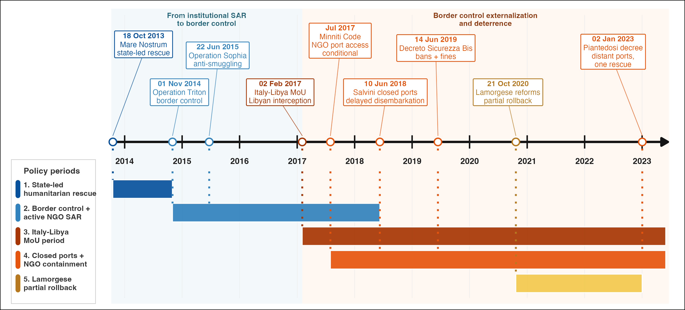
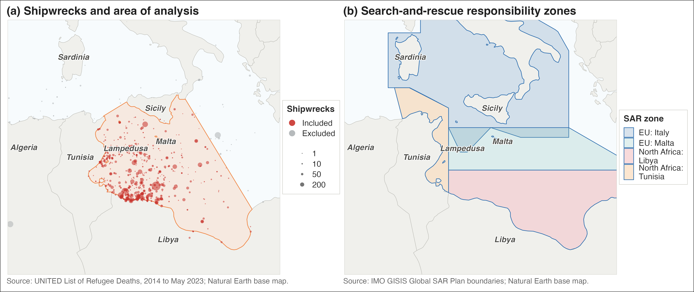

---
format:
  pdf:
    documentclass: article
    papersize: a4
    fontsize: 11pt
    linestretch: 1.2
    geometry:
      - margin=3cm
    number-sections: true
    toc: false
    title-block-style: none
    include-in-header:
      text: |
        \usepackage{setspace}
        \usepackage{graphicx}
        \usepackage{float}
        \usepackage{amsmath}
        \usepackage{caption}
        \usepackage{etoolbox}
        % Force each top-level section to start on a new page.
        \pretocmd{\section}{\clearpage}{}{}
        \captionsetup[figure]{font=footnotesize,labelfont=footnotesize,textfont=footnotesize}
        \captionsetup[table]{font=footnotesize,labelfont=footnotesize,textfont=footnotesize}
bibliography: references.bib
csl: apa.csl
filters:
  - wordcount_filter.lua
execute:
  echo: false
  warning: false
  message: false
---

\begin{titlepage}
\thispagestyle{empty}
\centering

\vspace*{1cm}

\includegraphics[width=0.45\textwidth]{assets/hertie-school-logo.png}

\vspace{3.5cm}

{\Large\bfseries When Rough Seas Become Deadlier:\\ Migrant Mortality and the 2017 Italy--Libya Memorandum \par}

\vspace{3.5cm}

Master's Thesis submitted

in partial fulfillment of the requirements for the degree of

\textbf{Master of Data Science for Public Policy at the Hertie School}

Class of 2026

\vspace{3.5cm}

\begin{flushleft}
\textbf{Supervisor:} Prof. Dr. Asya Magazinnik \\[0.4em]
\textbf{Candidate:} Giorgio Coppola
\end{flushleft}

\vfill

Word Count: @WORDCOUNT_BODY@

\vspace{1cm}
\end{titlepage}

\pagenumbering{roman}

\tableofcontents

\newpage

# Acknowledgments {.unnumbered}

I wish to express my sincere appreciation to my supervisor, Prof. Dr. Asya Magazinnik, for her thoughtful supervision, guidance, and support throughout this research process.

I am also really grateful to Oliver Lang, Zoe Sigman, and Alejandra Rodriguez-Sanchez for their generous and helpful conversations at different stages of the thesis. Their insights on data, model specification, and identification strategies were invaluable in shaping the direction and development of this work.

\newpage

# Abstract {.unnumbered}

The Central Mediterranean is the world's deadliest migration route, yet the political and academic quantitative debate over EU--Libya cooperation has focused mostly on how many people cross this migration route rather than on the risk they face. This thesis estimates how the association between significant wave height (SWH) and recorded deaths changed after the 2 February 2017 Italy--Libya Memorandum of Understanding. It builds a daily route-level panel for January 2014--May 2023 from ERA5 sea state, UNITED and IOM mortality records, Frontex incident microdata, and Libyan and Tunisian coast-guard pullbacks. Using within-month variation in lagged five-day SWH, the design estimates a change in the weather--mortality gradient. In the primary UNITED model, rougher seas predict fewer recorded deaths before the MoU but a higher weather--mortality gradient after it; IOM reproduces the same sign pattern. The shift remains after conditioning on observed crossing volume, boat composition, and conflict in Libya and Tunisia. Mechanism checks point to search-and-rescue availability: higher recorded Frontex SAR activity is associated with a lower SWH--mortality slope, so an increase in wave height predicts a smaller increase in recorded deaths; during the Lamorgese rollback, the overall weather--mortality gradient also moves back toward zero. The findings shift evaluation of the post-2017 rescue/interception regime from crossings alone to hazard sensitivity: after the MoU, the same increase in lagged five-day significant wave height is more strongly associated with recorded mortality, while SAR activity appears to buffer that relationship.

\newpage

\pagenumbering{arabic}

# Introduction

The Central Mediterranean is the deadliest migration route in the world. Since 2014, the IOM Missing Migrants Project has recorded 34,900 dead and missing migrants along the sea corridor between Libya, Tunisia, and Algeria and the southern shores of Italy and Malta.^[IOM Missing Migrants Project, https://missingmigrants.iom.int/data; counts current to 16 May 2026.] The UNITED *List of Refugee Deaths* counts 71,337 documented fatalities attributable to the "Fatal Policies of Fortress Europe" since 1993, and many more are never recorded.^[UNITED for Intercultural Action, *List of Refugee Deaths*, https://unitedagainstrefugeedeaths.eu/about-the-campaign/about-the-united-list-of-deaths/.] No other contemporary migration route has comparable mortality.

These deaths occurred while EU migration policy shifted away from state-led rescue and toward externalised interception and constraints on non-governmental search-and-rescue (SAR). The 2 February 2017 Italy--Libya Memorandum of Understanding (MoU) marks this shift on the Central Mediterranean Route. The MoU committed Italy to financing and equipping the Libyan Coast Guard to intercept migrants at sea and return them to Libya. A sequence of Italian and EU measures then followed, restricting the scope for civilian rescue [@cusumano2021; @moreno-lax2018; @punzo2024].

The empirical question is therefore not whether the post-2017 regime saved lives in net terms, but how it changed the risk faced by those who still departed. The political case for the regime rests in part on the claim that NGO and state-led rescue acted as a "pull factor", so that cutting rescue while expanding interception would reduce crossings and, mechanically, deaths. Recent quantitative work has weakened this claim on the volume side [@rodriguezsanchez2023; @deiana2024; @hoffmannpham2024; @tafani2025]. What remains open is the per-crossing risk: how likely a given crossing is to end in death, conditional on departure [@zambiasi2025].

This thesis addresses that gap. The research question is: how does the association between sea state and recorded deaths change across the pre- and post-MoU regimes? The estimand is the slope linking sea state to recorded mortality, and how this slope shifts across the regime change. @fig-cmr-static-2014-2023 places the Central Mediterranean within the broader system of Mediterranean and Atlantic routes; closure on one corridor has historically displaced both flow and risk to others [@hoffmannpham2024; @tafani2025; @vives2023].

{#fig-cmr-static-2014-2023 width=100% fig-pos="t"}

The empirical strategy uses daily variation in significant wave height (SWH) as a plausibly exogenous source of maritime hazard, conditional on month--year fixed effects. This variation traces how the same sea hazard maps into recorded mortality before and after the MoU. The January 2014--May 2023 panel combines ERA5 sea state, UNITED and IOM mortality records, Frontex incident microdata, and Libyan and Tunisian coast-guard pullbacks. After restricting deaths to the corridor polygon and to sea-crossing causes, the analysis sample contains 20,368 UNITED deaths and 15,285 IOM dead-and-missing. Because no untreated comparison route is available, the design estimates a within-route change in weather sensitivity rather than a difference-in-differences treatment effect.

The weather--mortality gradient shifts sharply upward around the MoU. In the primary UNITED negative-binomial model, the pre-MoU SWH slope is $-2.829$ (SE $0.723$) and the post-MoU shift is $+3.629$ (SE $0.820$): rough seas predicted fewer recorded deaths before the MoU, but more recorded deaths after it. The IOM series reproduces this sign pattern. The shift survives controls for crossing volume, boat composition, and a Libya conflict composite, and remains after excluding the Mare Nostrum period. Mechanism checks point in the same direction: weeks with more recorded Frontex SAR activity show a flatter SWH--mortality slope.

The contribution is to move the post-2017 Central Mediterranean debate from crossing volume, route diversion, and aggregate deaths to the *hazard sensitivity* of recorded mortality. The estimate is not a count of lives saved or lost by SAR contraction, nor a causal effect attributable to any single regime component. It shows that the post-MoU regime, taken as a whole, made rough seas more lethal in the recorded data, and that the SAR channel runs counter to the pull-factor logic that justified the regime: where rescue was more available, the weather--mortality gradient was flatter. Evaluating sea-border policy through arrivals and interceptions alone misses this margin: a regime can reduce crossings while raising the risk faced by those who still depart.

The remainder of the paper reviews the literature, develops the estimand, describes the data and identification strategy, reports the main and mechanism results, and concludes.

# Literature Review

A substantial literature shows that intensified or externalized border enforcement can raise migrant mortality even when it reduces, or seeks to deter, departures. It can do so by displacing migrants onto more hazardous routes or by making a given crossing more dangerous. The canonical case is the United States border, where tighter controls after 1993 redirected crossings into dangerous desert terrain and sharply increased the death toll [@cornelius2001; @solano2022]. A similar relationship is observed at sea: enforcement operations around the European Union between 2006 and 2015 are positively associated with migrant fatalities and with the rerouting of journeys toward more dangerous, less-patrolled crossings [@williams2018]. Likewise, post-2018 bilateral agreements in the Western Mediterranean increased mortality by militarizing the border and pushing migrants onto longer routes [@prieto-flores2025; @vives2023]. At the same border between 1997 and 2004, however, surveillance kept the risk of dying on each crossing roughly constant despite rising attempts and deaths, plausibly because it also enabled rescue [@carling2007].

Border policy can affect sea mortality through three channels. First, it can change the *number* of crossings: fewer crossings mean fewer people at risk at sea (*deterrence*). Second, it can change the *way* crossings happen: the boats, routes, and timing chosen by smugglers and migrants (*moral hazard*). Third, it can change the *risk of dying* once boats are at sea, through search-and-rescue (SAR) availability and the humanitarian response (*risk-reduction*). Although the data are limited, the first two channels are partly visible in administrative records (arrivals to Italy and Malta, incident records on boat type, and Libyan and Tunisian Coast Guard pullbacks) and have been studied empirically for the Central Mediterranean [@rodriguezsanchez2023; @deiana2024; @hoffmannpham2024]. The third channel is harder to observe directly, but it is the one on which SAR should matter most.

Recent quantitative work on the Central Mediterranean has examined how the route changed after the post-2017 contraction of SAR capacity. Crossing volume shows no detectable response to SAR itself, contrary to the "pull factor" hypothesis; coordinated Libyan Coast Guard pushbacks did reduce attempted crossings [@rodriguezsanchez2023]. Boat composition responded more clearly through a moral-hazard channel: the earlier expansion of SAR encouraged smugglers to use flimsier rafts and depart in worse weather, offsetting part of the intended safety gain [@deiana2024]. Route choice also adjusted: the contraction of rescue deterred Central Mediterranean crossings and diverted part of the flow toward the Western route [@hoffmannpham2024], a cross-route displacement also observed at measurable cost in lives after the EU--Turkey agreement [@tafani2025].

This behavioral evidence matters for identification. Weather is plausibly exogenous, but exposure to weather is not mechanically fixed: rough seas affect departures [@camarena2020; @deiana2024], and departure timing is partly organized by smugglers rather than by migrants alone [@camarena2020]. Smugglers also adjust boat technology, crowding, and route strategy when rescue or interception probabilities change [@deiana2024; @hoffmannpham2024]. A post-2017 change in the weather--mortality gradient can therefore reflect the weakening of the SAR buffer, endogenous changes in the crossings exposed to rough seas, or both. The empirical analysis below treats these behavioral channels as central threats to a narrow SAR interpretation rather than as background noise.

Quantitative studies of migrant mortality at sea are few. One of the remaining gaps is how the risk of death during an attempt of crossing the Central Mediterranean sea changes across policy periods, and therefore, as SAR availability contracts. Volume, composition, and route diversion describe how many people cross and under what conditions, not the risk itself. The spatial evidence on the MoU locates that risk in space (where deadly incidents became more likely) rather than tracing its relationship to sea state over time [@zambiasi2025]; sea state has been used as exogenous variation on this route, the identification strategy adopted here, but to explain crossing behavior rather than mortality [@deiana2024].

This thesis fills that gap by treating the slope linking sea state to recorded deaths as the estimand. The main analysis estimates how the whole post-MoU rescue/interception regime changed this slope. It then tests whether one mechanism modified by that regime, SAR availability, moves the slope in the direction predicted by the risk-reduction account.

# Theoretical Framework and Empirical Strategy

The literature review leaves a specific theoretical claim to formalize: rescue availability should moderate the relationship between sea hazard and mortality. This section first defines the post-2017 rescue/interception regime, then links weather, SAR, and per-crossing risk, and finally translates the theoretical mechanism into a reduced-form empirical estimand for the whole post-MoU regime.

## Externalized border control and the reconfiguration of search-and-rescue

This thesis focuses on the 2017 Italy--Libya Memorandum of Understanding (MoU) because it marks the point at which a longer trajectory of externalized border control became operationally central to rescue and interception along the Central Mediterranean route. Italy--Libya and EU--Libya cooperation on patrols, expulsions, detention, and border-management support had existed for two decades [@lutterbeck2006; @paoletti2011; @bialasiewicz2012], and the outsourcing of migration management to transit states had been identified as a distinct policy paradigm since the early 2000s [@boswell2003]. What changed after the 2015--2016 crisis was the intensity and institutional form of this paradigm: externalization was increasingly formalized through interstate instruments that delegated interception to third-country authorities while seeking to insulate European states from direct legal responsibility for it [@frelick2016; @niemann2023; @moreno-lax2017; @muller2021]. @fig-policy-timeline traces this policy sequence on the Central Mediterranean route, from the state-led rescue model of 2013--2014, through the 2017 MoU, to the later containment of NGO rescue and distant-port measures; the rest of this section follows it in turn.

{#fig-policy-timeline width=100%}

The 2017 MoU was the Central Mediterranean expression of this wider shift. Signed on 2 February 2017, it committed Italy to supporting Libyan border-control infrastructure, training, and equipment, including for the Libyan Coast Guard (LCG); the Malta Declaration adopted the following day endorsed the same approach at EU level. Its logic echoed the 2016 EU--Turkey Statement, which sought to curb irregular crossings in the Eastern Mediterranean through returns from the Greek islands to Turkey, resettlement from Turkey to the EU, and financial support for refugee-hosting capacity in Turkey. In this sense, the MoU can be read as the operational expression, on the Central Mediterranean route, of a broader EU turn toward externalized and securitarian border governance [@ghezelbash2018; @wolff2024].

This institutional shift also changed the practical organization of search-and-rescue (SAR). The direct state-led rescue model of the Italian Navy's Operation Mare Nostrum (October 2013--November 2014) had already given way to a more limited model centered on border surveillance and counter-smuggling under Frontex's Operation Triton, launched in late 2014, and EUNAVFOR MED Sophia, launched in 2015 [@cusumano2019]. NGO vessels increasingly filled the resulting rescue gap, especially in international waters near the Libyan coast [@cusumano2021].

The year 2017 was also pivotal for the containment of NGO SAR operations. That year, the Italian government issued a Code of Conduct for NGOs engaged in the rescue of migrants at sea ("Codice di condotta per le ONG impegnate nel salvataggio dei migranti in mare"). This framework was later hardened by the Salvini security decrees, notably Decree-Law No. 53 of 14 June 2019 ("Decreto Sicurezza Bis"), which authorized restrictions on the entry, transit, and stay of rescue vessels in Italian territorial waters and introduced heavy fines for non-compliant ships [@cusumano2019a; @cusumano2021]. Although the so-called Lamorgese Decree-Law of 21 October 2020 (Decree-Law No. 130) partially rolled back this framework by reducing the severity of sanctions and restoring some protection and reception guarantees, it did not abandon the underlying approach to migration governance. This logic continued under later governments through administrative measures such as the assignment of distant ports of disembarkation, which increased the time NGO vessels spent away from the rescue zone and further reduced rescue availability [@punzo2024].

European state-led rescue availability receded in parallel. Operation Sophia's naval assets were suspended in March 2019, and from 2019 the Italian Coast Guard increasingly reclassified search-and-rescue situations as law-enforcement operations [@duvell2024]. More recently, the EU New Pact on Migration and Asylum has entrenched externalization and return as central logics of irregular sea migration governance [@wolff2024], extending the policy arc toward offshoring and return-oriented asylum management. These policy periods therefore differ not only in the number of rescue assets near the Libyan coast, but also in the institutional meaning of rescue itself: direct rescue and disembarkation increasingly gave way to interception, pull-back, and delayed or constrained NGO operations.

@moreno-lax2018 describes the resulting EU paradigm as one of “rescue-through-interdiction / rescue-without-protection”: humanitarian language is used to legitimize interception, while rescue is reduced to keeping migrants alive long enough for them to be intercepted and taken back to Libya, rather than brought to a place where they can claim protection. The MoU operationalized this paradigm by financing and equipping the actor that performs the interception, thereby displacing the practical enforcement of non-refoulement obligations onto a third party.

## Weather, SAR, and per-crossing risk

SAR can reduce mortality during the Central Mediterranean crossing by interrupting the pathway from distress to death [@cusumano2020; @cusumano2023; @kosmas2022]. It does not eliminate the hazards of the crossing --- precarious boats, overcrowding, and prolonged exposure at sea --- but it can prevent those hazards from escalating into shipwrecks and deaths. As European state-led SAR assets withdrew from international waters off Libya, and as NGO rescue operations became increasingly constrained, the risk-reduction effect of SAR is expected to have weakened.

One of the most evident hazards migrants face at sea is adverse weather, including rough sea conditions. Qualitative accounts identify stormy weather and rough seas as key causes of death, alongside overloading, fuel shortages, and engine failure [@idemudia2020]. Existing evidence suggests that bad weather reduces departures from North African coasts towards Europe [@camarena2020; @deiana2024]. At the same time, crossings that do occur in rough weather are likely to carry a higher risk of death.

The theoretical mechanism examined in this thesis is whether rescue availability moderates the effect of rough sea conditions on the per-crossing risk of death. Sea state affects recorded deaths through two distinct channels, but the prediction tested here concerns only one of them.

The first channel operates through departures: when significant wave height (SWH) is high, fewer migrants depart from the North African coast, which mechanically reduces the recorded number of deaths without changing the danger faced by any individual crossing. The second channel operates through per-crossing lethality: conditional on having departed, rough seas increase the probability of distress, capsizing, and death.

Rescue availability moderates this second channel. The term refers to the extent to which a vessel in distress can be located, reached, rescued, and disembarked in a European place of safety. When rescue assets are nearby, able to respond quickly, and willing to disembark survivors there, they partly buffer the conditional lethality of rough seas. When rescue availability is reduced, or when rescue is transformed into interception and pull-back to Libya, that buffer weakens. Under those conditions, the same physical hazard is more likely to result in a recorded death.

Significant wave height is plausibly exogenous to the migration-control regime. This is why weather provides a useful bridge between the theory and the empirical strategy. Within a policy regime, daily variation in lagged SWH traces how sensitive recorded mortality is to sea hazard under the prevailing rescue configuration. Across regimes, the change in that sensitivity, a shift in the slope linking sea state to recorded mortality, is the analytical target.

## Theoretical estimand

Following @lundberg2021, defining the theoretical estimand (the target quantity implied by the research question, before any choice of estimator) clarifies what the empirical strategy can and cannot deliver.

Let $D_t$ denote recorded deaths on day $t$, $s_t \equiv SWH_{t-1:t-5}$ the lagged five-day mean of significant wave height, and $R_t$ rescue availability. The expected recorded count factors into three terms, each a function of sea state and rescue availability:

$$
\mathbb{E}[D_t \mid s_t, R_t]
\;=\;
q(s_t,R_t) \, A(s_t,R_t) \, m(s_t,R_t).
$$ {#eq-decomp}

$q(s_t,R_t)$ is *recording*: the probability that a true death is captured in the mortality data. $A(s_t,R_t)$ is *exposure*: the expected number of crossing attempts that day, counted per person, so that one migrant's departure is one attempt. $m(s_t,R_t)$ is *per-attempt lethality*: the latent probability that a crossing attempt ends in death, conditional on departure. Exposure and lethality are the two behavioral channels of the preceding subsection; recording is a distinct measurement channel, present because the outcome is *recorded* rather than true deaths. The product $A\,m$ is the expected number of true deaths, and $q\,A\,m$ the expected number of recorded deaths.^[@eq-decomp is an identity, not a probabilistic factorization: $A(s_t,R_t)$ is expected attempts, and $m$ and $q$ are the conditional ratios of expected true deaths to expected attempts and of expected recorded deaths to expected true deaths.]

The theoretical estimand is the cross-partial $\partial^{2} \log m / \partial s \, \partial R$, which measures how rescue availability moderates the slope linking rough seas to lethality. The risk-reduction hypothesis predicts that this quantity is negative: greater rescue availability flattens the SWH--lethality slope. Because rescue availability contracts after the MoU, a negative cross-partial implies that the lethality slope steepens across the regime change.

This estimand is not directly observed, because $q$, $A$, and $m$ are not separately identified from recorded deaths alone. The observable object is the reduced-form slope of recorded deaths on sea state, the term-by-term logarithmic derivative of @eq-decomp:

$$
\frac{\partial \log \mathbb{E}[D_t \mid s_t, R_t]}{\partial s_t}
\;=\;
\underbrace{\frac{\partial \log q}{\partial s_t}}_{\text{recording}}
\;+\;
\underbrace{\frac{\partial \log A}{\partial s_t}}_{\text{exposure}}
\;+\;
\underbrace{\frac{\partial \log m}{\partial s_t}}_{\text{lethality}}.
$$ {#eq-slope-decomp}

Differentiating @eq-slope-decomp with respect to $R$ shows that the *shift* in this slope across rescue regimes is itself a sum of three cross-derivatives, only one of which (the lethality term $\partial^{2} \log m / \partial s \, \partial R$) is the theoretical estimand.

Recovering the theoretical estimand from the observed shift therefore requires assumptions on the recording and exposure cross-derivatives, and three cases bound what that recovery delivers. If both are zero (their weather sensitivities do not change with the rescue/interception regime), the observed shift identifies the lethality shift exactly. If they move opposite to the lethality channel, the observed shift is a lower bound on it. The moral-hazard response documented by @deiana2024 implies exactly this for exposure: the post-MoU contraction of rescue makes departures more sensitive to rough weather, an opposite-signed exposure shift. The recording cross-derivative plausibly runs the same way: rough-weather shipwrecks are the events least likely to leave survivors or a recoverable wreck, so the withdrawal of rescue assets degrades recording more in rough weather than in calm, again an opposite-signed shift. Overstatement of the lethality shift therefore requires recording or exposure sensitivity to run contrary to these mechanisms, steepening in the same direction as lethality after 2017. The constructed-exposure control introduced below, the boat-composition checks in Appendix E, and two independently collected mortality sources discipline that case.

## From theoretical to empirical estimand

The reduced-form slope shift derived above is the observable counterpart that can be estimated with the available data. Operationally, the empirical estimand is the change in the SWH-recorded-death slope around the post-MoU regime:

$$
\beta_3 \;=\; \beta_{\text{post}} \;-\; \beta_{\text{pre}},
$$ {#eq-shift}

where $\beta_{\text{pre}}$ and $\beta_{\text{post}}$ are the slopes of log expected deaths on the lagged five-day mean of SWH before and after 2 February 2017. For example, negative pre-period slopes are consistent with rough seas limiting departures when rescue availability is greater.

Estimating this gradient is useful because the theory is about how a physical hazard is translated into deaths, not only about whether the average number of deaths is higher after the policy change. Average deaths before and after the MoU combine changes in crossing volume, route choice, boat composition, rescue, interception, and reporting. The SWH gradient instead asks a narrower question: within a policy regime, how much do recorded deaths move when sea conditions become rougher? Because daily sea state changes quickly and is plausibly outside the control of the migration-control regime, it provides high-frequency variation in maritime hazard. Comparing the gradient across regimes therefore tests whether the same hazard is mapped into recorded mortality differently after the post-MoU rescue/interception regime.

The $\beta_3$ term is a pre/post difference in the conditional SWH gradient. It is algebraically analogous to the interaction term in a continuous-regressor DiD, but because the design has no untreated comparison unit, it should not be interpreted as a standard DiD treatment effect. It identifies a within-route change in the conditional SWH-recorded-mortality slope, given month-year fixed effects: a policy-regime moderation parameter for the whole post-MoU regime.

This distinction is central to the interpretation. A positive $\beta_3$ is the estimated change in the weather--mortality gradient associated with the whole post-MoU regime. A causal interpretation of that regime-level estimate would require a credible counterfactual for how the same route's SWH--mortality gradient would have evolved absent the regime; the design observes only one route before and after the policy shift. The estimate is also not a count of deaths prevented by SAR, nor a clean direct estimate of the causal effect of SAR availability on mortality. Estimating the SAR effect would require otherwise similar crossings that differ exogenously in rescue availability. The post-MoU regime bundled changes in rescue availability, interceptions, NGO operations, smuggler incentives, and recording conditions; this bundling is part of the regime being estimated, but it limits attribution to any single component. The estimate can therefore show that the weather--mortality relationship changed in a direction consistent with a weakened rescue buffer; it cannot by itself say how many deaths SAR prevented.

Moreover, rescue availability $R_t$ is a latent construct: no public dataset measures the stock of rescue assets at sea. The empirical strategy first uses the pre/post-MoU policy regime to estimate the regime-level slope shift. It then uses weekly Frontex SAR measures to test whether a SAR-related mechanism is consistent with that shift. These proxies capture the activity of recorded rescue operations, not random assignment of rescue capacity.

## Research question and hypotheses

This framing yields a single empirical question:

> How does the marginal association between sea state and recorded deaths change across the pre- and post-MoU policy regimes?

The estimand for this question is the post-MoU slope shift $\beta_3$. The main thesis statement is that the post-MoU rescue/interception regime should make the SWH-mortality slope less negative or more positive if it weakened the buffer between rough seas and death. The prediction tested below is therefore $\beta_3 > 0$. A second, mechanism-level prediction is that higher observed SAR activity should flatten the SWH-mortality slope.

As the literature review set out, the post-2017 reconfiguration of the route produced several behavioral responses: shifts in crossing volume, boat composition, departure timing, and route choice. The channel this thesis examines is distinct from these but cannot be separated from them without assumptions: the per-crossing risk of dying given a crossing in given sea conditions. The prediction $\beta_3 > 0$ corresponds to a movement in this per-crossing-risk channel: the rescue buffer described above weakens as rescue gives way to interception.

The role of the exposure and boat-composition controls in the empirical analysis is therefore not to dismiss the volume, composition, timing, or diversion channels but to ask whether the observed versions of those channels absorb the slope shift. If $\beta_3$ is absorbed once exposure is controlled, the change is consistent with the volume and diversion channels alone. If it is absorbed once boat composition is controlled, the change is consistent with moral hazard alone. The prediction is that $\beta_3$ persists under both; if it does, the per-crossing-risk channel has moved in addition to whatever else has changed. This does not rule out omitted behavioral adaptation that the available data do not observe.

# Methods and Data

## Setting and sample

The analysis builds on a daily time series of crossing attempts for the Central Mediterranean Route. Each observation is one day, with weather, mortality, and crossing variables measured over the same area. Daily resolution is necessary because sea state changes quickly and can affect both departures and survival at sea. The design follows @deiana2024, which uses significant wave height (SWH) as an exogenous shock to crossing conditions on this route; monthly aggregation would absorb much of the identifying weather variation.

@fig-sea-zones-united-sar-panel defines the spatial frame. The analysis polygon is both the area over which daily SWH is averaged and the filter applied to mortality records. It retains 83.3% of UNITED-recorded CMR deaths and 88.7% of IOM dead-and-missing over January 2014--May 2023. The figure also places the area of analysis in relation to the Italian, Maltese, Libyan, and Tunisian search-and-rescue responsibility zones.

{#fig-sea-zones-united-sar-panel width=100%}

Using one corridor-level SWH series is therefore a spatial aggregation choice. Appendix A checks this choice directly by comparing the daily SWH series of all ERA5 ocean cells inside the polygon and by re-estimating the primary count model with SWH weighted toward cells containing more recorded incidents. The average cell has a correlation of 0.863 with the polygon mean, and the primary UNITED slope-shift estimate is nearly unchanged when incident-count weights are used.

The series runs from 1 January 2014 to 31 May 2023, the last complete month with Frontex coverage used to disaggregate Libyan and Tunisian coast-guard pullbacks to daily frequency. The regression sample begins on 15 January 2014, once the lagged crossing window has filled.

The policy-regime indicator is $Post_t = \mathbf{1}\{t \geq \text{2 February 2017}\}$, the date the Italy--Libya MoU was signed. The cutoff defines the post-MoU rescue/interception regime for the reduced-form comparison; it is not treated as a sharp causal switch. Period and rolling-window specifications later relax this binary split.

## Data sources

The panel combines four primary sources: ERA5 sea state; migrant-mortality records from UNITED and the IOM Missing Migrants Project; Frontex's Joint Operations Reporting Application (JORA); and Libyan and Tunisian Coast Guard (LCG/TCG) pullback counts from IOM's Global Migration Data Analysis Centre (GMDAC). ACLED conflict events and UNHCR daily arrivals enter only in robustness checks.

The data used in the models are summarized in Table&nbsp;\ref{tab:data-summary}.

\input{../output/tables/04_descriptive/06_data_summary.tex}

*Sea state.* Daily SWH is the ERA5 spatial mean [@hersbach2020] over sea cells in the analysis polygon. The primary regressor is the lagged five-day mean $SWH_{t-1:t-5}$. A five-day window covers the sea state relevant to a day-$t$ recorded death: pre-departure conditions that shape smuggler launch decisions, in-voyage conditions on a crossing that can last from a day to several days, and the delay between an incident and its appearance in either registry. Daily SWH is also strongly autocorrelated (lag-1 $\rho \approx 0.73$), so the five-day mean summarizes persistent maritime hazard rather than smoothing out independent shocks. One-, three-, and seven-day lagged means are used for window-sensitivity checks in Appendix B; all return positive and significant slope shifts on UNITED (Table&nbsp;\ref{tab:appx-exposure}), so the choice of window does not drive the result. All exclude day-$t$ weather.

*Mortality.* Recorded deaths come from the UNITED *List of Refugee Deaths* and the IOM Missing Migrants Project [@rodriguezsanchez2023; @poole2020]. UNITED records are restricted to the analysis polygon, the five Central Mediterranean incident countries plus open-sea records coded as Mediterranean, and deaths by drowning or other/unknown causes. IOM records are restricted to the Central Mediterranean route, the same five countries, incident-type records inside the polygon, and drowning or mixed/unknown causes; split incidents are excluded. UNITED is the primary outcome and IOM a robustness check.

*Frontex incident microdata.* Frontex JORA provides daily records of interceptions at sea and on European coasts. The 2014--2023 Central Mediterranean extract, released under PAD-194, covers Triton and Themis. The CMR sample retains departures from Libya, Tunisia, or Algeria and records SAR status, Frontex involvement, and the detecting or intercepting actor, allowing NGO-led rescues to be distinguished from interceptions by national assets.

*Coast-guard pullbacks.* Libyan and Tunisian Coast Guard pullbacks come from IOM-GMDAC monthly Mediterranean migration figures. Monthly totals are allocated to days by proportional Denton disaggregation [@denton1971], using Frontex-recorded daily departures from Libya or Tunisia as high-frequency indicators. The result is an approximate volume control, not a treatment variable.

*ACLED conflict.* A one-week-lagged Libya conflict composite from ACLED enters only the push-factor robustness check.

Figure \ref{fig:panel-event-type} summarizes monthly crossing outcomes and rescue/interception composition over 2014--2023. The post-2017 compositional shift motivates keeping Frontex SAR, Frontex non-SAR, and LCG/TCG categories separate in the panel and combining them only in the lower-bound crossing-attempt series $C_t$ defined in @eq-exposure.

\begin{figure}[H]
\centering
\includegraphics[width=\textwidth]{../output/figures/04_descriptive/01_panel_event_type.png}
\caption{Observed crossing outcomes and rescue/interception composition, 2014--2023. Source: own elaboration.}
\label{fig:panel-event-type}
\end{figure}

## Outcome and estimand

The outcome is the daily count of recorded deaths in source $j$, $D^j_t$, with $j \in \{\text{UNITED}, \text{IOM}\}$. The empirical estimand is the post-MoU slope shift $\beta_3$:

$$
\beta_3 = \frac{\partial \log \mathbb{E}[D^j_t \mid SWH_{t-1:t-5}, Post_t=1]}{\partial SWH_{t-1:t-5}} - \frac{\partial \log \mathbb{E}[D^j_t \mid SWH_{t-1:t-5}, Post_t=0]}{\partial SWH_{t-1:t-5}}.
$$ {#eq-estimand}

Section 3 predicts $\beta_3 > 0$: under the post-MoU rescue/interception regime, the same sea state should translate into more recorded deaths if the regime weakened the buffer between rough seas and death. The post-MoU indicator bundles SAR contraction with the wider policy package the MoU set in motion: expanded Libyan interceptions, restrictions on NGO rescue, and Italian closed-port measures. These components jointly define the regime-level estimand; the main specification does not separate them. Main threats are the absence of an untreated counterfactual route, post-2017 shifts in smuggler behavior and boat composition, Libyan conflict, and mortality recording. The observed components enter robustness checks (Appendices E and G), and month-year fixed effects absorb common time-varying shocks, but unobserved behavioral adjustment remains a limitation.

## Empirical specification

The primary specification estimates daily deaths as

$$
\mathbb{E}[D^j_t] = \exp\bigl(\alpha_{m(t)} + \beta_1 SWH_{t-1:t-5} + \beta_3 SWH_{t-1:t-5} \times Post_t\bigr).
$$ {#eq-count}

The month-year fixed effect $\alpha_{m(t)}$ absorbs seasonality and common monthly shocks. Identification of $\beta_3$ relies on within-month variation in lagged sea state and on the pre/post difference in how that variation maps into deaths. The specification does not estimate a separate post-MoU level shift. Results report the pre-period slope $\beta_1$, the shift $\beta_3$, and the implied post-period slope $\beta_1 + \beta_3$ with a delta-method standard error.

This design is therefore closer to a hazard-sensitivity test than to a before--after comparison of death levels. The month-year fixed effects remove common monthly changes in route conditions, while the SWH coefficient is estimated from remaining day-to-day variation in sea state. The interaction term then asks whether that day-to-day weather sensitivity differs after the post-MoU regime. This is the dimension on which the SAR mechanism should operate if rescue buffers rough-weather lethality.

The model is estimated by negative-binomial maximum likelihood and Poisson quasi-maximum likelihood. Negative binomial accommodates sparse, overdispersed counts; Poisson QMLE estimates the conditional mean without requiring mean-variance equality. The same specification is estimated on UNITED and IOM, with source-specific all-zero fixed-effect cells dropped by the estimator. Inference uses Newey--West standard errors with a 14-day bandwidth; month-year clustered errors are reported alongside.

Because crossing volume varies over time and may affect recorded deaths independently of sea state, a volume-controlled variant is also estimated. The crossing-volume control is a lower-bound daily count,

$$
\begin{aligned}
C_t ={}& \text{people recorded by Frontex in crossing events} \\
&+ \text{people pulled back by Libyan or Tunisian coast guards} \\
&+ \text{deaths recorded by UNITED}.
\end{aligned}
$$ {#eq-exposure}

where each component is counted on day $t$. This follows the Central Mediterranean convention of summing arrivals, interceptions, returns, and deaths to approximate attempted crossings [@rodriguezsanchez2023; @deiana2024]. The control enters in logs, with its coefficient estimated from the data:

$$
\mathbb{E}[D^j_t] = \exp\bigl(\alpha_{m(t)} + \beta_1 SWH_{t-1:t-5} + \beta_3 SWH_{t-1:t-5} \times Post_t + \gamma \log C_t\bigr),
$$ {#eq-rate}

estimated on days with $C_t > 0$. This specification asks whether the SWH slope shift remains after accounting for observed crossing volume.

## Identification and threats

The identifying argument has two layers. First, conditional on month-year fixed effects, day-to-day variation in lagged SWH is as-good-as random with respect to other determinants of recorded mortality. Second, the policy variable must be interpreted as the wider rescue/interception regime initiated and enabled by the MoU, not the legal memorandum alone. Expanded Libyan interceptions, NGO restrictions, and later Italian legal and administrative measures are components of that regime. For the regime-level estimand, the main counterfactual problem is not that these components occur together; it is that the design does not observe how the same route's weather--mortality gradient would have evolved absent the post-MoU regime.

The sharpest omitted-variable threat is that the composition of crossings exposed to a given SWH may change endogenously across regimes. Let $B_t$ collect unobserved behavioral variables such as departure timing, route choice, boat quality, overcrowding, and choices around when to make a distress call. If $B_t$ is correlated with $SWH_{t-1:t-5} \times Post_t$ and also affects recorded deaths, $\beta_3$ mixes the SAR risk-reduction channel with behavioral adaptation. For the broad policy-regime estimand, such adaptation is part of the total regime response. For a narrower claim about SAR availability alone, it is omitted-variable bias.

The behavioral literature makes this threat substantive. @camarena2020 show that rougher seas reduce Mediterranean arrivals and discuss evidence that smugglers help decide when boats leave. @deiana2024 show that SAR changed the weather sensitivity of departures and the use of unsafe boats. @hoffmannpham2024 show that the post-2017 interception regime affected crossings, diversion, and smuggler choices over boat size. The post-MoU interaction is therefore a reduced-form moderation parameter, interpreted through diagnostics on volume, composition, diversion, conflict, and reporting. These diagnostics can show whether observed behavioral proxies absorb the shift; they cannot prove that all relevant behavioral margins are observed.

Incomplete recording is the second major threat. The outcome includes only deaths that enter UNITED or IOM, and observed exposure captures only attempts detected by Frontex or intercepted by Libyan or Tunisian authorities. In the notation of @eq-decomp, $q(s_t,R_t)$ is below one and $A(s_t,R_t)$ is only partially observed through $C_t$. The post-MoU shift in $\beta_3$ is contaminated if recording changes differentially by sea state across regimes. The likely direction is attenuating: rough-weather shipwrecks are least likely to leave survivors or recoverable wrecks, so reduced rescue after 2017 should degrade recording more in rough weather than in calm. Estimating UNITED and IOM in parallel helps test whether the shift is driven by one registry's recording channel.

## Mechanism and robustness specifications

The mechanism specification asks whether one component modified by the post-MoU regime, SAR availability, moves the weather--mortality gradient in the predicted direction. It replaces the binary policy interaction with continuous SAR-capacity moderators:

$$
\mathbb{E}[D^j_t] = \exp\bigl(\alpha_{f(t)} + \theta_1 SWH_{t-1:t-5} + \theta_2 R_{t-1:t-7} + \theta_3 SWH_{t-1:t-5} \times R_{t-1:t-7}\bigr),
$$ {#eq-mechanism}

where $R_{t-1:t-7}$ is a standardized weekly lagged SAR measure. Two versions are used: the previous-week share of Frontex incidents classified as SAR, whose monthly evolution is visible in the SAR-share line of panel (d) in Figure \ref{fig:panel-event-type}, and the log of one plus persons recorded in Frontex SAR events over the same week. Both proxies are endogenous to crossings, distress and operational choices, so they are mechanism checks rather than alternative identification strategies for the regime effect.

Robustness checks target the main threats: spatial aggregation of sea state (Appendix A), past and future SWH windows (Appendix B), the UNITED--IOM cross-source comparison (Appendix C), fixed-effect and inference variants (Appendix D), boat-composition controls (Appendix E), Frontex SAR versus non-SAR event placebos (Appendix F), and ACLED push-factor decompositions (Appendix G). Section 5 also reports period and rolling-window specifications. These checks do not make the design experimental; they discipline the interpretation of $\beta_3$ against specific alternatives.

# Analysis and Results

This section reports the evidence in four steps. First, the reduced-form shift in the slope linking lagged sea state to recorded deaths around the 2017 MoU is estimated as the main regime-level result. Second, the analysis asks whether the shift is absorbed by observed crossing volume, boat composition, conflict pressure, or the Mare Nostrum baseline. Third, continuous SAR proxies test whether one mechanism changed by the regime moves the gradient in the predicted direction. Finally, period-specific and rolling-window estimates are examined to assess whether the result behaves like a gradual policy-regime change rather than a sharp break on the signing date.

## Reduced-form slope shift around the MoU

Table&nbsp;\ref{tab:primary} reports the main count estimates of @eq-count on the daily route series. The coefficients are semi-elasticities: they describe the change in log expected recorded deaths associated with a one-metre increase in the lagged five-day mean of SWH, conditional on month--year fixed effects. In multiplicative form, $\exp(\beta)$ rescales expected daily deaths per metre of five-day-mean SWH: in the UNITED NegBin column, the pre-MoU slope of $-2.829$ implies that a one-metre increase in lagged SWH is associated with a roughly 94\% decrease in expected recorded deaths, while the implied post-MoU slope of $+0.800$ implies that expected recorded deaths more than double. UNITED is the primary outcome; IOM is estimated with the same specification and used as an independent comparison.

For UNITED, the pre-MoU SWH slope is negative in both model families and distinguishable from zero. In the recorded daily count, the departure-reduction channel dominates the conditional-lethality channel: rougher seas suppress departures faster than they raise lethality, and recorded deaths fall on net.

The interaction with the post-MoU indicator is positive in both model families. The observed weather--mortality slope thus changes sign across the regime cutoff: rough seas predict fewer recorded deaths before the MoU, but no longer do so after it. This is the empirical estimand $\beta_3$ defined in @eq-shift: the reduced-form change associated with the whole post-MoU regime. By itself, it does not isolate SAR, because recorded deaths also reflect exposure, recording, and endogenous behavior. Its sign is nevertheless the sign predicted by the theoretical framework if the regime weakened the rescue buffer between rough seas and death.

This interpretation requires caution. A positive $\beta_3$ could also arise if, after 2017, smugglers and migrants changed departure timing, routes, boat quality, crowding, or rescue-seeking behavior in ways that made rough-weather crossings differently selected. The checks below ask whether observed exposure, boat composition, conflict, and reporting differences explain the shift; they do not eliminate unobserved behavioral channels.

The IOM comparison shows the same sign pattern: pre-MoU slopes are negative and post-MoU shifts positive in all four source--model pairs. The implied post-MoU slope ($\beta_1 + \beta_3$) lies close to zero across specifications, consistent with a gradient that loses its strongly negative pre-MoU level rather than reversing into a specific positive value.

\input{../output/tables/05_analysis/01_primary_model.tex}

The two estimators answer the same mean-model question under different distributional assumptions: the negative binomial allows overdispersion in the sparse daily-death series, while the Poisson QMLE relies only on the conditional mean. Both deliver the same conclusion: the SWH--mortality slope shifts upward around the post-MoU rescue/interception regime.

UNITED is the more stable of the two daily series. The two sources correlate tightly at monthly frequency but less so day by day (Appendix C); IOM records fewer total deaths spread over more nonzero days, and produces one significant future-weather placebo in Appendix B (the negative-binomial coefficient on the one-day lead), where UNITED placebos are uniformly null. This isolated leakage is consistent with the strong temporal autocorrelation of daily SWH (lag-1 $\rho \approx 0.73$): the next day's sea state shares much of its signal with the lagged five-day window, so even a one-day-ahead "placebo" is not fully independent of the legitimate exposure. The looser day-by-day alignment also reflects IOM's case-based recording, which aggregates deaths from heterogeneous sources (survivors, medical examiners, media and government reports) and indexes each entry by date of reporting rather than the underlying incident date [@poole2020], so the link between event date and recorded date is less tight than in the UNITED list. IOM therefore plays a corroborating role in what follows.

## Exposure and composition controls

A first alternative interpretation is that $\beta_3$ mainly reflects changes in the number of crossing attempts. If the post-MoU shift were only an exposure result, conditioning on the lower-bound crossing-volume measure $C_t$ should absorb much of it. Table&nbsp;\ref{tab:rate} shows that it does not. The volume-controlled Poisson estimates retain a negative pre-MoU slope and a positive post-MoU shift in both mortality sources.

The coefficient on crossing volume is positive in both series and well below one. The Wald test, which measures how far an estimated coefficient sits from a hypothesized value in units of its standard error, rejects $\gamma = 1$ in both series, the value that would obtain if crossings entered as a pure exposure offset. $C_t$ is therefore an observed-exposure control, not a full offset for the population at risk. The weather-regime shift remains after adjusting for it, so observed exposure does not explain the result.

\input{../output/tables/05_analysis/01_rate_model.tex}

A second alternative is boat composition. If the post-MoU regime changed the type of boats used on the route, and if those boat types respond differently to rough seas, composition could mimic a SAR-related shift in the SWH--mortality gradient. The observed change points in the opposite direction: the Frontex-observed inflatable share falls substantially after the MoU. In light of the moral-hazard channel in @deiana2024, this change should, if anything, attenuate the weather--death relationship as smugglers move away from rough-weather inflatable departures.

The boat-composition checks do not absorb the slope shift. On the boat-observable sample, adding inflatable and wooden shares as additive controls leaves the shift essentially unchanged. Adding a SWH $\times$ inflatable-share interaction also leaves the post-MoU shift intact, while the interaction itself is not separately identified. Appendix Table&nbsp;\ref{tab:appx-boat} reports the full sequence. The post-MoU change in observed boat composition therefore does not account for the estimated slope shift, although unobserved boat quality, crowding, route choice, and departure timing could still contribute to it.

Two further checks address residual push-factor variation and the Mare Nostrum baseline. Adding the log of one plus daily ACLED conflict events in Libya and Tunisia, alongside the lag-14 crossing control, leaves the shift essentially unchanged. The ACLED level coefficients are not separately interpretable in this specification: the conflict series is broadcast at weekly resolution and month--year fixed effects absorb most of the relevant variation.

The pre-MoU baseline could in principle be driven by the Mare Nostrum sub-period, when Italian state-led search-and-rescue was at its most active. Restricting the sample to the later Triton/Sophia phase yields essentially the same shift. The slope reversal does not require the Mare Nostrum window.

## Mechanism: continuous SAR proxies

The main estimate treats the post-MoU period as a regime-level change. The mechanism specification asks whether one component modified by that regime, SAR availability, is consistent with the risk-reduction interpretation. If SAR is part of the channel, higher SAR availability should flatten the relationship between rough seas and recorded deaths. Equation&nbsp;\ref{eq-mechanism} tests this implication by replacing the post-MoU indicator with the two standardized, weekly-lagged SAR proxies defined in Section 4.6: the share of Frontex incidents classified as SAR, and the log of one plus persons in Frontex SAR events. Interaction coefficients are per one standard-deviation change in the proxy.

Both moderators yield negative SWH $\times$ SAR-proxy interactions across model families and mortality sources (Table&nbsp;\ref{tab:mechanism}). The pattern appears in the primary UNITED series and in the IOM comparison series. This is the direction predicted by the risk-reduction mechanism: in weeks with more recorded SAR activity, the SWH--mortality slope is flatter.

The two SAR proxies have different weaknesses, so their agreement is useful. The SAR share can fall mechanically when non-SAR events increase, while the SAR-persons measure is less exposed to that denominator problem. Same-signed interactions across both measures indicate that the pattern is not only an artifact of changes in the Frontex-incident denominator. These estimates are mechanism checks rather than causal estimates of SAR deployment, because recorded SAR activity is endogenous to crossings, distress, detection, and operational choices. They support the interpretation that SAR capacity is a plausible channel through which the regime changed the weather--mortality gradient; they do not estimate the number of deaths prevented by rescue.

\input{../output/tables/05_analysis/03_mechanism_interactions.tex}

A behavioral cross-check estimates @eq-count on daily Frontex SAR-event counts, independent of recorded deaths. The SWH-by-post-MoU coefficient is negative on SAR events but indistinguishable from zero on non-SAR events, locating the moderation pattern in SAR activity rather than in a general contraction of Frontex-recorded events (Appendix Table&nbsp;\ref{tab:appx-frx-events}).

The SWH $\times$ SAR-moderator coefficients in Table&nbsp;\ref{tab:mechanism} are consistently negative, and nearly all are significant at conventional levels. The mechanism evidence therefore lines up with the main regime-level estimate: lower recorded SAR activity is associated with a steeper weather--mortality gradient, exactly where the theory predicts the rescue buffer should be weakest.

## The shift is gradual, not a sharp break

The binary post-MoU specification is useful as a summary, but the regime developed over time through Libyan interceptions, NGO restrictions, and closed-port measures. Two decompositions relax the single-cut specification.

The first re-estimates @eq-count with the SWH slope interacted with three policy regimes, constructed by grouping the phases in @fig-policy-timeline into broader analytical periods: SAR plus border control, MoU plus NGO containment, and the Lamorgese partial rollback. The model is fit on the full ERA5 span without a crossing-volume control and is clipped at the eve of the January 2023 Piantedosi decree, so that the rollback period is not mixed with the subsequent restriction phase. Period-specific gradients are reported in Table&nbsp;\ref{tab:period}.

\input{../output/tables/05_analysis/04_period_sar_gradient.tex}

The pre-MoU slope is consistently and significantly negative across both sources. During the MoU plus NGO-containment period, the slope turns positive in both sources, with UNITED significant and IOM at the conventional threshold. During the Lamorgese rollback period, the estimates lie close to zero. The Wald tests reject equality of the three slopes. The dominant feature of Table&nbsp;\ref{tab:period} is the distance between the pre-MoU baseline and the later regimes: the gradient breaks away from its strongly negative pre-MoU baseline during the MoU and NGO-containment years and moves back toward zero under the rollback.

Inside the pre-MoU regime, separating the Mare Nostrum sub-period from the subsequent Triton and Sophia phase produces gradients of nearly identical magnitude in the UNITED series. For IOM, the Triton/Sophia phase carries the pre-MoU signal on its own, while the Mare Nostrum sub-period is too thin to estimate precisely on the Frontex-bounded sample. The negative pre-MoU slope is therefore not a Mare Nostrum artifact.

Sharp policy boundaries do not drive the period structure either. Dropping the windows around the main regime cutoffs preserves the same slope pattern and the same rejection of equal period gradients. The result is a property of within-regime weather variation, not of the immediate days around the cutoffs.

Figure&nbsp;\ref{fig:rolling-beta} confirms the same picture from a time-varying angle. Panel (a) plots a 730-day rolling Poisson estimate of the unconditional SWH slope on IOM deaths for all incidents in the full corridor: it transitions from values around $-3$ pre-MoU to values close to zero or slightly positive after 2017, with the cross-over spread across 2018--2019 rather than concentrated at the signing date.

Panel (b) decomposes the same rolling estimate by SAR responsibility zone. The slope rises across the regime change in the African zone (Libyan plus Tunisian waters), where the MoU reassigned rescue responsibility to the LCG and TCG; it remains close to its pre-MoU value in the European zone (Italian plus Maltese waters), although the European bloc has too few death-days for a precise pre/post comparison. The geographic pattern is consistent with the thesis: the regime change altered the SAR buffer in the zone where the MoU concentrated its effect. Heavy window overlap makes the rolling series descriptive; it should not be tested as a single coefficient.

\begin{figure}[H]
\centering
\includegraphics[width=\textwidth]{../output/figures/05_analysis/02_rolling_beta.png}
\caption{Rolling-window SWH--mortality gradients on IOM deaths (730-day windows, weekly step, Poisson QMLE with month--year fixed effects and Newey--West standard errors with a 14-day bandwidth). Panel (a) plots the daily-aggregate route series across all incidents in the full corridor; the long-dashed horizontal segments mark the unweighted mean across windows fully pre- (left) and fully post-MoU (right). Panel (b) decomposes the rolling estimate by SAR responsibility zone: the African bloc combines Libyan and Tunisian waters, the European bloc combines Italian and Maltese waters. The red dotted vertical marks the MoU signing date (2 February 2017). Source: own elaboration.}
\label{fig:rolling-beta}
\end{figure}

# Conclusion and Further Work

This thesis asks how the association between sea state and recorded deaths on the Central Mediterranean Route changed after the post-2017 rescue/interception regime initiated by the Italy--Libya MoU. The empirical target is not the level of deaths and not the number of lives saved by rescue. It is the change in the daily slope linking lagged significant wave height to recorded mortality, estimated with month--year fixed effects on a route-level panel from 2014 to May 2023. The main analysis estimates how the whole post-MoU regime changed this weather--mortality gradient. The mechanism analysis then tests whether SAR availability, one component modified by that regime, moves the gradient in the direction predicted by the risk-reduction account.

The results support this interpretation in three connected ways. First, the main reduced-form estimates show a negative pre-MoU SWH--mortality slope and a positive post-MoU shift in both mortality sources and both count-model families. Second, the shift remains after conditioning on measured crossing volume, observed boat composition, conflict pressure, and the exclusion of the Mare Nostrum sub-period. Third, the mechanism checks move in the expected direction: higher recorded SAR activity is associated with a flatter weather--mortality gradient, and after 2017 rougher seas predict fewer SAR events but not fewer non-SAR events.

The main estimates show a large upward shift in this weather--mortality gradient. In the primary UNITED negative-binomial model, the pre-MoU slope is $-2.829$ (SE $0.723$), the post-MoU shift is $+3.629$ (SE $0.820$), and the implied post-MoU slope is $+0.800$ (SE $0.388$). In the same model, a one-metre increase in the lagged five-day mean of SWH is associated with a roughly 94\% decrease in expected recorded deaths before the MoU, but with expected recorded deaths more than doubling after the MoU. The UNITED Poisson estimate is smaller but points in the same direction: the pre-MoU slope is $-1.383$ (SE $0.484$), the shift is $+1.632$ (SE $0.555$), and the implied post-MoU slope is positive but imprecise. The IOM comparison series reproduces the same sign pattern in both model families, although its implied post-MoU slopes are close to zero and not statistically distinguishable from zero. Conditioning on the lower-bound crossing-volume measure does not absorb the pattern: the volume-controlled Poisson shift remains $+1.986$ (SE $0.608$) for UNITED and $+2.342$ (SE $0.933$) for IOM.

The mechanism and timing evidence are consistent with the risk-reduction interpretation, but they remain reduced-form. Weekly SAR proxies moderate the weather--mortality slope in the predicted direction: higher recorded SAR activity is associated with a flatter SWH gradient. For UNITED, the SWH $\times$ SAR-share interaction is $-1.466$ in the negative-binomial model and $-0.834$ in the Poisson model; the corresponding SAR-persons interactions are $-1.177$ and $-0.687$. The IOM estimates are also negative, with one of the four source--model pairs imprecisely estimated. These results do not turn SAR into the estimated treatment; they show that one mechanism changed by the post-MoU regime is consistent with the main regime-level slope shift. Period-specific estimates show the same structure dynamically. The slope is strongly negative before the MoU, turns positive during the MoU and NGO-containment period, and moves back toward zero during the Lamorgese rollback period. The result therefore looks less like an instantaneous break on 2 February 2017 than a gradual change in the rescue/interception regime.

These findings should be read within the limits of the design. The analysis has no untreated comparison route, so it cannot directly estimate how the same route's weather--mortality gradient would have evolved absent the post-MoU regime. The post-MoU indicator combines several changes: expanded Libyan and Tunisian interception, restrictions on NGO rescue, shifts in Italian disembarkation policy, and broader changes in smuggler and migrant behavior. This bundling is appropriate for the regime-level estimand, but it prevents the main estimate from isolating any single component. The SAR proxies are themselves endogenous to crossings, distress, detection, and operational choices. Recorded deaths are incomplete, and the constructed crossing measure captures observed arrivals, interceptions, pullbacks, and recorded deaths rather than the full population at risk. Appendix B also shows that coarser fixed-effect specifications are less stable. The estimates therefore identify a policy-regime moderation parameter, not a structural causal effect of rescue capacity on true mortality. If unobserved boat quality, overcrowding, route choice, departure timing, or reporting conditions changed with sea state in the same direction after 2017, part of $\beta_3$ may reflect those margins rather than SAR alone.

The restrained implication is that evaluations of sea border policy should not focus only on arrivals, interceptions, or aggregate deaths. The evidence here is consistent with SAR acting as a safety buffer: when rescue is more available, rough seas are less strongly translated into recorded mortality; when rescue is reduced or redirected, that buffer appears weaker. This does not imply that restoring SAR would save a specific number of lives, because the design cannot hold crossings, boats, routes, reporting, and rescue deployment fixed at the same time. It does suggest, however, that the policy increases the risk faced by people who still depart, even when crossing volumes fall.

## Further work

Further work should move the analysis from policy-period variation toward more direct variation in rescue availability. The central empirical challenge is that SAR capacity is not randomly assigned: it responds to crossings, distress, operational choices, and political constraints. A stronger design would therefore require high-frequency data on rescue assets, vessel locations, distress calls, response times, administrative detentions, port-assignment delays, and other interruptions to rescue capacity that are plausibly unrelated to contemporaneous crossing risk.

A second priority is better measurement of exposure. The crossing measure used here is a lower-bound proxy built from observed arrivals, interceptions, pullbacks, and recorded deaths. Future research would benefit from comparable day-by-location measures of nonfatal attempts, including failed, intercepted, and unobserved crossings. This would make it possible to distinguish changes in the number of people exposed to rough seas from changes in the probability of death conditional on exposure.

Finally, future work should separate the components bundled in the post-2017 regime. The present design cannot isolate SAR withdrawal from expanded interceptions, NGO restrictions, changes in disembarkation policy, smuggler adaptation, boat quality, reporting conditions, and route selection. Spatial designs comparing SAR responsibility zones, or crossing-level designs linking vessel characteristics, distress events, rescue response, and outcomes, would bring the estimand closer to the per-crossing lethality channel defined in this thesis.

# References {.unnumbered}

::: {#refs}
:::

\newpage

\appendix

# Appendix {.unnumbered}

\renewcommand{\thetable}{A\arabic{table}}
\renewcommand{\thefigure}{A\arabic{figure}}
\setcounter{table}{0}
\setcounter{figure}{0}

## A. Spatial aggregation of sea state {.unnumbered}

The primary regressor is the simple spatial mean of ERA5 significant wave height (SWH) over all ocean cells inside the analysis polygon. This choice aggregates corridor-wide sea conditions rather than weather at any single incident location. The aggregation is checked in two ways: first by measuring how closely cell-level daily SWH series move with the polygon mean, and second by re-estimating the primary model after weighting SWH toward cells with more recorded incidents.

The analysis polygon contains 179 ERA5 ocean cells. Pairwise cell-to-cell correlations average $r = 0.743$ (median $0.763$) across 15,931 cell pairs. Because distant cells are less synchronized, the more relevant diagnostic is each cell's correlation with the polygon-mean daily SWH: the mean is $0.863$, the median is $0.882$, and the 10th percentile is $0.755$. The left panel of Figure&nbsp;\ref{fig:appx-swh-grid-panel} maps these cell-level correlations; the right panel maps the static incident-density weights used for the robustness check.

\begin{figure}[H]
\centering
\includegraphics[width=\textwidth]{../output/figures/04_descriptive/03_swh_grid_panel.png}
\caption{Spatial SWH aggregation diagnostics. The left panel maps each ERA5 cell's correlation with the polygon-mean SWH series. The right panel maps static incident-density weights, measured as IOM incidents snapped to each ERA5 cell. Source: own elaboration.}
\label{fig:appx-swh-grid-panel}
\end{figure}

Weighted daily SWH series are constructed by assigning recorded incidents to the nearest ERA5 cell. The weights are fixed over the full sample rather than varying by day. The incident-count-weighted series has correlation $0.927$ with the polygon mean; a death-count-weighted version has correlation $0.954$. These alternatives concentrate weight on cells where recorded incidents cluster, but they do not condition on same-day outcomes.

Table&nbsp;\ref{tab:appx-swh-weighted} re-estimates the primary count specification with the incident-count-weighted five-day lagged SWH measure. For UNITED, the slope-shift coefficient barely changes: from $+3.629$ to $+3.708$ under negative binomial, and from $+1.632$ to $+1.586$ under Poisson. The IOM comparison estimates remain positive and statistically significant, although their magnitudes move more. The primary UNITED result is therefore not an artifact of using an unweighted polygon mean rather than a hotspot-weighted sea-state measure.

\input{../output/tables/04_descriptive/03_swh_weighted_model.tex}

## B. Exposure-window sensitivity {.unnumbered}

Table&nbsp;\ref{tab:appx-exposure} reports the SWH$\times$Post-MoU shift coefficient across past and future exposure windows on a shared sample of 3,417 days (15 January 2014 to 24 May 2023). All specifications include month-year fixed effects and Newey-West (lag 14) standard errors. Past windows of 1, 3, 5, and 7 days return positive and significant shifts for UNITED in both negative binomial and Poisson families. Future-window placebos on UNITED are uniformly indistinguishable from zero. Among the IOM future placebos, the one-day lead under negative binomial is the single significant cell; the remaining seven IOM future-window coefficients are not. The choice of past window therefore does not drive the result, and the only future-window leakage is confined to IOM and to a one-day lead that overlaps with the primary five-day window through the strong day-to-day autocorrelation of SWH.

\input{../output/tables/05_analysis/01_exposure_sensitivity.tex}

## C. Cross-source comparison {.unnumbered}

UNITED and IOM are independently collected, so their cross-source agreement is a check on whether the slope shift is a feature of either registry's recording channel. The daily and monthly distributions of route-sample deaths are tightly correlated at monthly frequency ($r = 0.91$) but only moderately correlated day by day ($r = 0.71$) over 2014--2023. The mean daily count is 5.92 for UNITED and 4.45 for IOM, with comparable right tails (95th percentiles at 31.1 and 20; daily maxima at 1,101 and 1,022).

The gap between daily and monthly alignment matters because the empirical design uses daily weather variation. IOM records fewer total deaths than UNITED in the route sample but spreads them over more nonzero death days, so its daily series is more diffuse and source-specific differences in event inclusion or event dating matter more for the estimated SWH gradient. A record-level cross-check also shows that the two registries are not duplicates: many events appear in only one source under the matching rule used here. This is why the IOM estimates are reported as a corroborating comparison rather than as the primary source.

## D. Fixed-effects and inference robustness {.unnumbered}

Table&nbsp;\ref{tab:appx-fe} reports the IOM negative binomial primary specification under alternative fixed-effects and variance choices. The month-year FE specification absorbs 51.1\% of SWH variance, the highest of the six FE grids tested; coarser FE deliver smaller and less stable $\beta_3$ estimates. The point estimate is invariant to the choice of Newey-West bandwidth between 7 and 21 days and to clustering by month-year or by year. Sample restrictions (dropping zero-death days or capping at 100 deaths) attenuate the magnitude but preserve the sign.

\input{../output/tables/06_robustness/02_fe_robustness.tex}

## E. Boat composition controls {.unnumbered}

Table&nbsp;\ref{tab:appx-boat} extends the volume-controlled Poisson specification with inflatable and wooden boat shares (Frontex-observed), plus a SWH$\times$inflatable-share interaction in the spirit of @deiana2024. The boat-observable sample is smaller than the main panel (1,732 UNITED days, 1,729 IOM days), because boat-type coding is incomplete in Frontex JORA. The slope shift is unchanged in sign and magnitude when boat composition enters as an additive control; the SWH$\times$inflatable-share interaction itself is not separately identified.

\input{../output/tables/06_robustness/05_rate_with_boat_controls.tex}

## F. Frontex SAR vs non-SAR event placebo {.unnumbered}

Table&nbsp;\ref{tab:appx-frx-events} reports a behavioral cross-check on the SAR channel. Re-estimating the primary specification with the daily number of Frontex SAR events as the outcome yields a strongly negative SWH$\times$Post-MoU coefficient, while the same specification on non-SAR events as a placebo channel is indistinguishable from zero. The contrast locates the post-MoU moderation pattern in SAR activity rather than in a general contraction of Frontex-recorded events.

\input{../output/tables/06_robustness/03_frx_event_swh_gradient.tex}

## G. Push-factor decomposition {.unnumbered}

Table&nbsp;\ref{tab:appx-pushfactor} reports the SWH$\times$Post-MoU shift under a triple-interaction specification with the one-week-lagged Libya conflict composite (ACLED battles, explosions, and violence against civilians, standardized). The shift coefficient remains positive and significant across all four model-source pairs. The triple interaction itself is positive in all four pairs, though significant only for the IOM negative binomial estimate, suggesting that the slope shift is, if anything, amplified rather than absorbed by Libyan conflict pressure.

\input{../output/tables/06_robustness/04_push_factor_decomposition.tex}
