# Exploratory Data Analysis: Mortality on the Central Mediterranean Route

**Study period:** February 2011 -- September 2021 (128 months)
**Event-level data:** IOM Missing Migrants Project, January 2014 -- September 2021
**Generated from:** `R/09_eda.R`

---

## 1. Time Trends (Figures 01--02)

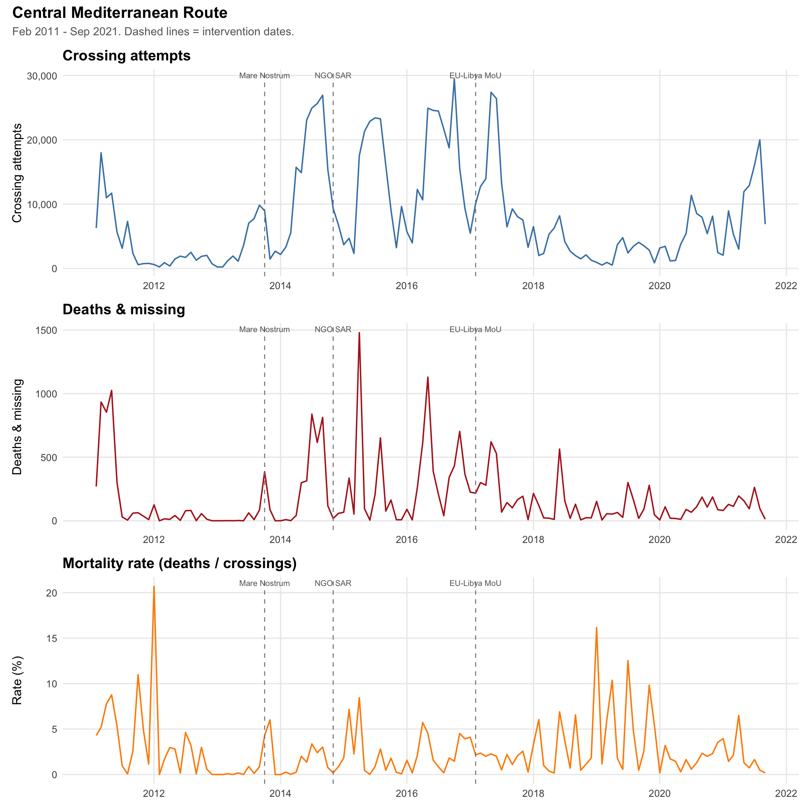

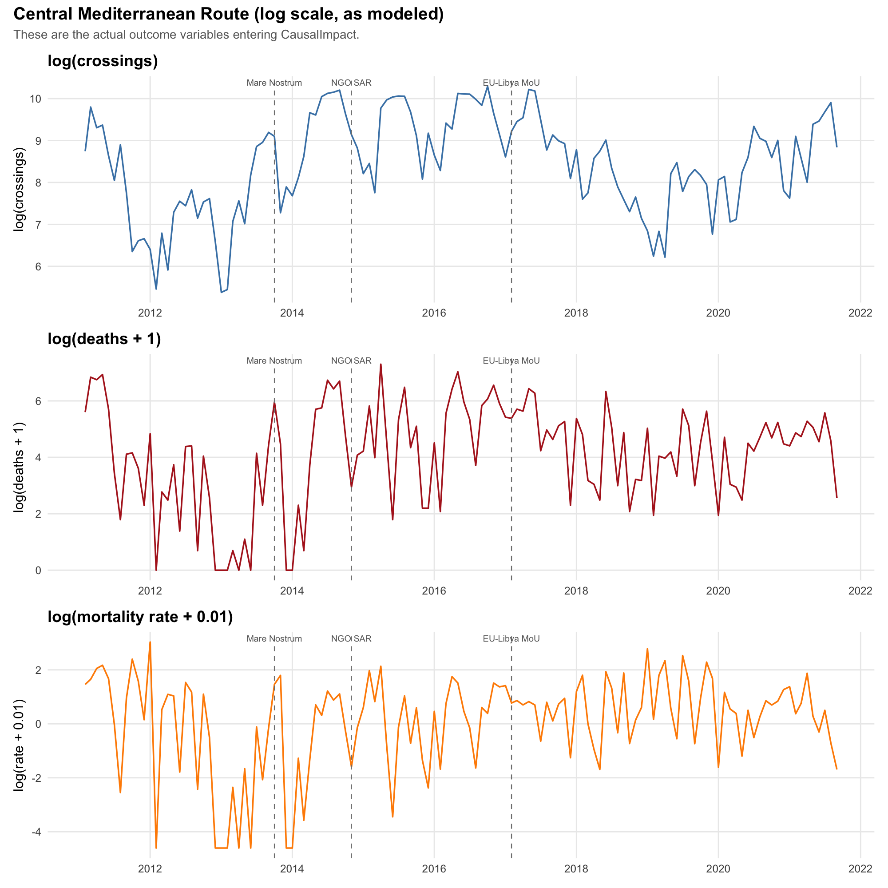

Three variables define the Central Mediterranean Route: crossing attempts, death counts, and the mortality rate (deaths / crossings × 100).

**Crossings** show a clear policy-driven pattern. Before Mare Nostrum (Oct 2013), monthly crossings average around 3,600. They surge to ~13,000 during MN and ~14,000 during NGO SAR operations, then drop back to ~6,400 after the EU-Libya MoU (Feb 2017). The pre-MoU peak in 2016-17 reaches nearly 30,000/month.

**Deaths** track crossing volume closely. The correlation is mechanical: more crossings at a roughly stable per-crossing risk produce more total deaths. The death time series mirrors the crossing time series with noisier peaks.

**Mortality rate** behaves differently. It is noisy and volatile (SD = 3.2% in post-MoU), with sharp monthly spikes but no clear secular trend. The log-scale view (Fig 02) shows the variable entering CausalImpact: `log(rate + 0.01)`. It oscillates without a discernible systematic pattern, which is the core challenge for any counterfactual method relying on exogenous predictors.

---

## 2. Cross-Route Comparison (Figures 03--05, 14)

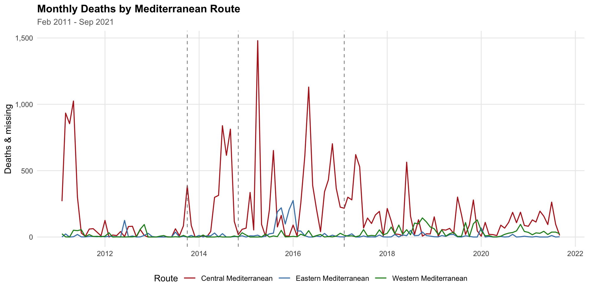

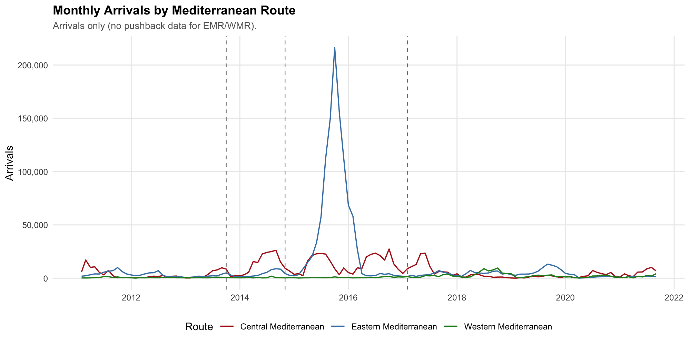

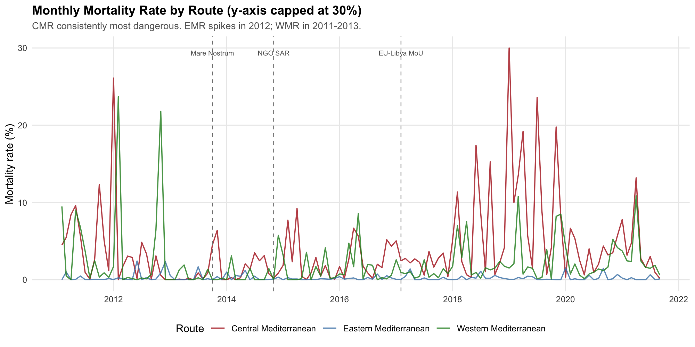

The Central Mediterranean is by far the deadliest Mediterranean route. Over the study period, the CMR recorded 23,059 deaths across 868,707 crossings (mean rate: 4.4%), compared to the Eastern Mediterranean's 2,079 deaths across 1,450,960 crossings (0.25%) and the Western Mediterranean's 2,972 deaths across 180,714 crossings (2.1%).

The EMR had an enormous volume surge in 2015--16 (the Syrian crisis, peaking above 200,000 arrivals/month) but very low mortality because the Aegean crossing is short. The WMR shows some mortality spikes in 2011--2013 but remains much smaller in scale.

Fig 14 (y-axis capped at 30%) reveals that CMR mortality is persistently higher than other routes across the entire period. This is a structural feature of the route's geography --- the Central Mediterranean crossing from Libya to Italy is long (300+ km) and exposed --- rather than a feature of any single policy.

| Route | Total deaths | Total crossings | Mean rate (%) |
|---|---|---|---|
| Central Mediterranean | 23,059 | 868,707 | 4.36 |
| Eastern Mediterranean | 2,079 | 1,450,960 | 0.25 |
| Western Mediterranean | 2,972 | 180,714 | 2.12 |

---

## 3. Deaths vs. Crossings (Figure 06)

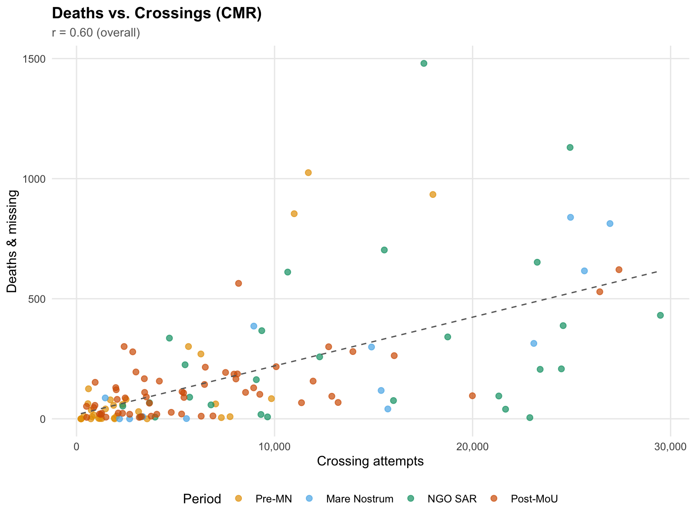

The scatter of monthly deaths against crossings (r = 0.60) shows the volume relationship. Points are colored by policy period:

- **Pre-MN** (yellow): low crossings, low deaths, clustered in the bottom-left
- **Mare Nostrum / NGO SAR** (blue/green): high crossings, high deaths, spread along the regression line
- **Post-MoU** (orange): back to lower crossings, but with some months showing high deaths relative to volume --- hinting at elevated per-crossing risk

The regression line captures the mechanical relationship. What matters for the thesis is the residuals: do post-MoU points systematically sit *above* the line (more deaths than predicted at that crossing level)?

---

## 4. Correlations with Exogenous Predictors (Figures 07--10)

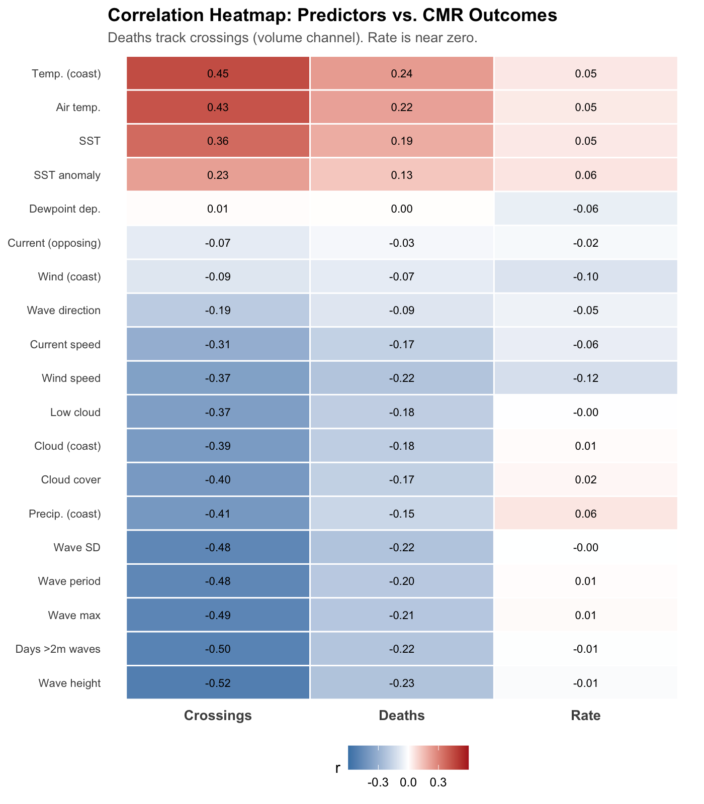

This is the central finding of the correlation analysis. Of 19 exogenous environmental predictors (sea state, atmospheric conditions, ocean currents):

- **16 of 19** are significantly correlated with log(crossings)
- **11 of 19** are significantly correlated with log(deaths)
- **0 of 19** are significantly correlated with log(mortality rate)

The heatmap shows the pattern clearly: the "Crossings" column is heavily colored (strong correlations, r = -0.52 to +0.45), the "Deaths" column shows attenuated versions of the same pattern (same signs, smaller magnitudes), and the "Rate" column is uniformly near zero.

**Interpretation:** Environmental covariates predict *when people cross* (good weather → more crossings), not *how dangerous each crossing is*. Deaths inherit the volume signal --- rougher seas → fewer crossings → fewer deaths --- but this reflects deterrence, not safety. The mortality rate, which divides out volume, shows no relationship with any environmental predictor.

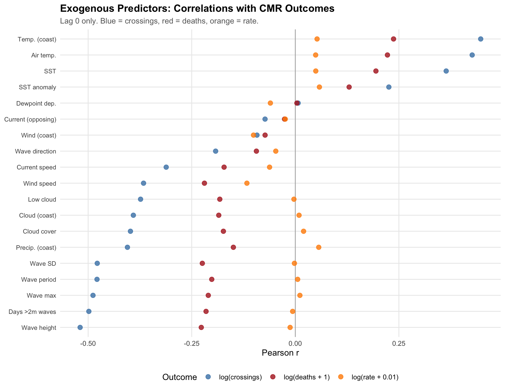

The dot plot makes the three-way contrast visible at a glance. For every predictor, the blue dot (crossings) is far from zero, the red dot (deaths) is closer, and the orange dot (rate) sits near the zero line.

**Why the signs are "wrong":** Wave height, wave max, wave SD, days >2m waves all have *negative* correlations with deaths. Higher waves should kill more people per crossing, but they deter crossings so strongly that fewer people die overall. This is the volume channel at work.

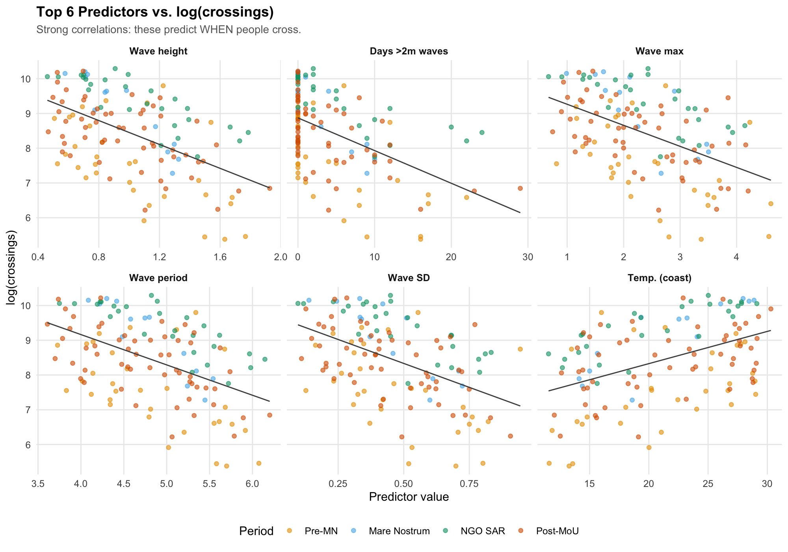

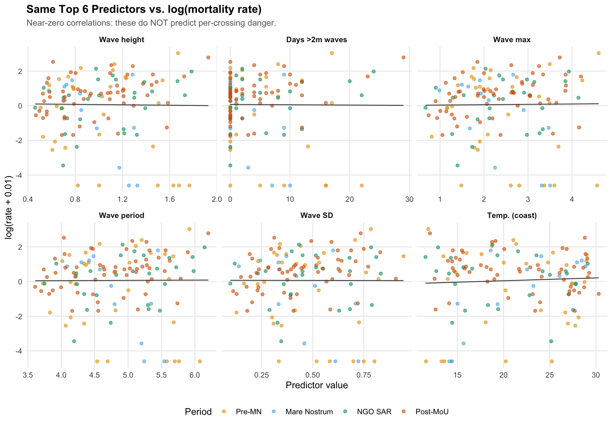

The scatter panels confirm: top-6 predictors show clear linear relationships with crossings (Fig 09) but flat, noisy clouds against mortality rate (Fig 10). The environmental covariates genuinely have no predictive power for per-crossing danger.

**Implication for CausalImpact:** BSTS spike-and-slab regression needs predictive covariates to build a counterfactual. With zero signal for mortality rate, the counterfactual is identified by the trend and seasonal state components alone, not by regression on covariates. This is why the forecasting diagnostic found that exogenous covariates add -2% marginal contribution over month dummies.

---

## 5. Seasonality (Figures 11--12)

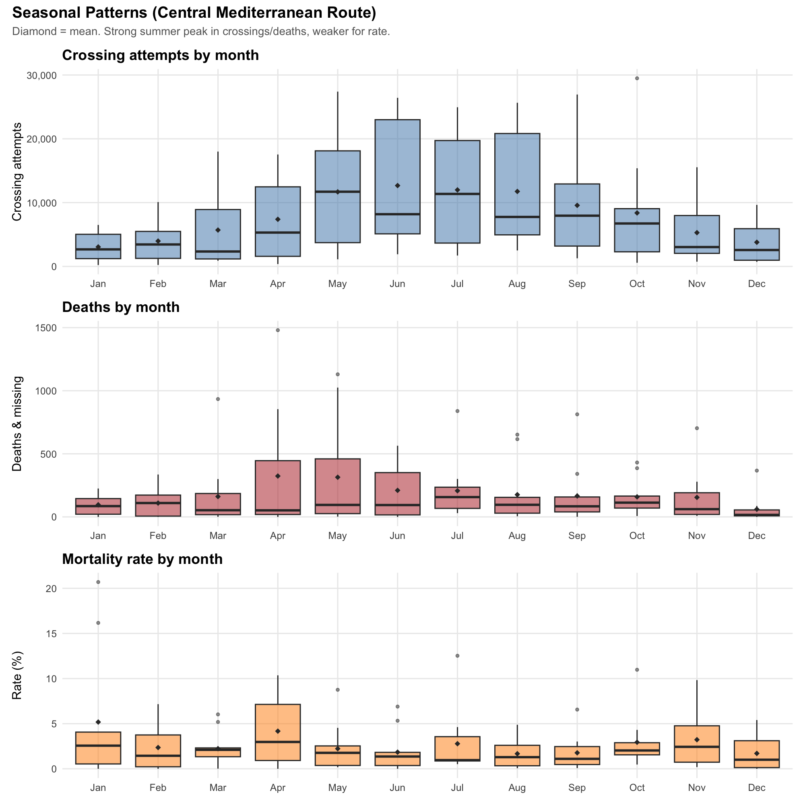

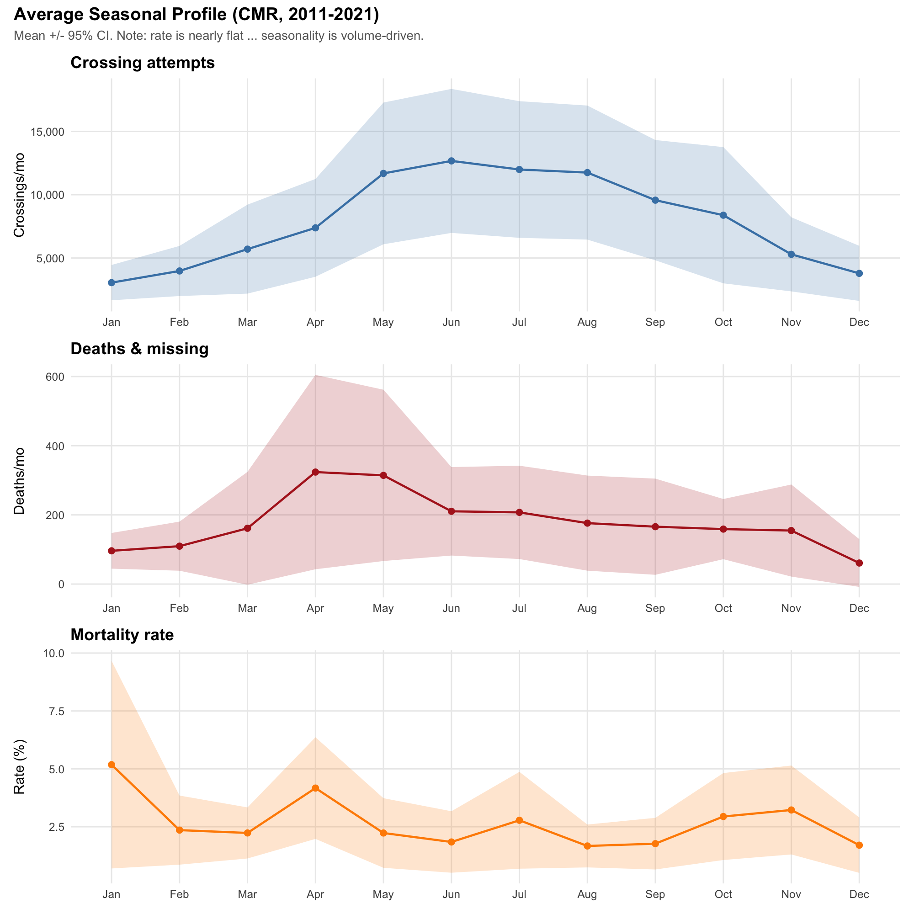

**Crossings** have a strong and expected seasonal pattern: the peak months are May--September, when Mediterranean weather permits safer departures. The boxplots show clear separation between summer and winter months.

**Deaths** follow a similar but noisier summer peak, shifted slightly earlier (April--May deaths peak before the June--July crossings peak). The earlier death peak likely reflects that spring crossings face more variable conditions.

**Mortality rate** shows no clear seasonal pattern. The monthly means are all between 2% and 5% across all 12 months, and the confidence intervals overlap heavily. This is the key insight: the summer surge in deaths is entirely driven by the summer surge in crossings, not by seasonal variation in per-crossing danger.

This explains why `AddSeasonal` in BSTS absorbs what covariates would contribute for crossings (both capture the summer peak) but adds nothing for mortality rate (there is no seasonal rate pattern to capture). Month dummies in the rate model are not capturing danger seasonality --- they're capturing minor compositional effects or noise.

---

## 6. Period-Level Distributions (Figure 13)

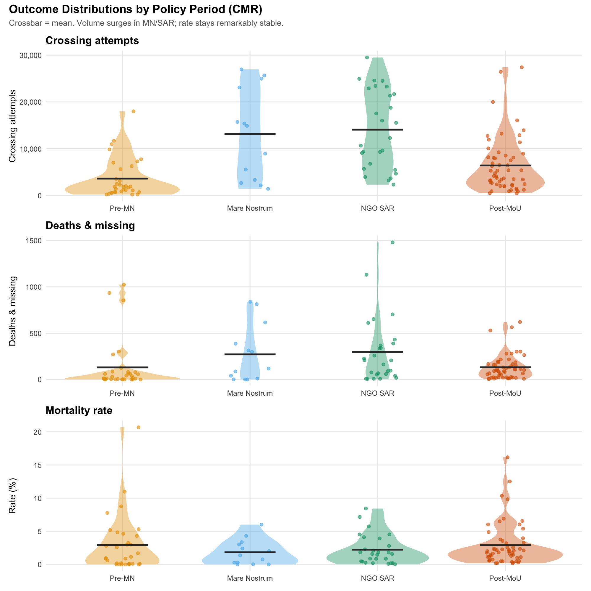

The violin plots show the full distribution of each outcome within each policy period.

**Crossings** (top panel): the distributions are clearly separated. Pre-MN is concentrated at low values; MN and NGO SAR shift dramatically rightward; Post-MoU returns to intermediate levels. The policy effects on volume are large and unambiguous.

**Deaths** (middle panel): similar pattern to crossings, driven by the same volume mechanism.

**Mortality rate** (bottom panel): the distributions overlap substantially across all four periods. However, the pattern is consistent with the hypothesis:

| Period | Mean rate (%) | SD (%) | Interpretation |
|---|---|---|---|
| Pre-MN | 2.93 | 4.32 | Baseline, limited SAR |
| Mare Nostrum | 1.83 | 1.91 | State-led SAR reduces risk *and* variance |
| NGO SAR | 2.22 | 2.26 | Less capacity than state, risk rises slightly |
| Post-MoU | 2.90 | 3.22 | SAR externalized to Libya, risk returns toward baseline |

The progression Pre-MN (2.93) → MN (1.83) → NGO SAR (2.22) → Post-MoU (2.90) follows a coherent story: professional state SAR was most effective at reducing per-crossing danger; NGO SAR was good but less resourced; the MoU dismantled both and risk climbed back. We should not expect a 50% increase --- a ~0.7pp increase from 2.22% to 2.90% is ~30% in relative terms, and every percentage point means dozens of deaths per month.

Note also the variance: MN dramatically reduced the standard deviation (1.91 vs. 4.32 pre-MN), meaning SAR not only lowered average danger but also prevented the worst-case months. Post-MoU variance increases again.

---

## 7. Mortality Rate Spikes by Period (Figures 18--19)

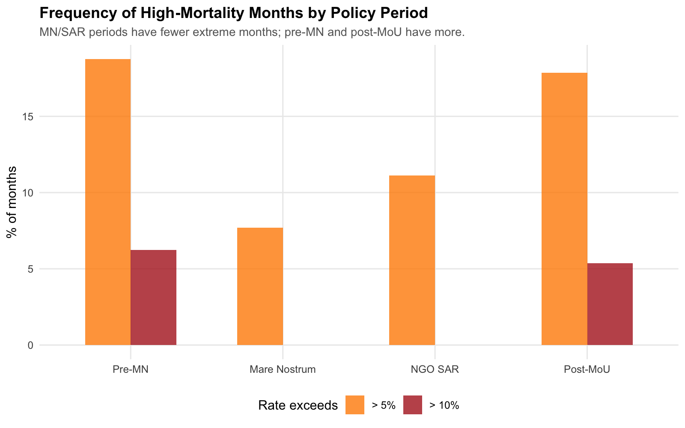

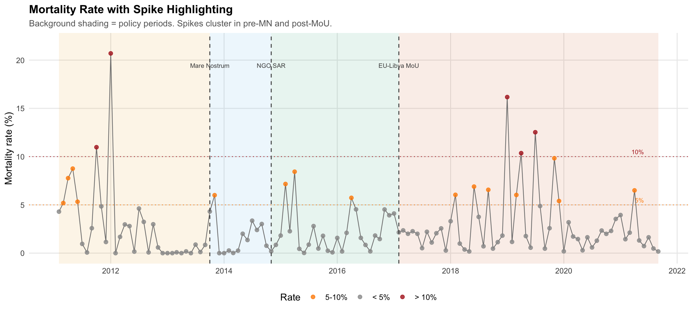

The spike analysis examines how often monthly mortality rate exceeds high thresholds:

| Period | N months | >5% months | >10% months | Max rate |
|---|---|---|---|---|
| Pre-MN | 32 | 19% (6) | 6% (2) | 20.7% |
| Mare Nostrum | 13 | 8% (1) | **0% (0)** | 6.0% |
| NGO SAR | 27 | 11% (3) | **0% (0)** | 8.4% |
| Post-MoU | 56 | 18% (10) | 5% (3) | 16.2% |

**Mare Nostrum eliminated catastrophic months entirely**: zero months above 10%, maximum capped at 6%. NGO SAR was almost as effective: zero months above 10%, max 8.4%. Post-MoU, extreme months return.

Fig 19 shows this visually: red dots (>10%) cluster in the pre-MN and post-MoU shaded bands; the MN/SAR bands are nearly clean.

**Caveat:** These are monthly aggregates. A "spike" month could reflect a single catastrophic shipwreck in a low-crossing month, not systematically elevated danger across all crossings. The event-level analysis (Part 12 below) investigates this directly.

---

## 8. Within-Post-MoU Trend (Figures 20--21)

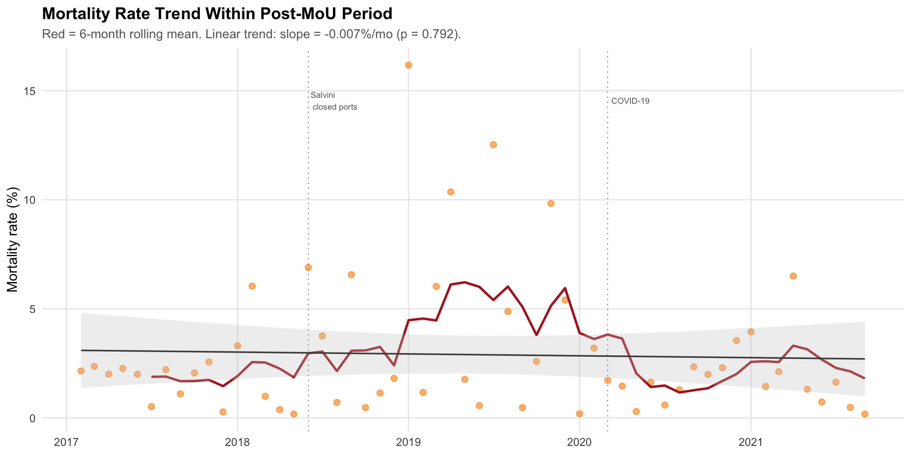

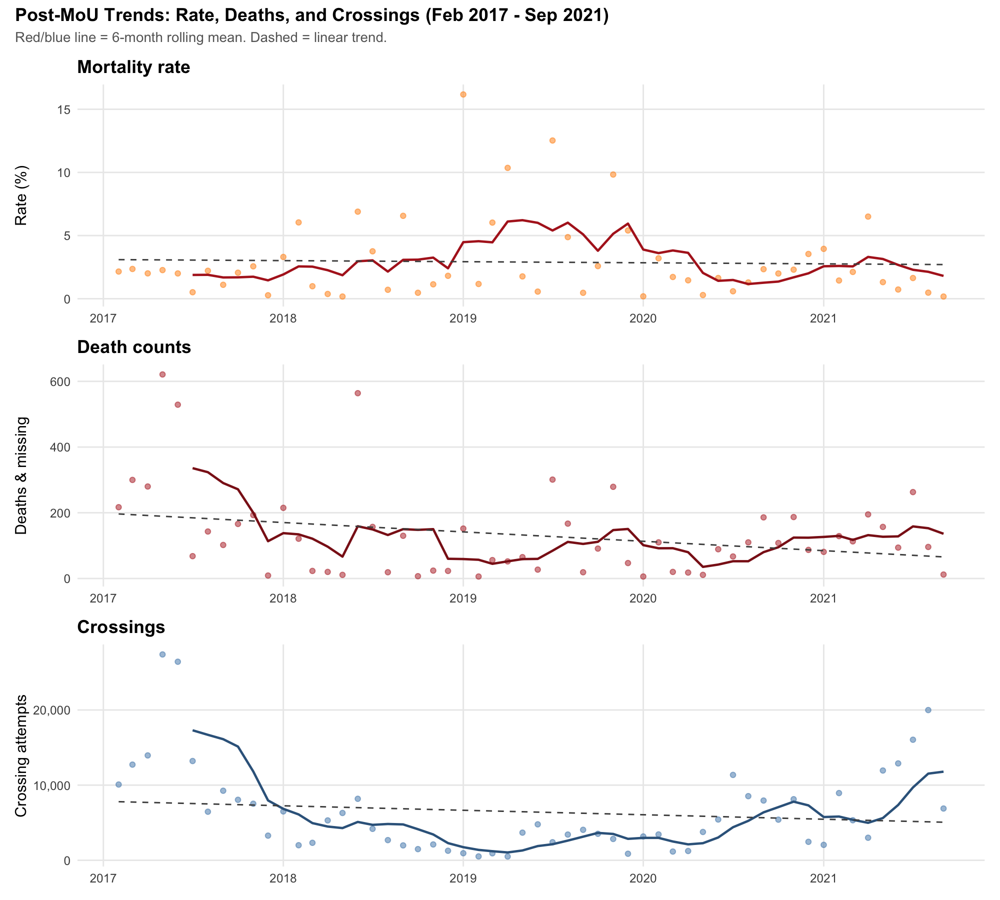

The linear trend within the post-MoU period is flat (slope = -0.007%/month, p = 0.79). There is no evidence that per-crossing danger systematically increased or decreased over the 56 post-MoU months.

However, the 6-month rolling mean (red line in Fig 20) reveals a more nuanced pattern:

- **Feb 2017 -- mid 2018**: relatively stable, ~2--3%
- **Late 2018 -- 2019**: spike cluster peaking at ~5% rolling average. This coincides with Salvini's closed-ports policy and intensified NGO criminalization
- **2020 onward**: drops back, possibly reflecting COVID-19 disruption and changing crossing composition

The early vs. late comparison confirms:

| Sub-period | Mean rate | SD | >5% months | Deaths/mo |
|---|---|---|---|---|
| Early MoU (Feb 17 -- Apr 19) | 3.17% | 3.59 | 22% | 156 |
| Late MoU (May 19 -- Sep 21) | 2.65% | 2.87 | 14% | 108 |

The danger was not a linear build-up but came in waves tied to specific policy-tightening moments within the broader MoU framework. CausalImpact assumes a sharp break at a single intervention date, but the actual mechanism is gradual and non-monotonic.

---

## 9. Key Predictor Time Series (Figures 15--16)

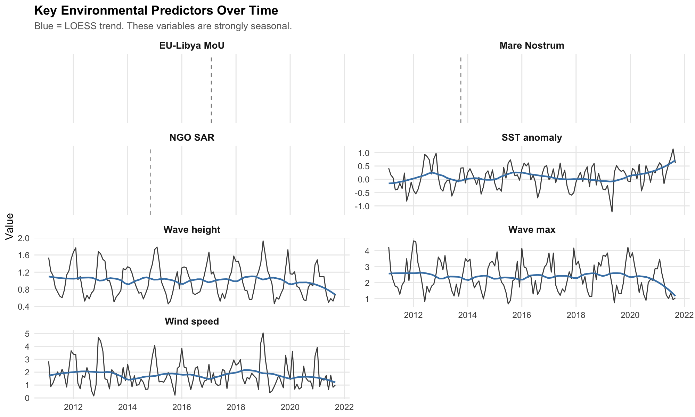

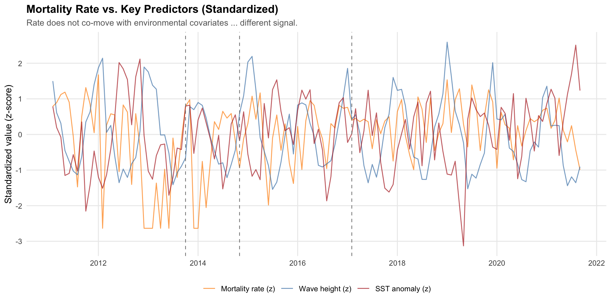

The environmental predictors (SST anomaly, wave height, wind speed, wave max) are all strongly seasonal, as expected. LOESS trends show no secular change over the study period --- climate conditions didn't shift meaningfully between 2011 and 2021.

Fig 16 overlays standardized mortality rate against standardized wave height and SST anomaly. The three series do **not** co-move. Wave height and SST anomaly oscillate with clean seasonal patterns; the mortality rate oscillates at a different frequency with different timing. Visually, there is no signal to extract.

---

## 10. Correlation Stability: Pre-MoU vs. Post-MoU (Figure 17)

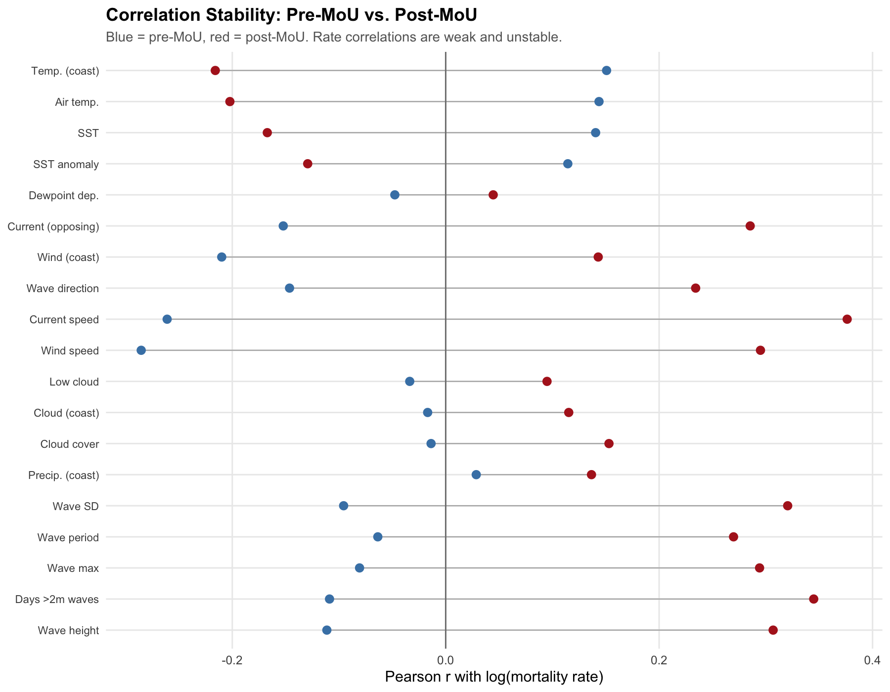

This analysis splits the data at the MoU date (Feb 2017) and computes predictor-rate correlations separately for each sub-period. The results are striking: correlations **flip sign** for most predictors.

| Predictor | Pre-MoU r | Post-MoU r | Change |
|---|---|---|---|
| Current speed | -0.261 | +0.376 | +0.637 |
| Wind speed | -0.285 | +0.295 | +0.580 |
| Days >2m waves | -0.109 | +0.345 | +0.454 |
| Wave height | -0.111 | +0.307 | +0.418 |
| Temp. (coast) | +0.151 | -0.216 | -0.367 |
| Air temp. | +0.144 | -0.202 | -0.346 |

The predictor-rate relationship is not just weak --- it is **unstable**. This has two possible interpretations:

1. **Noise:** With weak true correlations, sample estimates are dominated by random variation and can easily flip sign across sub-samples. This is the parsimonious explanation.

2. **Structural change:** The MoU changed *how* environmental conditions relate to mortality. If post-MoU crossings use different routes (longer, avoiding Libyan coast guard), different boats, or depart at different times, then the weather-mortality relationship shifts. Under this interpretation, the sign flips are themselves evidence that the MoU changed the crossing process.

Both interpretations are problematic for CausalImpact: the model needs to learn a stable pre-period relationship and extrapolate it forward. If the relationship is pure noise (interpretation 1), there is nothing to learn. If it changes structurally (interpretation 2), the pre-period estimate is not valid post-intervention.

The structural interpretation is plausible given what we know about the MoU's effects on the crossing process. Pre-MoU, bad weather deterred crossings but also made those crossings that occurred more dangerous (few crossings, high risk each) --- producing a negative correlation between wave height and mortality rate. Post-MoU, the crossing population and boat types changed: smaller boats, different routes to avoid LCG, departures driven more by smuggler logistics than weather windows. In this new regime, bad weather months may have *higher* mortality rates because the small boats are especially vulnerable, while good-weather months see more successful crossings on the smaller vessels --- flipping the sign to positive. If this explanation is correct, the sign flip is itself evidence of the structural transformation documented in the event-level analysis (Section 11c).

---

## 11. Event-Level Incident Analysis (Figures 22--25)

This section uses IOM Missing Migrants Project microdata (individual incidents, 2014--2021) to look beneath the monthly aggregates.

### 11a. The structure of dying changed

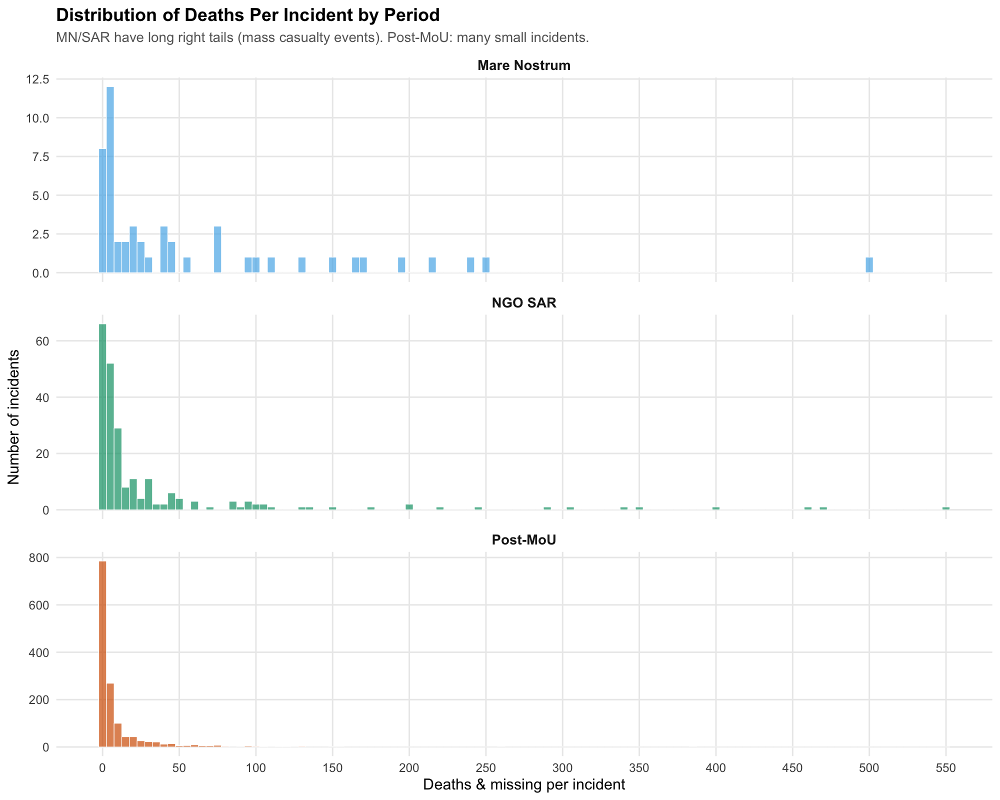

| Period | Incidents | Total dead | Mean/incident | Median | % >50 dead | % >100 dead | Max |
|---|---|---|---|---|---|---|---|
| Mare Nostrum | 51 | 3,054 | 59.9 | 19 | 31% | 22% | 500 |
| NGO SAR | 234 | 8,020 | 34.3 | 6 | 15% | 9% | 550 |
| Post-MoU | 669 | 7,321 | 10.9 | 2 | 7% | 2% | 156 |

The distributions are fundamentally different:

- **Mare Nostrum**: few incidents (51 in 13 months), but when things go wrong, they go catastrophically wrong. Mean 60 deaths per incident, with events reaching 500 dead. These are overcrowded large vessels sinking in the open sea.
- **NGO SAR**: more incidents (234 in 27 months), still with mass casualty events (up to 550). The right tail is shorter but still present.
- **Post-MoU**: many incidents (669 in 56 months), but dramatically smaller. Median is 2 deaths. Maximum is 156. The distribution is compressed near zero with only a thin right tail.

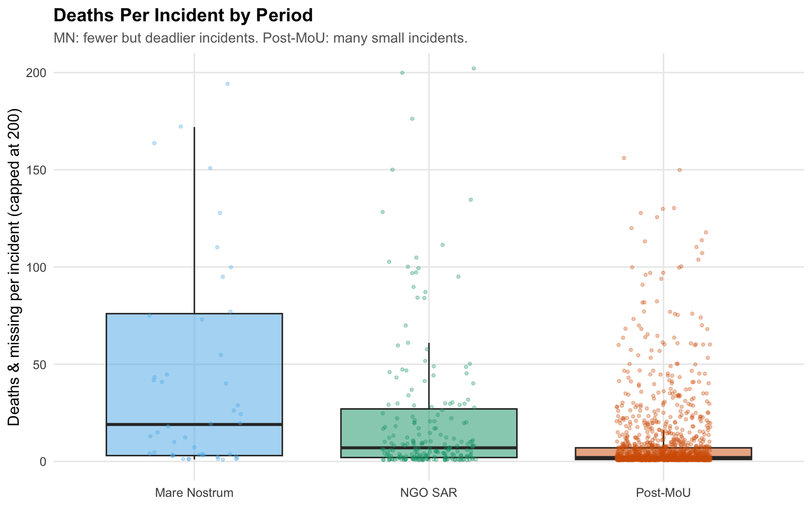

### 11b. More incidents per crossing, not just fewer crossings

The most important derived quantity is the **incident rate per crossing attempt**:

| Period | Monthly crossings | Incidents/month | Incidents per 1,000 crossings |
|---|---|---|---|
| Mare Nostrum | 13,136 | 3.9 | **0.30** |
| NGO SAR | 14,077 | 8.7 | **0.62** |
| Post-MoU | 6,433 | 11.9 | **1.86** |

**Post-MoU has 3x the incident rate of NGO SAR and 6x of Mare Nostrum.** Despite having half the monthly crossings, the post-MoU period generates more recorded incidents per month. Per 1,000 crossing attempts, the probability of a fatal incident tripled.

But each incident kills far fewer people: 10.9 mean deaths vs. 34.3 (NGO SAR). These two effects roughly cancel:

- 3x more incidents per crossing × ~3x fewer deaths per incident ≈ similar aggregate mortality rate

This is why the monthly mortality rate (2.22% → 2.90%) shows only a modest increase despite a dramatic structural shift in how people die.

### 11c. Why incidents tripled while deaths-per-incident dropped

This "cancellation" is not a coincidence --- it reflects a structural transformation of the smuggling market and the SAR architecture driven by three interlocking mechanisms.

#### Mechanism 1: Boat economics changed

During MN/SAR, smugglers operated a high-volume, high-price model. Large boats --- wooden fishing vessels, large rubber dinghies --- carried 100 to 500+ passengers per departure. SAR presence in international waters meant these boats only needed to reach the rescue zone, not Italy. Smugglers could maximize passengers per launch, charging high per-seat prices for a "service" that included near-certain rescue at sea.

Post-MoU, the LCG patrols near the Libyan coast and intercepts large, detectable departures. Large organized launches became risky for smugglers --- not for humanitarian reasons, but because interception means losing the boat, the cargo, and the revenue. Smugglers adapted: smaller, cheaper boats (small rubber dinghies, fiberglass skiffs), fewer passengers per vessel, lower price per seat, more frequent launches. Hoffmann Pham & Komiyama (2024) document this tactical shift directly using incident-level Frontex data obtained via FOIA: increased use of wooden boats relative to large rubber rafts, reduced average passengers per boat.

The organizational structure of CMR smuggling networks enables this rapid adaptation. Campana (2018; 2020) shows these networks are segmented, rudimentary, and have low barriers to entry --- not centralized criminal organizations. When the institutional environment changed at the MoU boundary, smugglers didn't maintain the same operational model; they shifted to a lower-cost, higher-frequency, smaller-boat equilibrium within months.

This directly explains both sides of the pattern:
- **More incidents per crossing:** smaller, less seaworthy boats are more likely to encounter distress. Each is a separate incident.
- **Fewer deaths per incident:** a 15-person dinghy that sinks kills 10--15 people, not 300--500. The maximum single-event death toll dropped from 500--550 (MN/SAR) to 156 (Post-MoU) simply because no one sends 500-person boats anymore.

#### Mechanism 2: The SAR safety net disappeared

During MN/SAR, professional rescue ships patrolled the central Mediterranean. When a large boat was in distress --- engine failure, overcrowding, taking on water --- it triggered a professional rescue operation. Many of these events ended as "rescues" with few or no fatalities, and do not appear in the IOM fatal incident database at all. The SAR architecture converted potential disasters into successful operations.

Post-MoU, NGO rescue capacity was progressively restricted (port closures, vessel seizures, criminal investigations against NGO crews) and not replaced by state SAR. The same distress event --- engine failure, deflating dinghy --- that previously ended in rescue now ends in death. So part of the increase in recorded *fatal* incidents reflects distress events that previously had non-fatal outcomes because rescue was available.

This also explains why SAR operations (MN in particular) reduced not just the mean mortality rate but also the variance and the right tail (zero months above 10%): SAR intercepted the mechanism that converts distress into disaster. Without it, the distress-to-death pathway reopened.

#### Mechanism 3: LCG interception created new categories of danger

The Libyan Coast Guard, equipped and trained under the MoU, patrols near the Libyan shore and intercepts departing boats. These interceptions are not equivalent to European SAR --- they are forced returns to Libya, often conducted violently. Several types of new fatal incidents emerged:

- Boats capsizing during LCG interception attempts (people panic, overbalance the vessel)
- People drowning while trying to escape LCG vessels (jumping overboard)
- Boats left adrift after LCG disengages without completing the interception
- Boats taking longer, more dangerous routes to avoid LCG patrol zones

Zambiasi & Albarosa (2025) provide spatial evidence: the mortality increase is concentrated within 120 km of Tripoli --- precisely the LCG operating zone. The probability of a deadly event decreased by 50% for every 100 km of distance from Libyan shores. This geographic concentration is consistent with LCG operations generating new incidents near the coast, while the open-sea mega-shipwrecks of the MN/SAR era (which occurred far from Libya) disappeared because fewer large boats reach open water.

#### The moral hazard framework in reverse

Deiana, Maheshri & Mastrobuoni (2024, AEJ: Economic Policy) document a moral hazard mechanism during the SAR era: smugglers responded to SAR availability by sending worse boats in worse weather, because the expected cost of a failed crossing was reduced by the rescue probability. SAR created an incentive to take more risk, partially offsetting its safety benefits.

Our EDA captures the reverse of this mechanism. When SAR was withdrawn (MoU), the incentive structure changed again --- but not symmetrically. The result is not a return to the pre-SAR regime of large boats (because LCG enforcement prevents that), but a *new* equilibrium: many small boats with no rescue safety net. The moral hazard disappeared (smugglers can no longer count on rescue), but so did the rescue itself. The net effect is more frequent distress events, each individually less catastrophic, but collectively producing a similar or slightly higher aggregate death toll per crossing.

#### The net effect and why it matters

```
More incidents/crossing  ×  Fewer deaths/incident  ≈  Similar aggregate rate
      (3x)                        (~3x)                   (2.22% → 2.90%)
```

The monthly mortality rate treats these two regimes as comparable, but they are qualitatively different. A 3% monthly rate generated by one 300-person shipwreck in a month with 10,000 crossings is a different phenomenon from a 3% rate generated by forty 2-person incidents in a month with 2,700 crossings. The first is a rare catastrophe; the second is systematic, diffuse danger. The MoU shifted the CMR from the first regime to the second.

This has profound implications for measurement and methodology:

- **Monthly aggregation hides the structural break.** CausalImpact at monthly frequency sees a roughly stable rate and finds it hard to detect a significant change. But the process generating that rate changed fundamentally.
- **The incident rate per crossing is a cleaner signal.** It tripled (0.62 → 1.86 per 1,000 crossings), a much larger and clearer effect than the rate change (2.22% → 2.90%). If incident-level data were used as the outcome, the statistical signal would be far stronger.
- **The "cancellation" is itself a finding.** The fact that the MoU simultaneously increased the frequency of distress events and decreased their severity, producing a roughly stable aggregate rate, is evidence of a structural transformation of the crossing process --- exactly what the policy's critics argue happened.

#### Data caveat: IOM reporting expansion

Part of the increase in recorded incidents may reflect improved IOM monitoring and reporting capacity over time, rather than a true increase in events. The IOM Missing Migrants Project expanded its network of sources and tracking methodology throughout this period. Two observations help calibrate this concern:

1. The incident rate already doubled from MN to NGO SAR (0.30 → 0.62 per 1,000 crossings) *before* the MoU, when the policy environment hadn't yet shifted dramatically. This suggests reporting improvement contributes to the trend continuously, not just at the MoU boundary.

2. Death totals are more reliably recorded than incident counts --- a body, a missing person report, or a survivor testimony is harder to miss than a non-fatal distress event. The deaths-per-incident decline (59.9 → 34.3 → 10.9) is therefore likely to reflect a real structural change even if the absolute incident count is inflated by better monitoring.

The safest interpretation is that the *direction* of the structural shift (more frequent, smaller incidents) is real, while the precise *magnitude* (3x incident rate increase) may overstate the true change due to reporting improvements.

### 11d. Incident structure over time

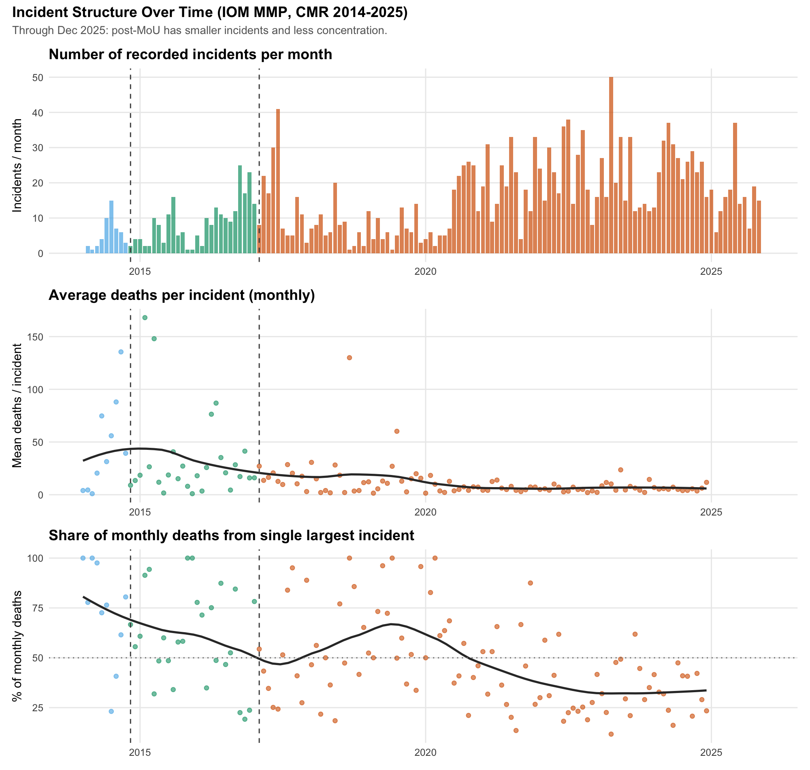

Three panels visualize the structural transformation:

**Top (incidents per month):** The bar chart shows the transition from sparse MN-era events (blue) to moderate NGO SAR era (green) to dense post-MoU (orange). The post-MoU period regularly records 20--40 incidents per month, compared to 3--15 during MN/SAR, despite having fewer total crossings.

**Middle (mean deaths per incident):** Monthly average deaths per incident drop dramatically at the MoU boundary, from LOESS-smoothed values of 30--50 in the SAR era to 5--15 post-MoU. This is the boat-size effect: smaller vessels, fewer passengers at risk per event.

**Bottom (top-1 event share):** During MN/SAR, the single deadliest event in a given month typically accounts for 60--90% of that month's deaths --- reflecting the dominance of individual catastrophic shipwrecks. Post-MoU, this drops to 30--50%, meaning deaths are distributed across many events. Monthly death totals are no longer driven by single disasters but by the accumulation of many small tragedies.

**Implication for the monthly spike analysis:** When we observe a monthly mortality rate spike of 10--15% during the SAR era, it is typically driven by a single catastrophic shipwreck (one event = 80%+ of the month's deaths). Post-MoU spikes emerge differently --- from the accumulation of many small incidents. These are qualitatively different phenomena that monthly aggregation makes look identical. This distinction is invisible to CausalImpact at monthly frequency.

### 11e. Cause of death

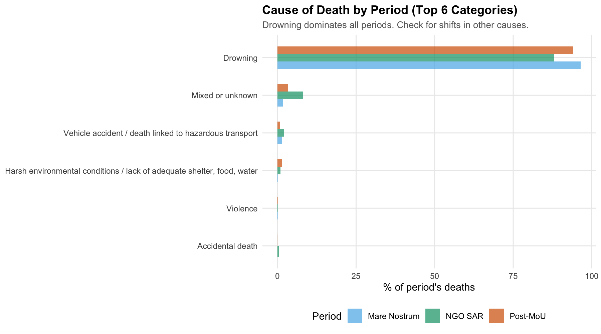

Drowning dominates all periods (88--96% of deaths). There is no major shift in cause-of-death composition across policy eras. The change is in the *structure* of drowning events (mass vs. distributed), not in the *type* of death. This is consistent with the mechanistic explanation: whether 300 people drown from a single sinking or 300 people drown across forty small incidents over a month, the proximate cause is the same. What changed is the process that produces the drowning --- the boat size, the SAR availability, and the geography of danger.

---

## 12. Summary: What the EDA Tells Us

### The phenomenon

1. **The mortality rate pattern is consistent with the hypothesis.** The progression from 2.93% (pre-MN) → 1.83% (MN) → 2.22% (NGO SAR) → 2.90% (post-MoU) tracks what we would expect if SAR operations reduce per-crossing danger and the MoU reverses that protection. The effect is modest in absolute terms (~0.7pp increase) but meaningful: every percentage point means dozens of additional deaths per month.

2. **SAR operations prevented catastrophic months.** During MN/SAR, zero months exceeded 10% mortality. The maximum monthly rate was 6% (MN) and 8.4% (NGO SAR). Post-MoU, spikes of 10--16% return. SAR didn't just lower the mean --- it compressed the right tail.

3. **The nature of dying changed.** The event-level data reveals a structural shift post-MoU: from fewer, larger catastrophes (mean 60 dead/incident during MN) to many smaller tragedies (mean 11 dead/incident post-MoU). The incident rate per 1,000 crossings tripled (0.62 → 1.86), but deaths per incident dropped proportionally, leaving the aggregate monthly rate nearly unchanged. The monthly mortality rate masks a profound change in the *process* generating deaths.

4. **Total crossings and deaths fell post-MoU, but incidents rose.** Fewer people cross, fewer people die in total, yet more things go wrong per crossing. The incident rate per 1,000 crossings tripled (0.62 → 1.86), while deaths per incident dropped by a factor of three (34.3 → 10.9). These cancel in the aggregate rate, making the monthly mortality rate a misleading summary statistic. The MoU didn't make crossings "slightly more dangerous" --- it transformed the entire structure of the crossing process: from a regime of rare, catastrophic mass drownings (large overcrowded boats sinking far from shore, 300--500 dead at once) to a regime of frequent, small tragedies (many small boats in distress near the Libyan coast, median 2 dead each). This transformation is driven by three interlocking mechanisms: (a) smuggler adaptation to LCG enforcement --- smaller, cheaper boats, more frequent launches; (b) disappearance of the SAR safety net --- distress events that previously ended in rescue now end in death; (c) LCG interception itself generating new categories of danger near the Libyan coast. See Section 11c for the full mechanistic discussion.

### The methodology

5. **Environmental covariates predict volume, not danger.** 16/19 predictors correlate with crossings, 0/19 with mortality rate. The covariates capture *when people cross* (seasonal volume), not *how dangerous each crossing is*. This is why CausalImpact's regression component contributes nothing to the mortality rate counterfactual.

6. **The predictor-rate relationship is unstable.** Correlations flip sign between pre-MoU and post-MoU periods. Whether this reflects noise (weak true signal) or structural change (MoU altered the weather-mortality mechanism), it undermines CausalImpact's assumption of a learnable, stable pre-period relationship.

7. **Seasonality is volume, not danger.** The mortality rate shows no clear seasonal pattern --- the summer peak in deaths is entirely driven by the summer peak in crossings. This is why month dummies and `AddSeasonal` help predict crossings but not rate.

8. **Monthly aggregation obscures the mechanism.** The event-level analysis shows that two months with identical mortality rates (e.g., 5%) can have completely different underlying structures: one catastrophic shipwreck vs. twenty small incidents. CausalImpact at the monthly level cannot distinguish these, yet they represent fundamentally different processes.

### Connection to the literature

The patterns documented in this EDA are consistent with --- and illuminated by --- several strands of the academic literature.

#### The structural shift: smuggler adaptation and boat types

The most striking EDA finding --- incidents tripling per crossing while deaths-per-incident dropped 3x --- aligns with **Hoffmann Pham & Komiyama (2024, PLOS ONE)**, who use incident-level Frontex data (obtained via FOIA) to document the shift in smuggler tactics post-MoU: increased use of wooden boats relative to rubber rafts, reduced average passengers per boat. Smugglers adapted to LCG enforcement by sending smaller, cheaper vessels with fewer passengers. This explains the shift from rare catastrophic mass drownings (overcrowded large boats sinking) to many smaller incidents (small boats in distress).

**Campana (2018, European J. Criminology; 2020, Crime and Justice)** provides the organizational explanation: smuggling networks on the CMR are segmented, rudimentary, and have low barriers to entry. This structure enables rapid tactical adaptation to policy changes --- exactly what we observe at the MoU boundary. When the institutional SAR framework collapsed, smugglers didn't maintain the same operational model; they shifted to a lower-cost, higher-frequency, smaller-boat model.

The **moral hazard mechanism** documented by **Deiana, Maheshri & Mastrobuoni (2024, AEJ: Economic Policy)** --- the highest-profile economics paper in this space --- provides the theoretical framework. They find that smugglers responded to SAR availability by sending worse boats in worse weather, as the expected cost of a failed crossing was reduced by rescue probability. Our EDA captures the reverse: when SAR was withdrawn (MoU), the incentive structure changed again, but now without the rescue safety net. The result is not a return to the pre-SAR regime of large boats, but a new equilibrium of many small boats with no rescue --- more frequent distress events, each individually less catastrophic.

#### Causal evidence on the MoU and mortality

**Zambiasi & Albarosa (2025, J. Economic Geography)** is the most directly relevant causal study. Their spatial difference-in-differences design compares deadly incident probability near Libyan shores (where LCG operates post-MoU) versus near Italian shores (where Italian Coast Guard continues SAR). They find the probability of a deadly event increased **8 times** in areas within 120 km of Tripoli after the MoU, and that the probability of shipwreck decreased by 50% for every 100 km of distance from Libyan shores. Their spatial approach provides causal identification that complements our time-series approach: their evidence is spatially granular where ours is temporally detailed.

Our EDA results --- the rate pattern (2.22% → 2.90%), the spike return, the incident-rate tripling --- are consistent with Zambiasi & Albarosa's finding that danger increased post-MoU, concentrated near Libya. The fact that our monthly CausalImpact Model C (rate) finds a defensible p = 0.008 with placebos at the 11th percentile is at least suggestive of the same effect, even if the identification is weaker.

#### The volume-danger separation

The EDA's central correlation finding (16/19 predictors correlated with crossings, 0/19 with rate) maps directly onto the separation between volume and danger channels studied in the pull factor literature. **Rodriguez Sanchez et al. (2023, Scientific Reports)** --- the paper we extend --- demonstrated that SAR does not act as a pull factor for crossing volume. Our extension asks the complementary question: did the MoU affect per-crossing danger? The EDA shows that the covariates that work well for the volume question (weather, sea state) are useless for the danger question --- these are fundamentally different outcomes driven by different processes.

**Steinhilper & Gruijters (2018, Sociology)** provide the systematic descriptive baseline: in 2015, the CMR was 19x deadlier than the EMR per crossing (15.4 vs. ~0.8 per 1,000). Our cross-route comparison (Fig 14) confirms this persistent differential. The CMR's elevated danger is structural (long crossing, exposed waters), not policy-driven --- but the MoU appears to have shifted danger within the CMR's already elevated baseline.

#### The denominator problem

**IOM GMDAC (2017)** documents a critical caveat for all mortality rate calculations after 2017: the Libyan Coast Guard intercepted a growing share of departures --- 8% in 2016, 16% in 2017, rising to an estimated 41% by 2019. Our "crossings" variable (arrivals + pushbacks + deaths) attempts to capture total departures, but LCG interceptions may not be fully reflected. If the denominator undercounts true departures, the computed mortality rate is biased upward, and the true incident rate per departure could be even higher than the 1.86 per 1,000 we compute. Conversely, if interceptions are well-captured, the rate comparison is valid. This is an irreducible data limitation that applies to all studies using aggregate flow data for this period.

#### Daily-level analysis as the way forward

Two papers demonstrate that **daily-level analysis** captures dynamics that monthly aggregates destroy --- directly supporting our diagnostic finding that exogenous covariates add -2% marginal contribution at monthly frequency.

**Camarena et al. (2020, PLOS ONE)** use daily data on migration, sea conditions, and conflict events. They find a 10% increase in wave heights leads to approximately 27% decrease in arrivals --- a strong, immediate deterrence effect visible at daily frequency but washed out in monthly means. This is precisely the signal our monthly covariates fail to capture for mortality: the lethal storm is a 1-day event within a monthly mean.

**Cantarella (2019, HiCN Working Paper)** is the closest existing work to a daily mortality analysis of the CMR. Using daily IOM and Frontex data, she finds that rescue-deterrence policies generated a **permanent increase of more than 4 deaths per day** on the Central Mediterranean. This remains unpublished in a peer-reviewed journal, but the approach --- daily-level mortality as the outcome --- is exactly what our diagnostic suggests would be needed to recover the danger signal that monthly aggregation destroys.

#### The mediation structure

The tension between modeling deaths and modeling the rate connects to the broader mediation literature. Our EDA shows that deaths = volume × per-crossing risk, and that covariates predict volume but not risk. **Charlot, Naiditch & Vranceanu (2024, J. Population Economics)** provide a theoretical matching model of the smuggling market that formalizes this decomposition: enforcement intensity (the MoU) affects both the equilibrium number of crossings and the equilibrium boat quality/danger, through smuggler optimization. The aggregate mortality rate is a sufficient statistic only if the two channels are separable --- our EDA shows they are empirically separable (covariates affect one but not the other), even if the rate model lacks statistical power.

### Implications for next steps

The EDA establishes two things simultaneously:

- **There is something real to find:** the rate pattern, the spike distribution, and the incident-rate tripling all point toward increased per-crossing danger post-MoU. This is consistent with the causal evidence from Zambiasi & Albarosa (2025) using a different identification strategy, with the smuggler adaptation documented by Hoffmann Pham & Komiyama (2024), and with the moral hazard framework of Deiana et al. (2024) running in reverse.
- **Monthly CausalImpact is poorly matched to finding it:** the covariates are orthogonal to the outcome, the signal-to-noise ratio is low, and the generating process changed structurally at the intervention boundary. Camarena et al. (2020) and Cantarella (2019) demonstrate that daily-level analysis is where the signal lives.

The event-level data suggests that the most informative analysis would operate at the incident level or daily level, where the actual danger signal lives, rather than at the monthly level where it is averaged away. Alternatively, the incident-rate-per-crossing could itself be an outcome variable --- it shows a much clearer signal than the aggregate mortality rate.

---

## References

- Achilli, L. (2018). "The 'Good' Smuggler: The Ethics and Morals of Human Smuggling among Syrians." *ANNALS of the American Academy of Political and Social Science*, 676, 77--96.
- Camarena, K.R., Claudy, S., Wang, J., & Wright, A.L. (2020). "Political and Environmental Risks Influence Migration and Human Smuggling across the Mediterranean Sea." *PLOS ONE*, 15(7), e0236646.
- Campana, P. (2018). "Out of Africa: The Organization of Migrant Smuggling across the Mediterranean." *European Journal of Criminology*, 15(4), 481--502.
- Campana, P. (2020). "Human Smuggling: Structure and Mechanisms." *Crime and Justice*, 49.
- Cantarella, M. (2019). "#Portichiusi: The Human Costs of Migrant Deterrence in the Mediterranean." HiCN Working Paper 317.
- Cantarella, M., Ferreri, N., & Ferroni, M. (2021). "The Migrant Crisis in the Mediterranean Sea: Empirical Evidence on Policy Interventions." *Socio-Economic Planning Sciences*, 75, 101038.
- Charlot, O., Naiditch, C., & Vranceanu, R. (2024). "Smuggling of Forced Migrants to Europe: A Matching Model." *Journal of Population Economics*, 37, 18.
- Cusumano, E. (2019). "Migrant Rescue as Organized Hypocrisy: EU Maritime Missions Offshore Libya between Humanitarianism and Border Control." *Cooperation and Conflict*, 54(1), 3--24.
- Cusumano, E. & Riddervold, M. (2023). "Failing Through: European Migration Governance across the Central Mediterranean." *Journal of Ethnic and Migration Studies*, 49(12).
- Cusumano, E. & Villa, M. (2019). "Sea Rescue NGOs: A Pull Factor of Irregular Migration?" EUI Policy Brief, Migration Policy Centre.
- Deiana, C., Maheshri, V., & Mastrobuoni, G. (2024). "Migrants at Sea: Unintended Consequences of Search and Rescue Operations." *American Economic Journal: Economic Policy*, 16(2), 335--365.
- Hoffmann Pham, K. & Komiyama, J. (2024). "Strategic Choices of Migrants and Smugglers in the Central Mediterranean Sea." *PLOS ONE*, 19(4), e0300553.
- IOM GMDAC (2017). "Calculating 'Death Rates' in the Context of Migration Journeys: Focus on the Central Mediterranean." GMDAC Briefing Series.
- Last, T., Spijkerboer, T. et al. (2017). "Deaths at the Borders Database." *Journal of Ethnic and Migration Studies*, 43(5), 693--712.
- Rodriguez Sanchez, A., Wucherpfennig, J., Rischke, R., & Iacus, S.M. (2023). "Search-and-Rescue in the Central Mediterranean Route Does Not Induce Migration." *Scientific Reports*, 13, 11014.
- Steinhilper, E. & Gruijters, R.J. (2018). "A Contested Crisis: Policy Narratives and Empirical Evidence on Border Deaths in the Mediterranean." *Sociology*, 52(3).
- Tafani, I. & Riccaboni, M. (2025). "The Impact of the EU-Turkey Agreement on the Number of Lives Lost at Sea." *Humanities and Social Sciences Communications*, 12, 869.
- Zambiasi, D. & Albarosa, E. (2025). "Externalizing Rescue Operations at Sea: The Migration Deal between Italy and Libya." *Journal of Economic Geography*, 25(1), 41--58.
